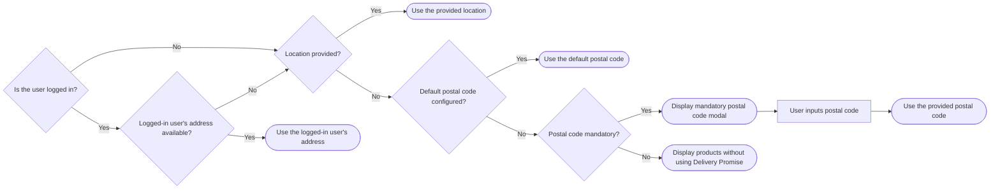

>ℹ This feature is in closed beta, meaning only selected customers can access it. If you’re interested in implementing it, please contact our [Support](https://support.vtex.com/hc/en-us) team.

In this guide, you’ll learn how to configure Delivery Promise in your FastStore project.

**Delivery Promise** is a feature that provides accurate and reliable delivery estimates for available products based on the customer's location. It ensures that customers only see products that are in stock and can be delivered to their address or picked up at a nearby location.

This solution continuously updates product availability throughout the buying journey by responding to changes in catalog, pricing, inventory, or shipping settings. These updates are then sent to [Checkout](https://developers.vtex.com/docs/guides/checkout-overview) and [Intelligent Search](https://help.vtex.com/tracks/vtex-intelligent-search), ensuring customers see up-to-date options based on their region.

## Hooks

This feature introduces the following hooks as part of the regionalization and location workflow:

* `useGeoLocation`: Uses the browser's geolocation API or other client-side methods to auto-detect the user's location when not provided.
* `useRegion`: Accesses or updates the user's region information, such as postal code or location, and manages region validation flows.
* `useRegionModal`: Handles modal display logic for region selection, especially when the location input is mandatory.
* `useDeliveryPromise`: Centralizes all logic for querying, displaying, and updating delivery-availability filters and states.

## Filter options

With Delivery Promise, shoppers can filter available products by using a [global filter](#global-filter), which affects all navigation, or directly on a [Product List Page (PLP) or search page](#plp-or-search-page-filters), affecting only the current page they're navigating. In both scenarios, they can filter by shipping method or pickup points.

>ℹ Learn more about filters usage and user flows in the [Delivery Promise Figma Community](https://www.figma.com/community/file/1514671929470875586) page.

### Global filters

Global filters determine the fulfillment method for all user navigation and are applied to all product queries until they change or are cleared.

Shoppers can filter available products globally **by shipping** or **by store**.

* **Filter by shipping:** Allows shoppers to select between delivery and pickup as a fulfillment method.


* **Filter by store:** Allows shoppers to filter products to display only those available for pickup at a specific store. It shows all available pickup points within a 50 km pickup radius configured in Checkout. The number of pickup points displayed is unlimited.


### PLP or search page filters

In PLPs or search pages, the shopper may have the following options to filter:

* **Deliver:** Displays available products according to the shopper's location.
* **Pickup at:** Displays the store set in the global pickup point filter, or the one closest to the shopper's location. To change the store set in `Pickup at {storeName}`, the shopper may click it and select a new store in the modal that will open. It shows all available pickup points within a 50 km pickup radius configured in Checkout. The number of pickup points displayed is unlimited.
* **Pickup nearby:** Displays products available for pickup at nearby stores. It shows up to 40 pickup points within 10 km of the shopper’s location.
* **Pickup anywhere:** Displays products available for pickup at any participating store within the merchant’s network, rather than restricting results to a selected pickup location or geographic proximity. **It's mainly used by B2B stores**.


## Default settings

Delivery Promise is defined in the `deliveryPromise` section of the [`discovery.config.js`](https://developers.vtex.com/docs/guides/faststore/project-structure-config-options) file.

Below are the default settings:

```js discovery.config.js
deliveryPromise: {
    enabled: true,
    mandatory: false
  },
```

* `enabled`: When set to **true**, Delivery Promise activates, allowing the store to provide delivery estimates based on the user’s location.
* `mandatory`: When set to **false**, providing a postal code is optional for the user. Users can browse and add items to the cart without entering their postal code, though the accuracy of delivery information may be limited.

## Before you begin

<Steps>

### Get the `search-session` app

Check if you have installed the `0.5.0` or later version of the [`search-session`](https://developers.vtex.com/docs/apps/vtex.search-session) app.

1. In your terminal, run the `vtex list` command.
2. In the retrieved results, search for the app.
3. If you don’t have this app installed, run the command `vtex install vtex.search-session`.

### Enable the VTEX Intelligent Search app

To enable the Intelligent Search app, check the version of your [Edition Store](https://developers.vtex.com/docs/guides/vtex-io-documentation-edition-app) account.

In your terminal, log in to your account by running `vtex login {accountName}`, then `vtex edition get` to see the Edition app version installed. *Replace the values between curly brackets with your account name*.

<details>
<summary>Accounts in the `vtex.edition-store@5.x`</summary>

If your account is using the `vtex.edition-store@5.x` major, the VTEX Intelligent Search app is already included, and you need to integrate it via VTEX Admin.

To integrate the VTEX Intelligent Search, access **Store Settings > Intelligent Search > Integrations** in the VTEX Admin, and click `START INTEGRATION`.

</details>

<details>
<summary>Accounts using an edition version below `5.x`</summary>

1. In the VTEX IO CLI, log in to your VTEX account by running `vtex login {accountName}`. *Replace the values between curly brackets with your account name.*
2. If the VTEX Intelligent Search app isn't installed in your account, run the following:

    ```bash
    vtex install vtex.search-resolver@1.x vtex.admin-search@1.x
    ```

After installing the app, integrate it by accessing **Store Settings > Intelligent Search > Integrations** in the VTEX Admin, and click `START INTEGRATION`.

</details>

<details>
<summary>Accounts that want to migrate to the `5.x`</summary>

If you are using a different major version and want to migrate, please [open a ticket with VTEX Support](https://help.vtex.com/en/support) and request the installation of the Edition app `vtex.edition-store@5.x`.

</details>

### Update the `@faststore/cli` package

Run the `yarn upgrade @faststore/cli` command to update the `@faststore/cli` package to its latest version.

  ### Open a ticket with VTEX Support

Open a ticket with [VTEX Support](https://help.vtex.com/en/support) and request that Delivery Promise be activated in your account.

</Steps>

## Instructions

### Step 1 - Enabling `deliveryPromise`

1. Open your FastStore project using the code editor of your choice.
2. Open the [`discovery.config.js`](https://developers.vtex.com/docs/guides/faststore/project-structure-config-options) file.
3. Under the [`deliveryPromise`](https://developers.vtex.com/docs/guides/faststore/project-structure-config-options#deliverypromise) section, set the `enabled` value to `true`. Set the `mandatory` value based on your business needs. Learn more in the [Default settings](#default-settings) section.

    ```js discovery.config.js
    deliveryPromise: {
      enabled: true,
      mandatory: false,
    }
    ```

### Step 2 - Syncing FastStore project with Headless CMS

Run the `faststore cms-sync` command to sync the `cms` folder of your FastStore project with the [Headless CMS](https://developers.vtex.com/docs/guides/faststore/headless-cms-overview).

The expected response is the message `CMS synced successfully...`. The native regionalization components and sections will be automatically updated. You can check them in the VTEX Admin:

* **Regionalization component:** Go to *Storefronts > Headless CMS > Global Sections > NavBar > Navigation > Regionalization*.

* **Region Bar section:** Go to *Storefronts > Headless CMS > Global Sections > Region Bar*.

* **Region Modal section:** Go to *Storefronts > Headless CMS > Global Sections > Region Modal*.

You only need to [add a new section](#step-3-adding-region-popover-section), the `Region Popover`.

### Step 3 - Adding `Region Popover` section

`RegionPopover` is a section that manages user location inputs. It's used when location data is missing, or the store's default postal code is applied. Available in [`@faststore/core`](https://developers.vtex.com/docs/guides/faststore/project-structure-overview#packagejson), `RegionPopover` uses the [`Popover`](https://developers.vtex.com/docs/guides/faststore/molecules-popover) component as its UI base.


<details>
<summary>`RegionPopover` code</summary>
```tsx packages/core/src/components/region/RegionPopover/RegionPopover.tsx
import type { PopoverProps as UIPopoverProps } from '@faststore/ui'
import {
  Icon as UIIcon,
  InputField as UIInputField,
  Link as UILink,
  Popover as UIPopover,
  useUI,
} from '@faststore/ui'
import { useRef, useState } from 'react'

import useRegion from '../RegionModal/useRegion'

import { sessionStore, useSession } from 'src/sdk/session'
import { textToTitleCase } from 'src/utils/utilities'
import styles from './section.module.scss'

interface RegionPopoverProps {
  title?: UIPopoverProps['title']
  closeButtonAriaLabel?: UIPopoverProps['closeButtonAriaLabel']
  inputField?: {
    label?: string
    errorMessage?: string
    noProductsAvailableErrorMessage?: string
    buttonActionText?: string
  }
  idkPostalCodeLink?: {
    text?: string
    to?: string
    icon?: {
      icon?: string
      alt?: string
    }
  }
  textBeforeLocation?: string
  textAfterLocation?: string
  description?: string
  triggerRef?: UIPopoverProps['triggerRef']
  onDismiss: UIPopoverProps['onDismiss']
  offsetTop?: UIPopoverProps['offsetTop']
  offsetLeft?: UIPopoverProps['offsetLeft']
  placement?: UIPopoverProps['placement']
}

function RegionPopover({
  title = 'Set your location',
  closeButtonAriaLabel,
  inputField: {
    label: inputFieldLabel,
    errorMessage: inputFieldErrorMessage,
    noProductsAvailableErrorMessage: inputFieldNoProductsAvailableErrorMessage,
    buttonActionText: inputButtonActionText,
  },
  idkPostalCodeLink: {
    text: idkPostalCodeLinkText,
    to: idkPostalCodeLinkTo,
    icon: { icon: idkPostalCodeLinkIcon, alt: idkPostalCodeLinkIconAlt },
  },
  textBeforeLocation = 'Your current location is:',
  textAfterLocation = 'Use the field below to change it.',
  description = 'Offers and availability vary by location.',
  triggerRef,
  offsetTop = 6,
  offsetLeft,
  placement = 'bottom-start',
}: RegionPopoverProps) {
  const inputRef = useRef<HTMLInputElement>(null)
  const { isValidating, ...session } = useSession()
  const { popover: displayPopover, closePopover } = useUI()
  const { city, postalCode } = sessionStore.read()
  const location = city ? `${textToTitleCase(city)}, ${postalCode}` : postalCode

  const [input, setInput] = useState<string>('')

  const { loading, setRegion, regionError, setRegionError } = useRegion()

  const handleSubmit = async () => {
    if (isValidating) {
      return
    }

    await setRegion({
      session,
      onSuccess: () => {
        setInput('')
        closePopover()
      },
      postalCode: input,
      errorMessage: inputFieldErrorMessage,
      noProductsAvailableErrorMessage:
        inputFieldNoProductsAvailableErrorMessage,
    })
  }

  const idkPostalCodeLinkProps = {
    href: idkPostalCodeLinkTo,
    children: (
      <>
        {idkPostalCodeLinkText}
        {!!idkPostalCodeLinkIcon && (
          <UIIcon
            name={idkPostalCodeLinkIcon}
            aria-label={idkPostalCodeLinkIconAlt}
            width={20}
            height={20}
          />
        )}
      </>
    ),
  }

  const RegionPopoverContent = (
    <>
      <span data-fs-region-popover-description>
        {postalCode ? (
          <>
            {textBeforeLocation} <span>{location}</span>. {textAfterLocation}
          </>
        ) : (
          <>{description}</>
        )}
      </span>
      <UIInputField
        data-fs-region-popover-input
        id="region-popover-input-postal-code"
        inputRef={inputRef}
        label={inputFieldLabel}
        actionable
        value={input}
        onInput={(e) => {
          regionError !== '' && setRegionError('')
          setInput(e.currentTarget.value)
        }}
        onSubmit={handleSubmit}
        onClear={() => {
          setInput('')
          setRegionError('')
        }}
        buttonActionText={loading ? '...' : inputButtonActionText}
        error={regionError}
      />
      {idkPostalCodeLinkTo && (
        <UILink data-fs-region-popover-link {...idkPostalCodeLinkProps} />
      )}
    </>
  )

  return (
    <>
      {displayPopover.isOpen && (
        <div className={`${styles.section} section-region-popover`}>
          <UIPopover
            data-fs-region-popover
            title={title}
            isOpen={displayPopover.isOpen}
            content={RegionPopoverContent}
            placement={placement}
            dismissible
            triggerRef={triggerRef}
            offsetTop={offsetTop}
            offsetLeft={offsetLeft}
            closeButtonAriaLabel={closeButtonAriaLabel}
            onEntered={() => {
              if (!postalCode && inputRef.current) {
                inputRef.current.focus()
              }
            }}
          />
        </div>
      )}
    </>
  )
}

export default RegionPopover
```
</details>

Follow the steps below to add the `RegionPopover` section to the Headless CMS.

1. In the VTEX Admin, go to **Storefront > Headless CMS > Global Sections**.
2. In the Sections tab, click `+` to open a modal with a list of section options.
3. Search for the **Region Popover** section and click it to add.
4. Set the `Title` and `Close popover aria-label` fields based on your scenario.
5. Click `Save` to save your changes.
6. Click `Publish` to open a dropdown list with the options `Add to Release` (to schedule the update) and `Publish now` (to publish immediately).

Learn more in [Adding Sections to the Headless CMS](https://developers.vtex.com/docs/guides/faststore/headless-cms-3-adding-content-types-and-sections#step-3-adding-sections-to-the-headless-cms)

### Step 4 - [Optional] Defining a default postal code

The default postal code is a fallback mechanism when the user doesn't provide a location, isn't logged in, or has no saved address.

To set a default postal code for your store, follow the steps below:

1. Open your FastStore project using the code editor of your choice.
2. Open the [`discovery.config.js`](https://developers.vtex.com/docs/guides/faststore/project-structure-config-options) file.
3. In the [`session`](https://developers.vtex.com/docs/guides/faststore/project-structure-config-options#session) object, set the `postalCode` value based on your scenario. See the following example:

     ```js discovery.config.js mark=12
      session: {
        currency: {
          code: "USD",
          symbol: "$",
        },
        locale: "en-US",
        channel: '{"salesChannel":"1","regionId":""}',
        country: "USA",
        deliveryMode: null,
        addressType: null,
        city: null,
        postalCode: 10021,
        geoCoordinates: null,
        person: null,
      },
      ```

## Understanding location priority

To provide accurate Delivery Promise estimates, FastStore projects determine user location based on the following priority:

1. **Logged in user's address:** If the user is logged in and has a saved address, this information is used.
2. **User-provided location:** If the user is logged in but doesn't have a saved address, or isn’t logged in but provided their location, like a postal code, this data is used.
3. **Default postal code:** If the user hasn't provided a location, isn't logged in, or has no saved address, we check if the merchant has configured a default postal code for all buyers. Learn to do so in [Defining a default postal code](#step-4-optional-defining-a-default-postal-code).
4. **No postal code (not required):** If no postal code is provided and not required, products are displayed without using Delivery Promise.
5. **No postal code (required)**: If no postal code is provided when required, a modal is displayed that the buyer can't close until a postal code is entered. To make the postal code required, open your `discovery.config.js` file and change the `mandatory` field in the `deliveryPromise` object to `true`, as shown in the [Default settings](#default-settings) section.

To better understand how this flow works, see the following diagram:


