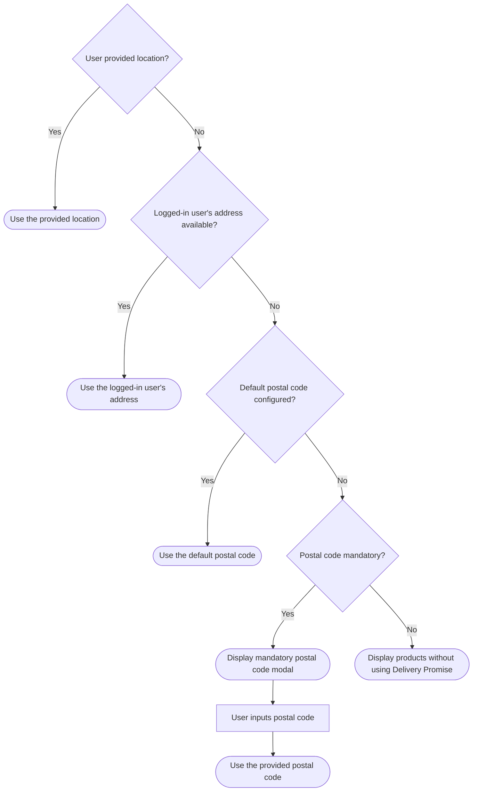

>ℹ This feature is in closed beta, available only for selected customers.

In this guide, you’ll learn how to set Delivery Promise in your FastStore project.

**Delivery Promise** is a feature that provides accurate and reliable delivery estimations for available products based on the customer location. It ensures that customers only see products that are in stock and can be delivered to their address or picked up at nearby locations.

This solution continuously updates product availability throughout the buying journey by responding to changes in catalog, pricing, inventory, or shipping settings. These updates are then sent to [Checkout](https://developers.vtex.com/docs/guides/checkout-overview) and [Intelligent Search](https://help.vtex.com/tracks/vtex-intelligent-search), ensuring customers see up-to-date options based on their region.

This feature introduces new hooks as part of the regionalization and location workflow:

- `useRegion`: Accesses or updates the user's region information, such as postal code or location.
- `useRegionModal`: Handles modal display logic for region selection, especially when the location input is required.
- `useGeoLocation`: Uses the browser’s geolocation API or other client-side methods to attempt to auto-detect the user's location.

## Default settings

Delivery Promise is defined in the `deliveryPromise` section of the [`discovery.config.js`](https://developers.vtex.com/docs/guides/faststore/project-structure-config-options) file.

Below are the default settings for FastStore projects created after the release of Delivery Promise.

```js discovery.config.js
deliveryPromise: {
    enabled: true,
    mandatory: false
  },
```

- `enabled`: When set to **true**, Delivery Promise activates, allowing the store to provide delivery estimates based on the user’s location.
- `mandatory`: When set to **false**, providing a postal code is optional for the user. Users can browse and add items to the cart without entering their postal code, though the accuracy of delivery information may be limited.

## Before you begin

<Steps>

### Get the `search-session` app

Check if you have installed the `0.5.0` or a later version of the [`search-session`](https://developers.vtex.com/docs/apps/vtex.search-session) app.

1. In your terminal, run the `vtex list` command.
2. In the retrieved results, search for the app.
3. If you don’t have this app installed, run the command `vtex install vtex.search-session`.

### Enable the VTEX Intelligent Search app

To enable the Intelligent Search app, check the version of your [Edition Store](https://developers.vtex.com/docs/guides/vtex-io-documentation-edition-app) account.

In your terminal, log in to your account by running `vtex login {accountName}` and run `vtex edition get` to see the Edition app version installed. *Remember to replace the values between curly braces with your account name*.

<details>
<summary>Accounts in the `vtex.edition-store@5.x`</summary>

If your account is using the `vtex.edition-store@5.x` major, the VTEX Intelligent Search app is already included, and you need to integrate it via VTEX Admin.

To integrate the VTEX Intelligent Search, access **Store Settings > Intelligent Search > Integrations** in the VTEX Admin, and click `START INTEGRATION`.

</details>

<details>
<summary>Accounts using an edition version below `5.x`</summary>

1. In the VTEX IO CLI, log in to your VTEX account by running `vtex login {accountName}`. *Remember to replace the values between curly braces with your account name.*
2. If the VTEX Intelligent Search app isn't installed in your account, run the following:

    ```bash
    vtex install vtex.search-resolver@1.x vtex.admin-search@1.x
    ```

After installing the app, integrate it by accessing **Store Settings > Intelligent Search > Integrations** in the VTEX Admin, and click `START INTEGRATION`.

</details>

<details>
<summary>Accounts that want to migrate to the `5.x`</summary>

If you are using a different major version and want to migrate, please [open a ticket with VTEX Support](https://help.vtex.com/en/support) and request the installation of the Edition app `vtex.edition-store@5.x`.

</details>

### Update the `@faststore/cli` package

Run the `yarn upgrade @faststore/cli` command to update the `@faststore/cli` package to its latest version.

  ### Open a ticket with VTEX Support

Open a ticket with [VTEX Support](https://help.vtex.com/en/support) and request the activation of Delivery Promise in your account.

</Steps>

## Instructions

### Step 1 - Enabling `deliveryPromise`

1. Open your FastStore project using the code editor of your choice.
2. Open the [`discovery.config.js`](https://developers.vtex.com/docs/guides/faststore/project-structure-config-options) file.
3. Under the [`deliveryPromise`](https://developers.vtex.com/docs/guides/faststore/project-structure-config-options#deliverypromise) section, set the `enabled` value to `true`. Set the `mandatory` value based on your business needs. Learn more in the [Default settings](#default-settings) section.

    ```js discovery.config.js
    deliveryPromise: {
      enabled: true,
      mandatory: false,
    }
    ```

### Step 2 - Syncing FastStore project with Headless CMS

Run the `faststore cms-sync` command to sync the `cms` folder of your FastStore project with the [Headless CMS](https://developers.vtex.com/docs/guides/faststore/headless-cms-overview).

The expected response is that you receive the message `CMS synced successfully...`. The native regionalization components and sections will be automatically updated. You can check them in the VTEX Admin:

- **Regionalization component:** Go to *Storefronts > Headless CMS > Global Sections > NavBar > Navigation > Regionalization*.

- **Region Bar section:** Go to *Storefronts > Headless CMS > Global Sections > Region Bar*.

- **Region Modal section:** Go to *Storefronts > Headless CMS > Global Sections > Region Modal*.

You only need to [add one new section](#step-3-adding-region-popover-section), the `Region Popover`.

### Step 3 - Adding `Region Popover` section

`Region Popover` is the section that manages user location inputs.

1. In the VTEX Admin, go to **Storefront > Headless CMS > Global Sections**.
2. In the Sections tab, click `+` to open a modal with a list of section options.
3. Search for the **Region Popover** section and click it to add.
4. Set the `Title` and `Close popover aria-label` fields based on your scenario.
5. Click `Save` to save your changes.
6. Click `Publish` to open a dropdown list with the options `Add to Release`, to schedule the update, and `Publish now`, to publish immediately.

Learn more in [Adding Sections to the Headless CMS](https://developers.vtex.com/docs/guides/faststore/headless-cms-3-adding-content-types-and-sections#step-3-adding-sections-to-the-headless-cms)

### Step 4 - [Optional] Defining a default postal code

The default postal code is a fallback mechanism when the user doesn't provide a location, isn't logged in, or has no saved address.

To set a default postal code for your store, follow the steps below:

1. Open your FastStore project using the code editor of your choice.
2. Open the [`discovery.config.js`](https://developers.vtex.com/docs/guides/faststore/project-structure-config-options) file.
3. In the [`session`](https://developers.vtex.com/docs/guides/faststore/project-structure-config-options#session) object, set the `postalCode` value based on your scenario. See the following example:

     ```js discovery.config.js mark=12
      session: {
        currency: {
          code: "USD",
          symbol: "$",
        },
        locale: "en-US",
        channel: '{"salesChannel":"1","regionId":""}',
        country: "USA",
        deliveryMode: null,
        addressType: null,
        city: null,
        postalCode: 10021,
        geoCoordinates: null,
        person: null,
      },
      ```

## Understanding location priority

To provide accurate Delivery Promise estimates, FastStore projects determine user location based on the following priority:

1. **User-provided location:** If the user provided their location, such as postal code, this information is used.
2. **Logged-in user’s address:** If the user hasn’t provided a postal code, we attempt to identify the location using the logged-in user's address.
3. **Default postal code:** If the user hasn't provided a location, isn’t logged in, or has no saved address, we check if the merchant has configured a default postal code for all buyers. Learn to do so in [Defining a default postal code](#step-4-optional-defining-a-default-postal-code).
4. **No postal code (not required):** If no postal code is provided and not required, products are displayed without using Delivery Promise.
5. **No postal code (required)**: If no postal code is provided when it's required, a modal is displayed that the buyer can't close until a postal code is entered. To make the postal code required, open your `discovery.config.js` file and change the `mandatory` field in the `deliveryPromise` object to `true`, as shown in the [Default settings](#default-settings) section.

To better understand how this flow works, see the following diagram.


