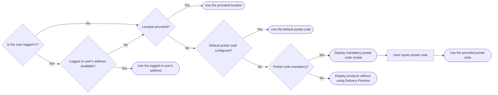

>ℹ This feature is in closed beta, meaning only selected customers can access it. If you’re interested in implementing it, please contact our [Support](https://support.vtex.com/hc/en-us) team.

**Delivery Promise** is a feature that provides accurate and reliable delivery estimates for available products based on the customer's location. It ensures that customers only see products that are in stock and can be delivered to their address or picked up at a nearby location.

This guide explains how the solution operates, covering:

* [Hooks](#hooks): Discover the hooks used to manage user location, fulfillment options, and delivery promise workflows.
* [Filter options](#filter-options): Learn how shoppers can filter products by delivery or pickup methods.
* [Location priority](#location-priority): Understand the order and logic used to determine the shopper's location for accurate delivery estimates.

## Hooks

This feature introduces the following hooks as part of the regionalization and location workflow:

* `useGeoLocation`: Uses the browser's geolocation API or other client-side methods to auto-detect the user's location when not provided.
* `useRegion`: Accesses or updates the user's region information, such as postal code or location, and manages region validation flows.
* `useRegionModal`: Handles modal display logic for region selection, especially when the location input is mandatory.
* `useDeliveryPromise`: Manages all logic for querying, displaying, and updating delivery-availability filters and states.

## Filter options

Delivery Promise offers shoppers two product filtering options:
- [Global filters](#global-filters): Applies to all store navigation.
- [Product List Page (PLP) or search page](#plp-or-search-page-filters): Only applies to the current page they're navigating.

>ℹ Learn more about filter usage and user flows in the [Delivery Promise Figma Community](https://www.figma.com/community/file/1514671929470875586) page.

### Global filters

Global filters determine the fulfillment method for all user navigation and are applied to all product search until they change or are cleared.

Shoppers can filter available products globally **by shipping** or **by store**.

* **Filter by shipping:** Allows shoppers to select between delivery and pickup as a fulfillment method.

* **Filter by store:** Allows shoppers to filter products to display only those available for pickup at a specific store. It shows all available pickup points within a 50 km pickup radius configured in Checkout. The number of pickup points displayed is unlimited.

### PLP or search page filters

In PLPs or search pages, the shopper may have the following options to filter:

* **Deliver:** Displays available products according to the shopper's location.
* **Pickup at:** Displays the store set in the global pickup point filter, or the one closest to the shopper's location. To change the store set in `Pickup at {storeName}`, the shopper may click it and select a new store in the modal that will open. It shows all available pickup points within a 50 km pickup radius configured in Checkout. The number of pickup points displayed is unlimited.
* **Pickup nearby:** Displays products available for pickup at nearby stores. It shows up to 40 pickup points within 10 km of the shopper’s location.
* **Pickup anywhere:** Displays products available for pickup at any participating store within the merchant’s network, rather than restricting results to a selected pickup location or geographic proximity. **It's mainly used by B2B stores**.

## Understanding location priority

To provide accurate Delivery Promise estimates, FastStore projects determine user location based on the following priority:

1. **Logged in user's address:** If the user is logged in and has a saved address, this information is used.
2. **User-provided location:** If the user is logged in but doesn't have a saved address, or isn’t logged in but provided their location, like a postal code, this data is used.
3. **Default postal code:** If the user hasn't provided a location, isn't logged in, or has no saved address, we check if the merchant has configured a default postal code for all buyers. Learn to do so in [Defining a default postal code](#step-4-optional-defining-a-default-postal-code).
4. **No postal code (not required):** If no postal code is provided and not required, products are displayed without using Delivery Promise.
5. **No postal code (required)**: If no postal code is provided when required, a modal is displayed that the buyer can't close until a postal code is entered. To make the postal code required, open your `discovery.config.js` file and change the `mandatory` field in the `deliveryPromise` object to `true`, as shown in the [Default settings](#default-settings) section.

To better understand how this flow works, see the following diagram:

