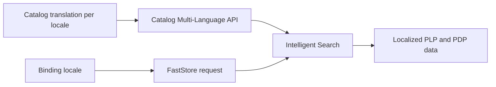

Product information is managed separately from CMS content. To translate product names, descriptions, and product-level SEO fields, use the Catalog Multi-Language API. FastStore then uses Intelligent Search to retrieve the translation that matches the current storefront locale.

> ℹ️ For an overview of CMS content, product information, commercial settings, and SEO, see [Understanding the Localization feature](https://developers.vtex.com/docs/guides/faststore/localization-feature-understanding-the-localization-feature).

## How localized product data reaches the storefront

1. Catalog users or an integration create translations for supported product fields.
2. The Catalog Multi-Language API stores each translation with its locale.
3. The storefront binding identifies the shopper's current locale.
4. FastStore includes the locale when requesting product data from Intelligent Search.
5. Intelligent Search returns localized data for Product Listing Pages (PLPs), search results, shelves, and Product Details Pages (PDPs).

## Product fields you can localize

At the product level, translations can include:

- Product name and title
- Product description
- Search and product-level SEO title
- Meta description
- Locale-specific product slug when available

The set of translatable fields and supported entities is defined by the Catalog Multi-Language API. See [Catalog Multi-Language integration guide](https://developers.vtex.com/docs/guides/catalog-multi-language-integration-guide) for the current API requirements and translation workflow.

> ⚠️ CMS translations don't change Catalog data. Translate marketing sections and page content in the CMS, and translate product attributes through the Catalog Multi-Language API.

## Prepare product translations

1. Confirm that Localization is enabled by following [Handling internationalization with the Localization feature](https://developers.vtex.com/docs/guides/faststore/localization-feature-handling-internationalization-with-the-localization-feature).
2. Configure the target locales for the account and storefront bindings.
3. Follow [Creating or updating translations for a product](https://developers.vtex.com/docs/guides/catalog-multi-language-integration-guide#creating-or-updating-translations-for-a-product) to add localized Catalog values.
4. Follow [Consuming localized content](https://developers.vtex.com/docs/guides/catalog-multi-language-integration-guide#consuming-localized-content) to prepare the Intelligent Search integration.
5. Reindex the translated Catalog data if required by the integration guide.

## Validate the storefront

For each locale, inspect a PLP and PDP and verify:

- Names and descriptions use the expected language.
- Product links lead to valid locale-specific URLs.
- Search results and shelves match the PDP data.
- Missing translations follow the configured Catalog behavior.
- Product SEO title and description use localized values where provided.

> ⚠️ Test product URLs in every locale. A product may be available in one Sales Channel but excluded from another, even when a translation exists.

## Related guides

<Flex>

  <WhatsNextCard
  title="Manage currency and availability"
  description="Understand how the binding's Sales Channel affects assortment, prices, inventory, and currency."
  linkTo="https://developers.vtex.com/docs/guides/faststore/localization-feature-managing-currency-and-product-availability"
  linkTitle="Review commercial context"
  />

  <WhatsNextCard
  title="Localize SEO metadata"
  description="Learn how translated Catalog fields and locale-specific URLs affect search metadata."
  linkTo="https://developers.vtex.com/docs/guides/faststore/localization-feature-localizing-seo-metadata"
  linkTitle="Review localized SEO"
  />

</Flex>
