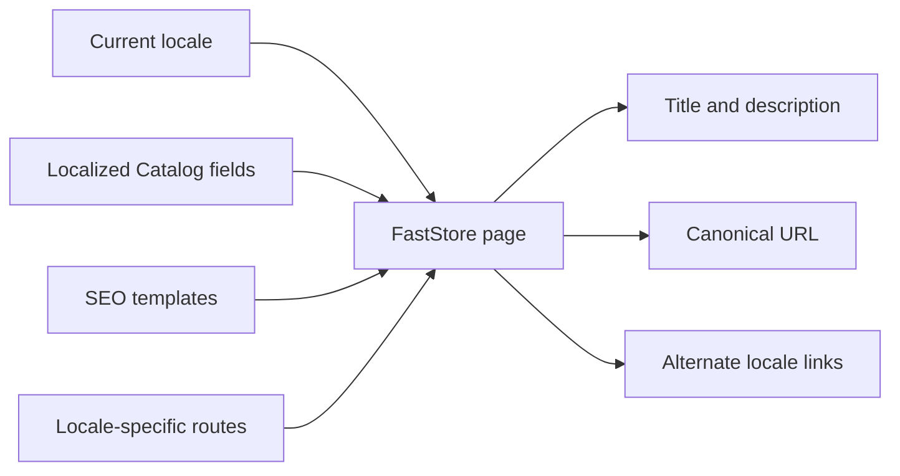

Localized SEO helps search engines identify the language and regional version of each storefront page. FastStore combines the current locale, translated Catalog data, and locale-specific URLs to generate metadata for Product Listing Pages (PLPs) and Product Details Pages (PDPs).

> ℹ️ For the complete Localization model, see [Understanding the Localization feature](https://developers.vtex.com/docs/guides/faststore/localization-feature-understanding-the-localization-feature).

## SEO data flow

FastStore uses:

- **Localized Catalog fields:** Product or category title, description, meta description, and localized slug when available.
- **SEO templates:** Fallback title and description templates from `discovery.config.js`.
- **Locale-specific routes:** The valid URL for the current locale and valid equivalents in other locales.

## Titles and descriptions

Translate product-level SEO fields through the Catalog Multi-Language API. FastStore requests these values from Intelligent Search using the current locale.

When a localized field isn't available, FastStore follows the metadata fallback behavior described in [Configuring SEO for PLPs and PDPs](https://developers.vtex.com/docs/guides/faststore/seo-configuring-seo-for-plp-and-pdp). Depending on the field, it can use other Catalog data or a template from `discovery.config.js`.

> ⚠️ A CMS page translation doesn't translate product metadata. Manage product and category SEO fields in the Catalog localization workflow.

## Canonical and alternate locale URLs

For localized product pages, FastStore generates metadata using locale-specific routes:

- The canonical URL identifies the preferred URL for the current localized page.
- Alternate locale links help search engines discover equivalent pages for other supported locales.
- FastStore includes only valid locale alternatives known for the product, preventing alternate links from pointing to unavailable pages.

Each locale-specific slug must resolve to a working page in that locale. A translation alone doesn't guarantee that the product is available in the Sales Channel associated with the locale's binding.

## Validate localized metadata

For representative PLPs and PDPs in every locale:

1. Inspect the rendered page title and meta description.
2. Confirm that the canonical URL uses the current locale's valid route.
3. Check that each alternate locale link resolves successfully.
4. Verify that translated product slugs open the correct product.
5. Confirm that unavailable products aren't advertised through alternate links.
6. Test direct navigation and locale switching without relying on browser state.

> ℹ️ Validate the rendered HTML, not only the visible page content. Titles, descriptions, canonical URLs, and alternate links are consumed primarily by search engines.

## Related guides

<Flex>

  <WhatsNextCard
  title="Configure SEO fallbacks"
  description="Define PLP and PDP title and description templates used when specific Catalog metadata isn't available."
  linkTo="https://developers.vtex.com/docs/guides/faststore/seo-configuring-seo-for-plp-and-pdp"
  linkTitle="Configure SEO"
  />

  <WhatsNextCard
  title="Localize product information"
  description="Create translated product data that Intelligent Search can return for each locale."
  linkTo="https://developers.vtex.com/docs/guides/faststore/localization-feature-localizing-product-information"
  linkTitle="Localize product data"
  />

</Flex>
