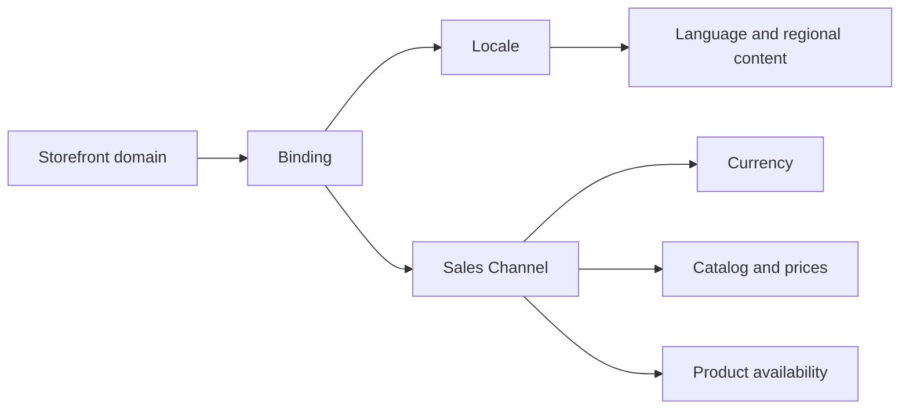

In a localized FastStore storefront, the Sales Channel associated with a binding defines the shopper's commercial context. It controls the currency and determines which catalog, prices, inventory, and trade policy conditions the storefront uses.

> ℹ️ For the complete Localization model, see [Understanding the Localization feature](https://developers.vtex.com/docs/guides/faststore/localization-feature-understanding-the-localization-feature).

## How bindings define the shopping experience

A binding connects:

- A storefront domain
- A locale, such as `en-US` or `pt-BR`
- A Sales Channel, also called a trade policy

The locale selects language and regional content. The Sales Channel selects the commercial conditions. Keeping these responsibilities separate lets a store reuse one language across markets while offering different currencies or assortments.

## What the Sales Channel controls

| Storefront element | Source |
| --- | --- |
| Currency | Sales Channel configuration |
| Product assortment | Catalog linked to the Sales Channel |
| Prices and promotions | Trade policy conditions |
| Inventory and fulfillment availability | Logistics and inventory for the commercial context |
| Language and CMS content | Locale associated with the binding |

> ⚠️ Changing only the locale doesn't convert prices. To offer another currency, associate the binding with a Sales Channel configured for that currency and commercial context.

## Example

An account can use the same FastStore project for two markets:

| Domain | Locale | Sales Channel | Shopper experience |
| --- | --- | --- | --- |
| `www.example.com/en-us` | `en-US` | 1 | English content, USD prices, US assortment |
| `www.example.com/pt-br` | `pt-BR` | 2 | Portuguese content, BRL prices, Brazil assortment |

The two storefronts can share components and fallback content while displaying different products, prices, promotions, and inventory.

## Configure the commercial context

1. Define the Sales Channel and its trade policy conditions in the VTEX platform.
2. Confirm that the intended catalog, prices, promotions, and logistics settings apply to the Sales Channel.
3. Request the binding association by following [Handling internationalization with the Localization feature](https://developers.vtex.com/docs/guides/faststore/localization-feature-handling-internationalization-with-the-localization-feature#step-2---configure-store-bindings).
4. Configure a CMS locale whose ISO code matches the binding.
5. Rebuild the FastStore project after the binding configuration changes.

## Validate each market

Open every localized storefront and confirm:

- Prices use the expected currency and formatting.
- PLPs, search, and shelves contain only products available to the Sales Channel.
- PDPs don't expose unavailable locale-specific URLs.
- Promotions and price conditions match the intended trade policy.
- Cart totals preserve the same currency and commercial context.
- Switching locales leads to an equivalent available product or a safe fallback page.

> ⚠️ Product translation and product availability are independent. A translated product is shown only when it also belongs to the Sales Channel's assortment and is available under its commercial conditions.

## Related guides

<Flex>

  <WhatsNextCard
  title="Localize product information"
  description="Translate product names, descriptions, and product-level SEO fields for each locale."
  linkTo="https://developers.vtex.com/docs/guides/faststore/localization-feature-localizing-product-information"
  linkTitle="Localize Catalog data"
  />

  <WhatsNextCard
  title="Configure locales"
  description="Create CMS locales and connect their ISO codes to the corresponding storefront bindings."
  linkTo="https://help.vtex.com/docs/tutorials/configuring-locales"
  linkTitle="Configure CMS locales"
  />

</Flex>
