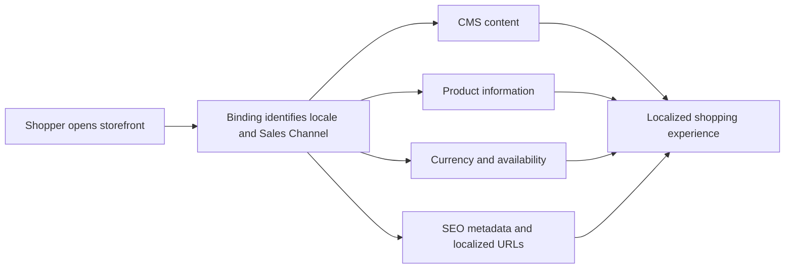

> ⚠️ Localization is currently in Closed Beta and requires FastStore v4 and the CMS. To request access, contact the [VTEX Support team](https://support.vtex.com/hc/en-us).

Localization helps a single FastStore project serve shoppers in different languages and regions. It coordinates content, catalog data, commercial settings, and search metadata so that each shopper receives a consistent experience for the locale associated with the storefront they visit.

This guide introduces the four pillars of Localization and directs you to the documentation for planning and implementing each one.

> ℹ️ This page explains the concepts and scope of Localization. To enable the feature, configure bindings, update your FastStore project, and test your locales, follow [Handling internationalization with the Localization feature](https://developers.vtex.com/docs/guides/faststore/localization-feature-handling-internationalization-with-the-localization-feature), the main implementation guide.

## How Localization works

When a shopper opens a localized storefront, the domain binding identifies the locale and Sales Channel. FastStore uses this context across the experience:

> ℹ️ A locale represents a language and region, such as `en-US` or `pt-BR`. A binding connects a storefront domain to a locale and a Sales Channel.

The [implementation guide](https://developers.vtex.com/docs/guides/faststore/localization-feature-handling-internationalization-with-the-localization-feature) explains how to configure this flow in WebOps, FastStore, the CMS, and your local environment.

## Explore the four pillars

<Flex>

  <WhatsNextCard
  title="1. CMS content"
  description="Create localized page content and define fallback rules so shoppers always receive relevant content."
  linkTo="#cms-content"
  linkTitle="Explore CMS content"
  />

  <WhatsNextCard
  title="2. Product information"
  description="Translate product names, descriptions, and product-level SEO fields through the Catalog Multi-Language API."
  linkTo="https://developers.vtex.com/docs/guides/faststore/localization-feature-localizing-product-information"
  linkTitle="Explore product information"
  />

  <WhatsNextCard
  title="3. Currency and availability"
  description="Use Sales Channels to control the currency, catalog scope, prices, and available products for each binding."
  linkTo="https://developers.vtex.com/docs/guides/faststore/localization-feature-managing-currency-and-product-availability"
  linkTitle="Explore commercial settings"
  />

  <WhatsNextCard
  title="4. SEO"
  description="Serve localized metadata, canonical URLs, and alternate links so search engines understand every locale."
  linkTo="https://developers.vtex.com/docs/guides/faststore/localization-feature-localizing-seo-metadata"
  linkTitle="Explore localized SEO"
  />

</Flex>

### CMS content

The CMS stores localized versions of page and section content. Each locale can provide its own values, while fallback rules reuse content from another locale when a translated field is empty. This lets content teams localize only what needs to change instead of duplicating entire pages.

Use the CMS guides to complete this pillar:

- [Configuring locales](https://help.vtex.com/docs/tutorials/configuring-locales): Create locales, choose the default locale, and connect locale codes to storefront bindings.
- [Understanding locale fallback rules](https://help.vtex.com/docs/tutorials/understanding-locale-fallback-rules): Choose a fallback strategy for shared content and regional variations.
- [Localizing content](https://help.vtex.com/docs/tutorials/localizing-content): Edit and translate CMS fields for one or more locales.

### Product information

Product information belongs to the Catalog, not the CMS. The Catalog Multi-Language API stores localized product data, including names, descriptions, and product-level SEO fields. FastStore sends the current locale to Intelligent Search, which returns the matching catalog translation.

[Learn how product localization works](https://developers.vtex.com/docs/guides/faststore/localization-feature-localizing-product-information).

### Currency and product availability

The binding's Sales Channel defines the commercial context for a localized storefront. It determines which currency, catalog assortment, prices, inventory, and trade policy conditions shoppers receive. Two locales can therefore show different products or currencies even when they use the same FastStore project.

[Learn how Sales Channels affect currency and product availability](https://developers.vtex.com/docs/guides/faststore/localization-feature-managing-currency-and-product-availability).

### SEO

Localized SEO combines translated catalog fields with locale-specific URLs. FastStore uses the current locale when generating titles and descriptions, and exposes canonical and alternate locale URLs to help search engines index the correct version of each page.

[Learn how FastStore localizes SEO metadata](https://developers.vtex.com/docs/guides/faststore/localization-feature-localizing-seo-metadata).

## Plan your implementation

Localization works as a system. Before publishing a new locale, confirm that every layer is ready:

1. Complete [Handling internationalization with the Localization feature](https://developers.vtex.com/docs/guides/faststore/localization-feature-handling-internationalization-with-the-localization-feature) to enable Localization and configure the project and bindings.
2. Configure the locale and fallback behavior in the CMS.
3. Translate the required catalog and CMS content.
4. Validate currency, assortment, pricing, inventory, and localized URLs.
5. Review metadata, canonical URLs, and alternate locale links.

> ⚠️ Avoid treating locale and currency as interchangeable. The locale controls language and regional content, while the Sales Channel associated with the binding controls the currency and commercial context.

## Next steps

<Flex>

  <WhatsNextCard
  title="Handling internationalization with Localization"
  description="Follow the main implementation guide to prepare your account and FastStore project, configure bindings, enable the feature, and test it locally."
  linkTo="https://developers.vtex.com/docs/guides/faststore/localization-feature-handling-internationalization-with-the-localization-feature"
  linkTitle="Open the implementation guide"
  />

  <WhatsNextCard
  title="Configure CMS locales"
  description="Create the locales that content teams will use and choose the default and fallback settings."
  linkTo="https://help.vtex.com/docs/tutorials/configuring-locales"
  linkTitle="Configure locales"
  />

</Flex>
