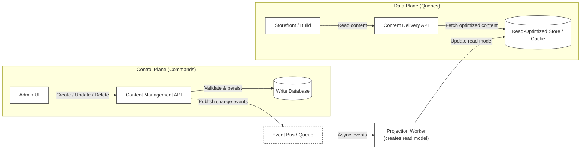

The CMS is built on the **CQRS (Command Query Responsibility Segregation)** architectural pattern, which separates read operations (queries) from write operations (commands) into different models or services. Instead of using a single API and database for both reading and writing data, CQRS uses specialized systems for each:

- **Command side (Control Plane)**: Handles all write operations by creating, updating, and deleting content. Optimized for data validation, business logic, and consistency.  
- **Query side (Data Plane)**: Handles all read operations by fetching content for display. Optimized for fast retrieval and caching.

With CQRS, content editors get a responsive editing experience while your store gets fast content delivery, without either affecting the other, covering the following aspects:

- **Performance under load**: Read and write operations scale independently.  
- **Optimization trade-offs**: Each plane is optimized for its specific purpose.  
- **Reliability**: Failures in one plane don't affect the other.  
- **Technology choices**: Best technology for each plane's requirements.

The following diagram shows the three main components of the CMS architecture:  



Each component in the architecture serves a specific purpose:

## Control Plane (Content Management)

The Control Plane handles all content authoring and management operations and has the key operations:

- Create, update, and delete content entries.  
- Manage branches and commits.  
- Preview content before publishing.  
- Merge branches to publish content.

| Component | Purpose |
| :---- | :---- |
| **CMS interface (Admin UI)** | Visual interface for content editors to create, edit, and publish content. |
| **Control Plane API** | RESTful API for content management operations (CRUD, branching, merging). |
| **Database** | Stores content entries, branches, commits, and user data. |
| **Message Bus** | Publishes events when content is published (triggers builds, syncs to Data Plane). |

## Data Plane (Content Delivery)

The Data Plane is optimized for high-performance content delivery to storefronts and has the key characteristics:

- **Read-only**: Only serves published content, no write operations.  
- **ETag caching**: Supports efficient cache validation.  
- **Slug-based lookups**: Retrieve content by URL path.  
- **Context filtering**: Filter content by locale or other contexts.

| Component | Purpose |
| :---- | :---- |
| **Data Plane API** | Read-only RESTful API optimized for fast content retrieval. |
| **Database** | Stores published content in a format optimized for queries. |

## Schema Registry

The Schema Registry manages component schemas and Content Type definitions and has the key operations:

- Upload and store schema bundles.  
- Validate content against schemas.  
- Provide schema definitions to CMS interface for form rendering.

| Component | Purpose |
| :---- | :---- |
| **CLI Plugin** | Command-line tool for generating and uploading schemas. |
| **Registry API** | Stores and serves schema definitions. |
| **Schema Store** | Persists schema versions and metadata. |

## Content data management through the architecture

1. **Schema upload** (development time):  
     
   - Developer runs `vtex content upload-schema`.  
   - CLI sends schema to Schema Registry API.  
   - Schema is stored and made available to Control Plane and Data Plane.

   

2. **Content editing** (authoring time):  
     
   - Editor creates/edits content in the CMS Admin interface.  
   - CMS interface (Admin UI) calls Control Plane API.  
   - Content is saved to Control Plane database.  
   - Changes are isolated on a branch until merged.

   

3. **Content publishing** (publish time):  
     
   - Editor merges branch to main.  
   - Control Plane publishes `BranchMerged` event.  
   - Event triggers sync to Data Plane and build webhook.

   

4. **Content delivery** (runtime):  
     
   - FastStore build fetches content from Data Plane API.  
   - Data Plane returns published content with ETag headers.  
   - Content is rendered into static pages.

## Schema declarations

Schemas define the structure of content in the CMS. They specify which fields a section exposes, the data types those fields accept, and the validation rules that apply.

When a content editor creates or edits content in the CMS interface in the Admin, schemas are used to:

- **Render the editing form**: Each field in the schema becomes an input field in the interface.  
- **Validate content**: Ensure required fields are filled, and data types are correct.  
- **Define relationships**: Schemas determine which sections can be used within specific Content Types.

Both the Headless CMS and the CMS rely on [JSON Schema](https://json-schema.org/) to define schemas. However, they differ in how schemas are organized, authored, and deployed.

### Schema declarations between CMS and Headless CMS

The table below summarizes the key differences between schema declarations in the Headless CMS and the CMS:

| Aspect | Headless CMS | CMS |
| :---- | :---- | :---- |
| **File organization** | Single `sections.json` file. | Individual `.jsonc` files per component. |
| **Section identifier** | `name` field. | `$componentKey` field. |
| **Display name** | `schema.title` | `$componentTitle` field. |
| **Inheritance** | Not supported. | `$extends` for schema inheritance. |
| **Base component** | N/A | Extends `#/$defs/base-component`. |
| **Image widget** | `"ui:widget": "image-uploader"` | `"ui:widget": "media-gallery"` |
| **File extension** | `.json` | `json` or `.jsonc` |
| **Deployment** | Synced via `vtex cms sync`. | Uploaded via `vtex content upload-schema`. |

### Schema format comparison

To understand the practical differences, let's compare how the same Banner component is defined in the CMS and the Headless CMS.

#### Headless CMS format

In the Headless CMS, all sections are defined in a single `sections.json` file. Each section has a `name` and a nested `schema` object.

- All components are defined in a single array within one file.  
- Component identified by the `name` field.  
- Display name comes from `schema.title`.  
- No inheritance between components.

```json
// sections.json (single file with all sections)
[
  {
    "name": "Banner",
    "schema": {
      "title": "Banner",
      "description": "A banner component for the storefront",
      "type": "object",
      "required": ["title"],
      "properties": {
        "title": {
          "title": "Title",
          "type": "string"
        },
        "image": {
          "type": "object",
          "title": "Image",
          "properties": {
            "src": {
              "type": "string",
              "title": "Image",
              "widget": {
                "ui:widget": "image-uploader"
              }
            },
            "alt": {
              "type": "string",
              "title": "Alternative Label"
            }
          }
        }
      }
    }
  }
  // ... all other sections in the same file
]
```

#### CMS schema format

In the CMS, each component is defined in its own `.jsonc` file. The schema is flatter and includes additional metadata fields for identification, display, and inheritance.

- Each component in its own file (`cms_component__ComponentName.jsonc`).  
- Component identified by `$componentKey` field.  
- Display name specified by `$componentTitle`.  
- Inherits from base schema via `$extends`.

```jsonc
// cms/components/cms_component__Banner.jsonc
{
  "$extends": ["#/$defs/base-component"],
  "$componentKey": "Banner",
  "$componentTitle": "Banner",
  "type": "object",
  "required": ["title"],
  "properties": {
    "title": {
      "title": "Title",
      "type": "string"
    },
    "image": {
      "type": "object",
      "title": "Image",
      "properties": {
        "src": {
          "type": "string",
          "title": "Image",
          "widget": {
            "ui:widget": "media-gallery"
          }
        },
        "alt": {
          "type": "string",
          "title": "Alternative Label"
        }
      }
    }
  }
}
```

### CMS schema keywords

The CMS introduces additional schema keywords for a more modular, reusable, and maintainable schema definition.

| Keyword | Purpose | Example |
| :---- | :---- | :---- |
| `$extends` | Inherit properties from base schemas. | `"$extends": ["#/$defs/base-component"]` |
| `$componentKey` | Unique identifier for the component. | `"$componentKey": "Banner"` |
| `$componentTitle` | Display name shown in CMS interface. | `"$componentTitle": "Promotional Banner"` |
| `$ref` | Reference another schema definition. | `"$ref": "#/components/SEO"` |

#### Schema inheritance with `$extends`

The `$extends` property allows sections to inherit properties from one or more base schemas, promoting code reuse and consistency. Schema inheritance provides benefits for content modeling, including:

- **Consistency** through a shared base structure across components.  
- **Maintainability** by propagating changes from base schemas.  
- **Reusability** via domain-specific base schemas (for example, promotional or navigational components).  
- **Type safety** through schema-compatibility validation.

**Example: Inheriting from multiple schemas**

```jsonc
{
  "$extends": [
    "#/$defs/base-component",
    "#/components/PromoBase"
  ],
  "$componentKey": "PromoBanner",
  "$componentTitle": "Promotional Banner",
  "properties": {
    // Inherits: id, name, description, data (from base-component)
    // Inherits: startDate, endDate (from PromoBase)
    "discountPercentage": {
      "title": "Discount Percentage",
      "type": "number"
    }
  }
}
```

## Folder structure

The CMS introduces a modular folder structure that aligns with modern development practices. Instead of consolidating all schemas into a single file, the new structure separates components and Content Types into individual files, making it easier to manage, review, and version-control your content definitions.

The shift from monolithic files, as in the Headless CMS, to individual files addresses the following issues:

- **Version control conflicts**: With a single `sections.json` file, multiple developers editing different components often caused merge conflicts. Individual files mean each component can be edited independently.  
- **Code review clarity**: Reviewing changes to a single component is straightforward when each component has its own file, rather than searching through a large JSON array.  
- **Maintainability**: Finding and updating a specific component is faster when you can navigate directly to `cms_component__Banner.jsonc` instead of scrolling through hundreds of lines in `sections.json`.  
- **Comments and documentation**: The `.jsonc` format allows inline comments, enabling developers to document schema decisions directly in the file.

### Headless CMS folder structure

In the Headless CMS, all schema definitions are consolidated into two main files within a subdirectory, for example, `faststore`:

```sh
your-faststore-project/
├── cms/
│   └── faststore/
│       ├── sections.json       # All component schemas in one file
│       └── content-types.json  # All Content Type definitions
├── src/
│   └── components/
│       ├── Banner/
│       │   └── Banner.tsx
│       └── ProductShelf/
│           └── ProductShelf.tsx
└── ...
```

### CMS folder structure

The CMS organizes schemas into individual files. Below are two common approaches:

**Option 1: Centralized schemas**

Keep component schemas in a dedicated `cms/components/` directory:

```
your-faststore-project/
├── cms/
│   ├── components/                              # Individual component schemas
│   │   ├── cms_component__Banner.jsonc
│   │   ├── cms_component__MegaMenu.jsonc
│   │   ├── cms_component__ProductShelf.jsonc
│   │   └── cms_component__RecommendationShelf.jsonc
│   └── pages/                                   # Content type definitions
│       ├── cms_content_type__landingPage.jsonc
│       ├── cms_content_type__home.jsonc
│       └── cms_content_type__pdp.jsonc
├── src/
│   └── components/
│       ├── Banner/
│       │   └── Banner.tsx
│       └── ProductShelf/
│           └── ProductShelf.tsx
└── ...
```

**Option 2: Co-located schemas**

Place component schemas alongside their implementation files:

```
your-faststore-project/
├── cms/
│   └── pages/                                   # Content type definitions
│       ├── cms_content_type__landingPage.jsonc
│       ├── cms_content_type__home.jsonc
│       └── cms_content_type__pdp.jsonc
├── src/
│   └── components/
│       ├── Banner/
│       │   ├── Banner.tsx
│       │   └── cms_component__Banner.jsonc      # Schema co-located with component
│       └── ProductShelf/
│           ├── ProductShelf.tsx
│           └── cms_component__ProductShelf.jsonc # Schema co-located with component
└── ...
```

#### File naming conventions

The CMS uses a consistent naming pattern that makes file purposes immediately clear:

| Item | Headless CMS | CMS |
|------|------|---------|
| **Component schemas** | All in `sections.json` | `cms_component__ComponentName.jsonc` |
| **Content types** | All in `content-types.json` | `cms_content_type__typeName.jsonc` |
| **File extension** | `.json` | `.jsonc` (allows comments) |
| **Location** | `cms/faststore/` | `cms/components/` and `cms/pages/`, or co-located with component code |
