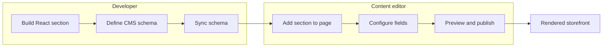

> ⚠️ This guide applies to stores using the [CMS](https://developers.vtex.com/docs/guides/cms-for-faststore-storefronts). If your store still runs on [Headless CMS (legacy)](https://developers.vtex.com/docs/guides/faststore/headless-cms-legacy), refer to [Creating a new section (Headless CMS (legacy))](https://developers.vtex.com/docs/guides/faststore/headless-cms-creating-a-new-section-legacy) instead.

When FastStore's native sections do not meet your storefront requirements, you can build a custom React section and expose its properties as editable fields in the [VTEX CMS](https://developers.vtex.com/docs/guides/cms-for-faststore-storefronts).

In this workflow, developers build and register the section, define its CMS schema, and sync it with the CMS. Content editors then add the section to a page and configure its fields in the VTEX Admin, and developers preview the result in the local storefront.

## When to create a new section

Create a new section when you need a custom structure or behavior that is not available in FastStore's native sections.

Depending on your goal, you may need a different customization approach:

| Goal | Customization method |
| --- | --- |
| Configure the properties of an existing section | The section editor in the CMS |
| Build a new editable storefront block | A custom section, as described in this guide |
| Change the visual appearance of the storefront | [Themes and design tokens](https://developers.vtex.com/docs/guides/faststore/styling-a-component) |
| Add new data to existing FastStore API queries | [API extensions](https://developers.vtex.com/docs/guides/faststore/api-extensions) |

## CMS integration workflow

The section's React implementation and CMS schema work together. Developers prepare the section and its schema, and content editors use the synced section in the CMS:

- The React component defines what the section renders.
- The JSONC schema defines the fields that content editors can complete in the CMS.
- The CMS makes the section available in the section picker after the schema is synced.
- A content editor adds the section to a page and configures its fields.
- FastStore renders the configured section in the storefront.

The table below summarizes each role's responsibilities in this workflow:

| Developer | Content editor |
| --- | --- |
| Build the React section | Add the section to a page |
| Register the component in the project | Complete the section's fields in the Admin |
| Define the CMS schema | Preview and save the content |
| Generate and sync the schema | Publish the page through the CMS workflow |

## Before you start

Make sure that:

- Your FastStore project is connected to the [CMS](https://developers.vtex.com/docs/guides/cms-for-faststore-storefronts).
- The [Content plugin](https://developers.vtex.com/docs/guides/content-plugin) is installed and available in your development environment.
- You understand the relationship between [components and sections](https://developers.vtex.com/docs/guides/faststore/understanding-components-and-sections).
- You can run the FastStore storefront locally. For setup instructions, see [Setting up your development environment](https://developers.vtex.com/docs/guides/faststore/setting-up-your-environment).

## Next step

Follow [Creating a new section in the CMS](https://developers.vtex.com/docs/guides/creating-a-new-section) for a complete implementation using a `CallToAction` example.