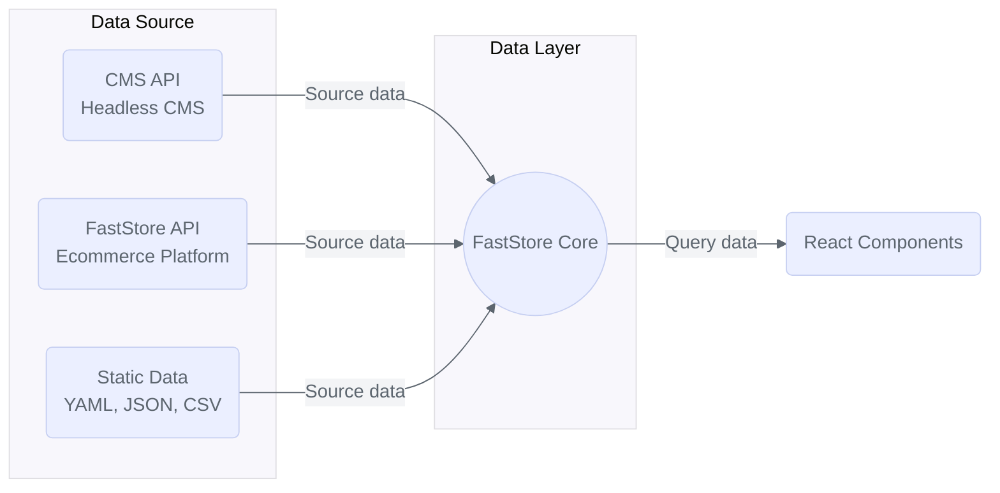

FastStore API is an interface between your ecommerce platform and your store's frontend. It uses **[GraphQL](https://graphql.org/)**, a query language for APIs and a runtime for fulfilling queries, to deliver structured data from everyday ecommerce tasks to frontend components.

The FastStore API allows you to obtain all the information you need for a given page, and customize your query to get exactly the data you need. With the FastStore API, you can:

- Retrieve product information.
- Add items to the cart.
- Apply promotions to products.
- Filter search results.

Also, thanks to a type-safe GraphQL protocol, the FastStore API allows developers to retrieve only the strongly typed data needed for building robust and responsive solutions. 
In practice, developers can integrate the FastStore API with the [Next.js](https://nextjs.org/) data layers and consume it on frontend components to create stores.

> ℹ️ To learn more about GraphQL and its main concepts, visit the official [GraphQL website](https://graphql.org/).

## Going beyond

For advanced use cases, it is also possible to use the [API extension](https://developers.vtex.com/docs/guides/faststore/api-extensions-overview) feature to enhance your GraphQL schema, accommodating custom data requirements and retrieving data not natively available. Following these best practices helps to maintain your site's performance at optimal levels.

- **[Extending API schemas](https://developers.vtex.com/docs/guides/faststore/api-extensions-extending-api-schema):** Extend VTEX and third-party APIs to customize how your store manages and processes data.

- **[Extending queries using fragments](https://developers.vtex.com/docs/guides/faststore/api-extensions-extending-queries-using-fragments):** Extend GraphQL queries using fragments in FastStore API extension to add custom fields to predefined queries.

- **[Consuming FastStore API extension with custom components](https://developers.vtex.com/docs/guides/faststore/api-extensions-consuming-api-extensions):** Consume FastStore API extension data with custom components, such as [Sections](https://developers.vtex.com/docs/guides/faststore/building-sections-creating-a-new-section) and [Override components](https://developers.vtex.com/docs/guides/faststore/building-sections-overriding-components-and-props#override-native-components-props).

