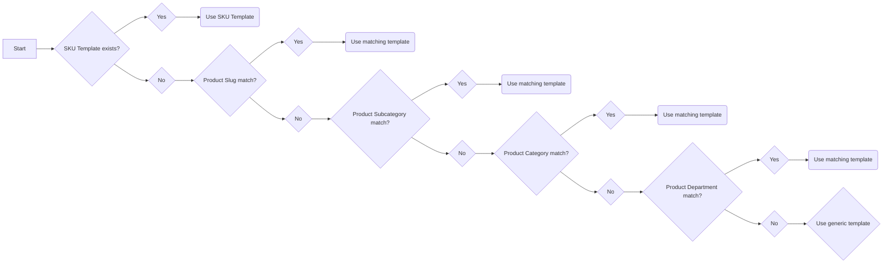

Multiple page templates allow the creation of flexible layouts for Product Details and Product Listing Pages (PDPs and PLPs) in Headless CMS. This feature allows you to create and manage pages hierarchically, leveraging product information, user context, product type, brand specifications, and template hierarchy.

This document outlines the implementation details, usage instructions, and template hierarchy logic for integrating the templates into your FastStore project.

## Before you begin

To benefit from this feature, update your FastStore project to `v3.0.17` or higher. To do this, follow these steps:

1. Open your project in a code editor.

2. Open a terminal and run the following command to update the FastStore packages to the latest version:

  ```bash
  yarn upgrade -L --scope @faststore
  ```

3. Run `yarn dev` to apply the changes to your project.

## Creating a multiple page template

To add multiple templates to your FastStore project, follow the steps below:

1. Go to the VTEX Admin and navigate to **Storefront > Headless CMS**.
2. Select your FastStore project.
3. Click `Create Document` and choose between `Product Page` and `Product List Page`.
4. Now that you have created the template, check the [Template hierarchy logic] section to learn how to use and edit the template.

> ℹ️ Check the [Managing pages in the Headless CMS](https://help.vtex.com/tutorial/managing-pages--3DO6rBhZ1p3zndnFu5BgRt) guide to learn how to edit the name, publish, duplicate, or delete the template.

## Template hierarchy logic

Both PDPs and PLPs use a similar logic for selecting the appropriate template to render. This logic prioritizes templates based on various criteria, starting with the most specific and moving to more generic templates, like department or generic PDP/PLP.

Here's the difference between Product Details and Product Listing Page template hierarchy:

| Feature                         | PDP hierarchy logic                                            | PLP hierarchy logic                                        |
| ------------------------------- | -------------------------------------------------------------- | ---------------------------------------------------------- |
| Matching Criteria               | Slug, Subcategory, Category, Department, Generic.              | Slug (subcategory, category, department implied), Generic. |
| Reliance on Product Information | Considers product details (subcategory, category, department). | Ignores product details beyond the slug.                   |

### Product Details Page (PDP) template selection criteria

The template selection process follows a specific hierarchy, starting with the most specific template and progressing towards a generic one if no exact match is found.

FastStore checks for templates in the following order:



The system first searches for a template named after the product slug. For example, if the product slug is `/blue-shirts/p`, FastStore will look for a template named `/blue-shirts/p`.

1. If an SKU template is available, it takes precedence over the product template. For example, if a template is available for slugs containing the SKU ID (e.g., `/blue-shirts-99988212/p`), this template will take precedence over a more generic product template for `/blue-shirts/p`.
2. If no SKU template is available, the system searches for one template based on the product slug.
3. If no template matches the slug, FastStore searches for a template based on the product subcategory. For example, if the subcategory is `summer clothing`, the system might look for `/clothing/shirts/summer-clothing/`.
4. Following the subcategory, the system checks for a template matching the product category. For example, if the category is `shirts`, the system might look for `/clothing/shirts/`.
5. If no match is found at the category level, FastStore searches for a template based on the product department. For example, if the department is `clothing`, the system might look for `/clothing/`.
6. If none of the above criteria match, the generic Product Page template is used. This template has an empty Template section value in the settings.


### Product Listing Page (PLP) template selection criteria

PLP templates are selected in FastStore based on URL slug matching. Templates defined at a department (e.g., `/office`) are always inherited by all subcategories (e.g., `/office/chairs`, `/office/desks`), unless a more specific template exists for that subcategory.

The PLP template selection process follows this order:

1. FastStore system first checks for a template that matches the exact requested slug, such as `/office/chairs`. If a match is found, this template is used.
2. If no exact slug match exists, the system checks for a template matching the main department template slug (e.g., `/office` applies to `/office/chairs`). If a department template is found, it applies to all subcategory under that department by default. (e.g., `/office/chairs`, `/office/desks`).
3. If no department or category template matches, the generic PLP template with an empty template value in Headless CMS is applied.
4. If no template is found at any of these levels, the system uses the first available PLP template.

For example, suppose you define the following in Headless CMS:

- Template value `/computers`: applies to both `/computers` and any slug under it unless overridden.
- Template value `/computers/accessories`: applies only to `/computers/tools`.
- Template value left empty: default template used if neither previous options match.

Resulting behavior:

- Visiting `/computers` uses the department template.
- Visiting `/computers/accessories` uses the category template.
- Visiting `/computers/laptop` (with no template defined for it) inherits the `/computers` template.
- Any slug not matched by the above uses the generic PLP template. 

The table below summaries the template selection logic:

| URL slug         | Template Defined For | Applied Template                                   | 
| ---------------- | -------------------- | -------------------------------------------------- |
| `/computers`        | `/computers`            | Department template (exact match).                 |
| `/computers/laptops` | None                 | Inherits `/computers` (falls back to department).     |
| `/computers/accessories` | `/computers/accessories`     | Category template (overrides main department template). |
| `/unknown-slug`  | None                 | Default template	(no matches, uses fallback).     |

#### Using Rewrites with PLP template

FastStore allows you to create custom routes using [Next.js rewrites](https://nextjs.org/docs/app/api-reference/next-config-js/rewrites). It is possible to enable the multiple page template feature for the custom route as well by adding your rewrites function into the `discovery.config.js` file as suggested in the [Next.js documentation](https://nextjs.org/docs/app/api-reference/next-config-js/rewrites):

1. Add your rewrite function to discovery.config.js:

```js
async rewrites() {
  return [
    {
      source: '/my-office',
      destination: `/office`,
    },
  ]
},
```

This rewrites the URL `/my-office` to the existing route `/office`, effectively using the `/office` template without modifying the displayed URL. This allows you to map the template in the Headless CMS to the `/office` route.

2. Alternatively, use the extended format:

```js
async rewrites() {
  return {
    beforeFiles: [
      {
        source: '/my-office',
        destination: `/office`,
      },
    ],
    afterFiles: [],
    fallback: [],
  }
},
```

This format offers more flexibility for advanced rewrite scenarios.

From version `3.0.61` of the `@faststore/core` package, it's also possible to use the `source` route in the Headless CMS to map the template. To update your store's `@faststore/core` package to the `3.0.61`, run the following command:


```bash
yarn add @faststore/core@3.0.61
```

### Main difference between PDP and PLP template selection criteria

To sum up, here's the difference between the two template hierarchies:

| Feature                         | PDP Hierarchy logic                                            | PLP Hierarchy logic                                        |
| ------------------------------- | -------------------------------------------------------------- | ---------------------------------------------------------- |
| Matching Criteria               | Slug, Subcategory, Category, Department, Generic.              | Slug, fallback to main department, generic/default, fallback. |
| Reliance on Product Information | Considers product details (subcategory, category, department). | Ignores product details and uses URL slug only.           |

## Examples

In this section, we'll delve into different scenarios for selecting PDP and PLP templates.

### PDP template selection example

For this example, we will explore three template scenarios to render in Headless CMS for the Apple Magic Mouse product:

- [Slug](#rendering-within-a-slug): Matches the product slug, e.g., `/apple-magic-mouse/p`. It offers the highest level of specificity.
- [Department](#rendering-within-a-department): Applies to products within a specific department category, such as `/technology/`, if no slug template is defined.
- [Generic Product Page Template](#rendering-the-generic-product-page-template): Fallback template used if no other specific template matches.

#### Rendering within a slug

When using PDPs, this type of page template is recognized by the slug pattern. In the example, we will use the [Apple Magic Mouse product page](https://starter.vtex.app/apple-magic-mouse/p), which has the slug `/apple-magic-mouse/p`.


Adding the slug to this template makes it specific, prompting FastStore to prioritize it for rendering on the product page.

#### Rendering within a `department`

Products in [catalog](https://help.vtex.com/en/tutorial/catalog-overview--77M8ItLhDXs6aBdQTqToVe) fall under a [category tree](https://help.vtex.com/en/tutorial/what-is-a-category--6HV4Q3E2FauUoOQoiCCgCg), typically `/department/category/subcategory/`. For example, the product we’ve been using is in the `Technology department`, allowing you to create a department-specific template.


If this product is under a [subcategory](https://help.vtex.com/en/tutorial/what-is-a-subcategory--2cb0aRkG3i6AeiAMM24iwY?&utm_source=autocomplete), you can create a corresponding template. The category tree is used in the template input, separated by slashes.


You can also see the category hierarchy through the breadcrumb.


#### Rendering the generic Product Page template

If no matches are found for the slug or department, the generic template will be used to render the PDP. In this case, create a Headless CMS document with the `Product Page` option, leaving the **Template** field empty in the **Sections** tab.


### Product Listing Page (PLP) template selection example

For PLPs, we will go over the following possible templates:

- [Slug](#rendering-within-slugs)
- [Product Listing Page generic template](#rendering-the-generic-product-listing-page).

When using PLPs, this type of page template is recognized by the slug pattern. In the example, we will use the [office/chairs slug](https://starter.vtex.app/office/chairs) to render the PLP template.

#### Rendering within slugs

Products in the catalog are organized within a category tree, structured as `/department/category/subcategory`. If a slug template exists for any of these options, it will be rendered accordingly.

For example, if you want to render a specific template for products inside a [department](https://help.vtex.com/en/tutorial/what-is-a-department--22rKjmYWVmmKAK8CWa8yKw?&utm_source=autocomplete) without considering the category or subcategory, you can create a Department template [/office](https://starter.vtex.app/office/chairs).


If this product were under a `subcategory`, it would still be possible to create a template representing this scenario. The category tree is used in the template slug input, as in the image below.


> ⚠️ Keep in mind that if a more specific template, such as `/office/chairs`, exists, it will take precedence when the slug matches the same pattern.

#### Rendering the generic Product Listing Page

If no matches are found for the slug, the generic template will be used to render the PLP. In this case, create a Headless CMS page with the `Product List Page` option, leaving the Template field empty in the **Sections** tab.


