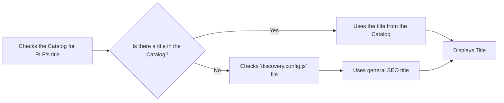
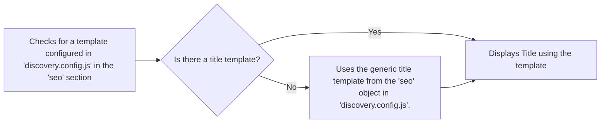
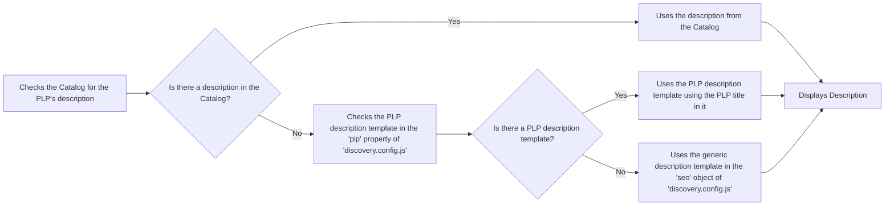

By default, FastStore improves performance by wrapping store sections in `LazyLoadingSection` and `ViewportObserver` components. These components delay loading non-essential sections until needed, such as when a user scrolls near them. This approach reduces initial page load times and improves user experience, particularly on slower networks or devices.

While lazy loading improves performance, it can harm SEO. Search engine crawlers often do not execute JavaScript or wait for dynamically loaded content. As a result, critical sections like product grids on category pages may not be indexed. For instance, if a user accesses the "gym clothes" collection, its product listing might not appear in search results if it's not included in the initial HTML.

In this guide, learn how to optimize SEO by controlling lazy loading for sections in FastStore.

## Before you begin

Make sure the `@faststore/cli` package is updated to the latest version. If you need to update it, follow the instructions on [Updating the '@fastore/cli' package version](https://developers.vtex.com/docs/guides/faststore/project-structure-updating-the-cli-package-version).

## Understand how SEO metadata is determined

FastStore follows a specific priority order when generating SEO metadata for PLP pages:

<details>
<summary>Title</summary>



</details>

<details>
<summary>Title template</summary>



</details>

<details>
<summary>Description template</summary>



</details>

## Instructions

### Step 1: Configuring SEO for Product Listing Pages (PLP)

Configure the title and description templates for product listing pages (PLP) in the [`discovery.config.js`](https://developers.vtex.com/docs/guides/faststore/project-structure-config-options) file to optimize your store's SEO. These templates allow you to dynamically generate metadata based on the type of PLP, such as collections, categories, subcategories, or brands: 

- Title template: This template will be applied to all PLPs, including collections, categories, subcategories, and brands.
- Description template: This template is used for `collections`, as descriptions for `collections` are not configured in the Catalog. If a specific description isn't configured in the Catalog for a category, subcategory, or brand, this template will be used as a fallback.

To understand the order to generate the SEO metadata for PLPs, see the [Understand how SEO metadata is determined](#understand-how-seo-metadata-is-determined) section.

1. Open your FastStore project in a code editor of your preference.
2. Go to the `discovey.config.js` file and in the `seo` section add the following:

  ```discovery.config.js
  seo: {
    plp: {
      titleTemplate: '%s | FastStore PLP',
      descriptionTemplate: '%s products on FastStore Product Listing Page',
    },
  },
  ```

  > ⚠ Change the values in `titleTemplate` and `descriptionTemplate` according to your needs. The `%s` should be used where you would like the PLP title/name to appear. 

### Step 2: Controlling lazy loading for custom sections

By default, FastStore lazy-loads sections for performance optimization. However, certain custom sections (e.g., those containing H1 headers) may need to appear in the initial HTML for SEO purposes. To ensure these sections are included in the initial HTML, you can configure them to skip lazy loading.

Below are the steps to disable lazy loading for a custom section. In this example, we’ll use a custom section named `CustomPLPName`. If you haven’t created a custom section yet, refer to the [Creating a new section](https://developers.vtex.com/docs/guides/faststore/building-sections-creating-a-new-section) guide.

1. Open the `cms/faststore/sections.json` file in your project.
2. Locate your custom section in the file and add the `skipLazyLoadingSection` property, and set it to `true`. For example, if your custom section is named `CustomPLPName`, the configuration would look like this:

  ```sections.json
  …
  {
    "name": "CustomPLPName",
    "schema": {
      "title": "Collection Name",
      "description": "Custom H1 configuration",
      "type": "object",
      "required": ["skipLazyLoadingSection"],
      "properties": {
        "skipLazyLoadingSection": {
          "title": "Skip lazy loading",
          "type": "boolean",
          "default": true
        }
      }
    }
  }
  ```

3. To display data related to the PLP (e.g., collection, category, or brand names) in a custom section, use the [`usePLP()`](https://developers.vtex.com/docs/guides/faststore/api-extensions-consuming-api-extensions#consuming-api-extensions-data-from-custom-sections) hook in the section’s file:

  ```CallToAction.tsx
  import { usePLP } from '@faststore/core'

  export default function CustomPLPName() {
    const context = usePLP()

    return (
      <section>
        <h1>Testing - {context.data?.collection?.seo?.title ?? 'PLP'}!</h1>
      </section>
    )
  }
  ```

### Step 3: Sending the changes to the Headless CMS

1. Open the terminal and run `faststore cms-sync` to sync your local changes with the Headless CMS.
2. Go to the VTEX Admin, access **Storefront > Headless CMS**.
3. Access the **Product List Page** Content Type.
4. Add the custom section you created. At the end of the section, you’ll notice the **Skip lazy loading** option.

   

5. Click `Save` and publish the changes you made.
6. Click `Preview`.
7. Search for a collection name to see your new section. For example, if you have a `Just arrived` collection, add its slug to the URL, for example: `https://mystore.vtex.app/just-arrived`. You’ll be able to see something similar to the following:

    

### Step 4: Checking if the custom section is visible to search engines

To make sure that the custom section is present in the initial HTML response, follow these steps:

1. In the browser, right-click anywhere on the page and select **Inspect** from the context menu.
2. In the **Developer Tools** panel, click the **Network tab**. Ensure that the **All filter** is selected.

  > ℹ To focus only on the main HTML document, you can filter by **Doc** in the filter bar. This will show only the initial HTML request, making it easier to inspect the page's source code.

3. Reload the page while the Developer Tools are open. This will capture all network requests made during the page load.
4. In the **Name** column of the **Network** tab, look for the request corresponding to the page you're inspecting In our example `just-arrived`.
5. Click the **Response** tab in this panel.
6. If the section is present in the initial HTML response, you will see the corresponding HTML code in the **Response** tab. For example:

   

If the section is present in the initial HTML, as in the example above, it means it is not lazy-loaded and is visible to search engines.
