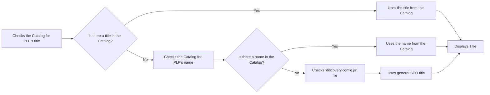
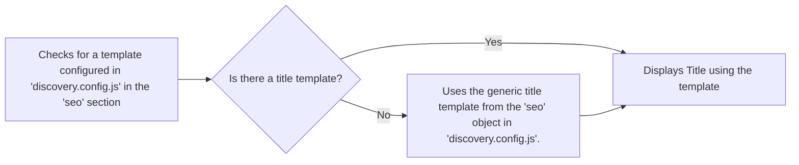
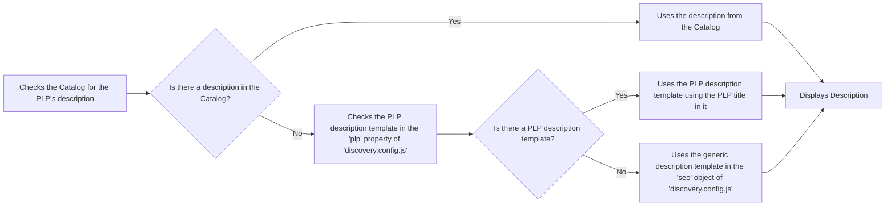

By default, FastStore improves performance by wrapping store sections in `LazyLoadingSection` and `ViewportObserver` components. These components delay loading non-essential sections until needed, such as when a user scrolls near them. This approach reduces initial page load times and improves user experience, particularly on slower networks or devices.

While lazy loading improves performance, it can harm SEO. Search engine crawlers often do not execute JavaScript or wait for dynamically loaded content. As a result, critical sections like product grids on category pages may not be indexed. For instance, if a user accesses the "gym clothes" collection, its product listing might not appear in search results if it's not included in the initial HTML.

In this guide, learn how to optimize SEO by controlling lazy loading for sections in FastStore.

>❗ Disabling lazy loading may increase initial page load time. Use it only when necessary.

## Before you begin

<Steps>

### Update the `@faststore/cli` package

Make sure the `@faststore/cli` package is updated to the latest version. If you need to update it, follow the instructions on [Updating the '@fastore/cli' package version](https://developers.vtex.com/docs/guides/faststore/project-structure-updating-the-cli-package-version).

### Configure SEO for PLPs

Set up title and description templates in the [`discovery.config.js`](https://developers.vtex.com/docs/guides/faststore/project-structure-config-options) file to dynamically generate metadata for PLPs, such as collections, categories, subcategories, or brands. 
For instructions, see the [Configuring SEO for Product Listing Pages (PLP)](https://developers.vtex.com/docs/guides/faststore/managing-performance-configuring-seo-for-plp) guide.

</Steps>

## SEO metadata for PLPs

FastStore follows a structured approach to generating SEO metadata for PLPs, prioritizing available catalog data before falling back to predefined templates in `discovery.config.js`.

<details>
<summary>Title</summary>



</details>

<details>
<summary>Title template</summary>



</details>

<details>
<summary>Description template</summary>



</details>

## Instructions

### Step 1: Controlling lazy loading for custom sections

FastStore lazy-loads sections for performance reasons. However, certain [custom sections](https://developers.vtex.com/docs/guides/faststore/building-sections-creating-a-new-section), such as those containing H1 headers, may need to appear in the initial HTML for SEO purposes. To disable lazy loading for these sections, consider the following:


1. Open the `cms/faststore/sections.json` file in your project.
2. Locate your custom section in the file and add the `skipLazyLoadingSection` property, and set it to `true`. For example, if your custom section is named `CustomPLPName`, the configuration would look like this:

  ```sections.json

  …
  {
    "name": "CustomPLPName",
    "schema": {
      "title": "Collection Name",
      "description": "Custom H1 configuration",
      "type": "object",
      "required": ["skipLazyLoadingSection"],
      "properties": {
        "skipLazyLoadingSection": {
          "title": "Skip lazy loading",
          "type": "boolean",
          "default": true
        }
      }
    }
  }

  ```

3. To display data related to the PLP (e.g., collection, category, or brand names) in a custom section, use the [`usePLP()`](https://developers.vtex.com/docs/guides/faststore/api-extensions-consuming-api-extensions#consuming-api-extensions-data-from-custom-sections) hook in the section’s file:

  ```CallToAction.tsx

  import { usePLP } from '@faststore/core'

  export default function CustomPLPName() {
    const context = usePLP()

    return (
      <section>
        <h1>Testing - {context.data?.collection?.seo?.title ?? 'PLP'}!</h1>
      </section>
    )
  }

  ```

### Step 2: Sending the changes to the Headless CMS

1. Open the terminal and run `faststore cms-sync` to sync your local changes with the Headless CMS.
2. Go to the VTEX Admin, access **Storefront > Headless CMS**.
3. Access the **Product List Page** Content Type.
4. Add the custom section you created. At the end of the section, you’ll notice the **Skip lazy loading** option.

   

5. Click `Save` and publish the changes you made.
6. Click `Preview`.
7. Search for a collection name to see your new section. For example, if you have a `Just arrived` collection, add its slug to the URL, for example: `https://mystore.vtex.app/just-arrived`. You’ll be able to see something similar to the following:

    

### Step 3: Checking if the custom section is visible to search engines

To make sure that the custom section is present in the initial HTML response, follow these steps:

1. In the browser, right-click anywhere on the page and select **Inspect** from the context menu.
2. In the **Developer Tools** panel, click the **Network tab**. Ensure that the **All filter** is selected.

  > ℹ To focus only on the main HTML document, you can filter by **Doc** in the filter bar. This will show only the initial HTML request, making it easier to inspect the page's source code.

3. Reload the page while the Developer Tools are open. This will capture all network requests made during the page load.
4. In the **Name** column of the **Network** tab, look for the request corresponding to the page you're inspecting In our example `just-arrived`.
5. Click the **Response** tab in this panel.
6. If the section is present in the initial HTML response, you will see the corresponding HTML code in the **Response** tab. For example:

   

If the section is present in the initial HTML, as in the example above, it means it is not lazy-loaded and is visible to search engines.
