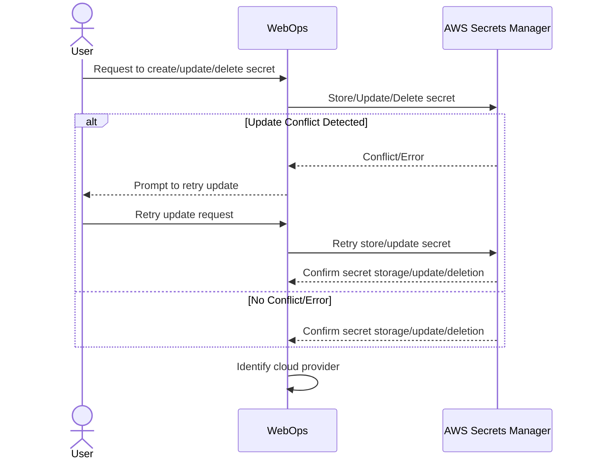
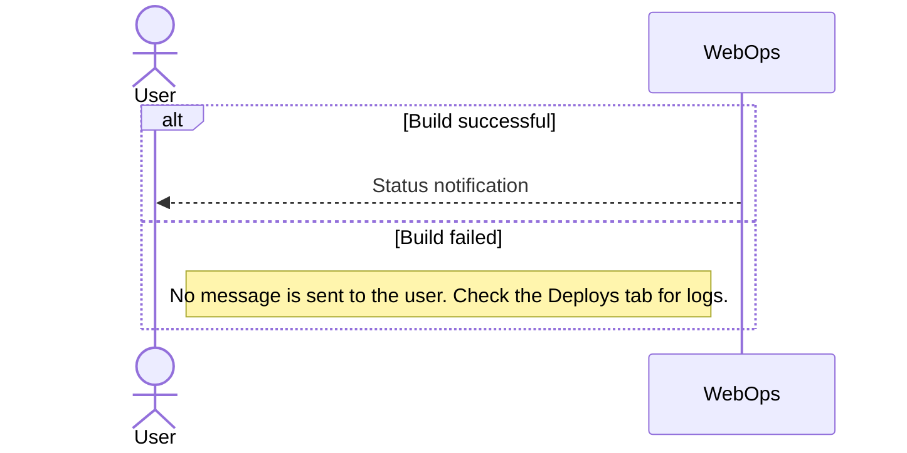

Secrets are sensitive information, such as API keys, passwords, and tokens, that must be securely managed during the FastStore project deployment process. [WebOps](https://developers.vtex.com/docs/guides/faststore/1-onboarding-overview) centralizes and standardizes secrets management, ensuring a consistent and secure process across all deployment providers.

This functionality leverages [AWS Secrets Manager](https://aws.amazon.com/pt/secrets-manager/) as a centralized repository for managing and retrieving secrets across all WebOps projects. As a result, secrets can be securely stored and accessed without embedding them directly within the project.

In this guide, you'll learn how to manage secrets in your FastStore project using [WebOps](https://developers.vtex.com/docs/guides/faststore/1-onboarding-overview).

## Secrets flow

The Secrets feature employs a structured method for interacting with deployment providers based on project-specific configurations. Below is an example of a successful flow that illustrates how WebOps determines the appropriate provider to use based on the project’s settings and then delegates the build and deployment process accordingly.

### User request and secret storage

1. The user initiates a request to create, update, or delete a secret through the WebOps interface.
2. WebOps forwards the request made by the user (create, update, or delete a secret) to AWS Secrets Manager.
  
   a. If AWS detects a conflict, it returns an error to WebOps. When there is a conflict, WebOps notifies the user with the message `Fail to add (update or delete) new secret. Please, try again.`. Check the error in the [Deploys](https://developers.vtex.com/docs/guides/faststore/1-onboarding-dashboard#deploys) tab.
    
   b. Upon successful operation, the AWS Secrets Manager confirms the action with WebOps.
3. Once the secret management step is complete, WebOps identifies the cloud provider set for the project.

<details>
<summary>User request and secret storage</summary>



</details>

### Secret propagation

4. After secret management is completed successfully, WebOps identifies which cloud provider is set for the project.
5. WebOps sends the build information to the identified provider (Provider A, B, or N).
6. The selected provider is responsible for building and hosting the application. The building process follows this pattern:
  
    a. The provider performs the build and deployment steps.

    b. Upon completion, the provider communicates the build status back to WebOps. If it succeeds, the provider sends a `success` status to WebOps. If it fails, the provider returns the build status (error) and associated logs to WebOps.

<details>
<summary>Secret propagation</summary>

 ```mermaid
sequenceDiagram
  participant WebOps as WebOps
  participant AWS as AWS Secrets Manager
  participant Provider A as Provider A
  participant Provider B as Provider B
  participant Provider N as Provider N

 %% 4. Build flow with secrets propagation
  Note right of WebOps: Decision: Choose provider based on project configuration

  alt If Provider A
    WebOps ->> Provider A: Send build info
    Provider A ->> Provider A: Build and host application
    alt Build success
      Provider A -->> WebOps: Send build status (success)
    else Build failed
      Provider A -->> WebOps: Send build status and logs (error)
      Note right of WebOps: Error visible in Deploys tab
    end
  else If Provider B
    WebOps ->> Provider B: Send build info
    Provider B ->> Provider B: Build and host application
    alt Build success
      Provider B -->> WebOps: Send build status (success)
    else Build failed
      Provider B -->> WebOps: Send build status and logs (error)
      Note right of WebOps: Error visible in Deploys tab
    end
  else If Provider N
    WebOps ->> Provider N: Send build info
    Provider N ->> Provider N: Build and host application
    alt Build success
      Provider N -->> WebOps: Send build status (success)
    else Build failed
      Provider N -->> WebOps: Send build status and logs (error)
      Note right of WebOps: Error visible in Deploys tab
    end
  end
```

</details>

### Deployment feedback

7. When a build succeeds, the user receives a status notification on WebOps. 
8. When a build fails, the user is expected to check the [Deploys](https://developers.vtex.com/docs/guides/faststore/1-onboarding-dashboard#deploys) tab, where the build errors and associated logs are available for further investigation.

<details>
<summary>Deployment feedback</summary>



</details>

## Instructions

To manage your secrets, access your [FastStore WebOps dashboard](https://developers.vtex.com/docs/guides/faststore/1-onboarding-dashboard) and navigate to the **Settings** tab.

In the [Secrets](https://developers.vtex.com/docs/guides/faststore/1-onboarding-dashboard#secrets) section, you can [create](#creating-secrets), [update](#updating-secrets), or [delete](#deleting-secrets) secrets following the steps below.

>ℹ Follow the deployment status in the [Deploys](https://developers.vtex.com/docs/guides/faststore/1-onboarding-dashboard#deploys) tab of the WebOps dashboard.

### Creating secrets

1. Input the related values in the `Key` and `Value` fields.
2. Click `Add`. A pop-up with `New Secret added successfully` will open. Then, you'll see the message `Secrets have changed. Changes will take effect in the next successful deployment.` alongside a `Redeploy` button.
3. Click `Redeploy`. You’ll see the message `Redeploying with secret changes`, then a pop-up with `Deployment created successfully` will open.


### Updating secrets

1. Go to the `Current Keys` section.
2. Alongside the secret you need to update, click `⋮`, then click `Edit`.
3. Click `Update`.  A pop-up with `Secret updated successfully` will open. Then, you'll see the message `Secrets have changed. Changes will take effect in the next successful deployment.` alongside a `Redeploy` button.
4. Click `Redeploy`. You’ll see the message `Redeploying with secret changes`, then a pop-up with `Deployment created successfully` will open.


### Deleting secrets

1. Go to the `Current Keys` section.
2. Alongside the secret you need to update, click `⋮`, then click `Delete`.
3. Validate the secret you want to remove. 

   >⚠ This action can’t be undone.

4. Click `Delete secret`. A pop-up with `Secret deleted successfully` will open. Then, you'll see the message `Secrets have changed. Changes will take effect in the next successful deployment.` alongside a `Redeploy` button.
5. Click `Redeploy`. You’ll see the message `Redeploying with secret changes`, then a pop-up with `Deployment created successfully` will open.


