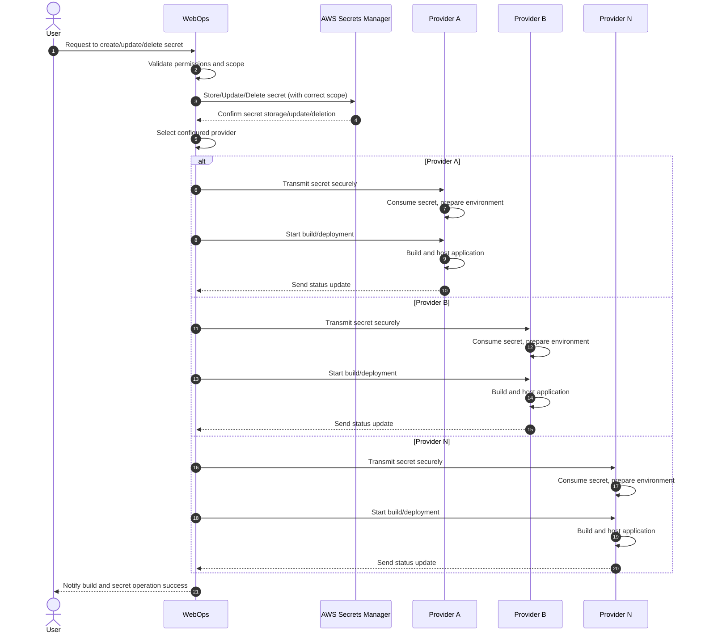

Secrets are sensitive information, such as API keys, passwords, and tokens, that must be securely managed during the FastStore project deployment process. Standardizing secrets management through WebOps ensures consistency and enhances security across various deployment providers.

This functionality leverages [AWS Secrets Manager](https://aws.amazon.com/pt/secrets-manager/) as a centralized repository for managing and retrieving secrets across all WebOps projects. As a result, secrets can be securely stored and accessed without embedding them directly within the project.

In this guide, you'll learn how to manage secrets in your FastStore project using [WebOps](https://developers.vtex.com/docs/guides/faststore/1-onboarding-overview).

## Secrets flow

The Secrets feature employs a structured method for interacting with deployment providers based on project-specific configurations. Below is an example of a successful flow that illustrates how WebOps determines the appropriate provider to use based on the project’s settings and then delegates the build and deployment process accordingly.

When a user initiates a request to create or delete a secret, WebOps first validates the user's permissions and the request scope. The scope defines the context, such as project, environment, namespace, or account, that determines where and how the secret will be stored, propagated, and accessed.

Once validated, WebOps forwards the operation to AWS Secrets Manager, which confirms the action. Next, WebOps identifies the appropriate deployment provider based on the project’s configuration. It then securely transmits the secret information to the selected provider.

The chosen provider consumes the secret and prepares the environment, after which WebOps triggers the build and deployment process. The provider proceeds to build and host the application and returns a status update to WebOps.

Finally, WebOps notifies the user that the secret operation and the deployment were successful.

## Instructions

To manage your secrets, access your [FastStore WebOps dashboard](https://developers.vtex.com/docs/guides/faststore/1-onboarding-dashboard) and navigate to the **Settings** tab.

In the **Secrets** section, you can [create](#creating-secrets), [update](#updating-secrets), or [delete](#deleting-secrets) secrets following the steps below.

### Creating secrets

1. Input the related values in the `Key` and `Value` fields.
2. Click `Add`. You’ll see the message: `New Secret added successfully. Changes will take effect in the next successful deployment.`
3. Click on `Redeploy`. You’ll see the message: `Creating deployment…`, then `Deployment created successfully`.

### Updating secrets

1. Go to the `Current Keys` section.
2. Alongside the secret you need to update, click `⋮`, then click `Edit`.
3. Update the secret in the modal that will open.
4. Click `Update`. You’ll see the message: `Secret updated successfully. Changes will take effect in the next successful deployment.`
5. Click on `Redeploy`. You’ll see the message: `Creating deployment…`, then `Deployment created successfully`.

### Deleting secrets

1. Go to the `Current Keys` section.
2. Alongside the secret you need to update, click `⋮`, then click `Delete`.
3. Validate the secret you want to remove. 

	>⚠ This action can’t be undone.

4. Click `Delete secret`. You’ll see the message: `Secret deleted successfully. Changes will take effect in the next successful deployment.`
5. Click on `Redeploy`. You’ll see the message: `Creating deployment…`, then `Deployment created successfully`.

>ℹ Follow the deployment status in the [Deploys](https://developers.vtex.com/docs/guides/faststore/1-onboarding-dashboard#deploys) tab of the WebOps dashboard.
