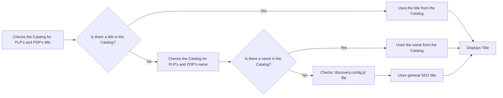
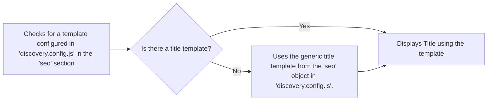
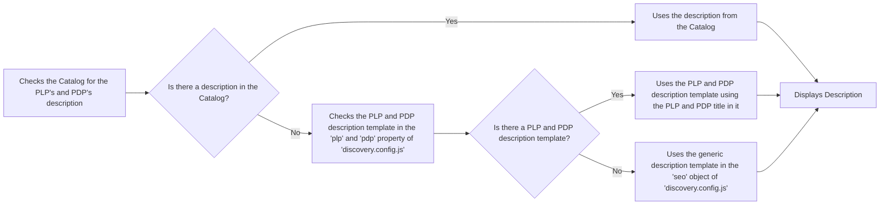

Configuring SEO settings for Product Listing Pages (PLPs) and Product Details Pages (PDPs) is essential for improving search engine visibility and discoverability. This guide walks you through setting up title and description templates for PLPs and PDPs and provides best practices for optimizing SEO performance.

## SEO metadata

FastStore follows a structured approach to generating SEO metadata for PLPs and PDPs, prioritizing available catalog data before falling back to predefined templates in the [`discovery.config.js`](https://developers.vtex.com/docs/guides/faststore/project-structure-config-options) file.

<details>
<summary>Title</summary>



</details>

<details>
<summary>Title template</summary>



</details>

<details>
<summary>Description template</summary>



</details>

## Instructions

1. Open your FastStore project in a code editor of your preference.
2. Go to the `discovey.config.js` file and in the `seo` section add the following:

```js
...
seo: {
  ...
  plp: {
    titleTemplate: '%s | FastStore PLP',
    descriptionTemplate: '%s products on FastStore Product Listing Page',
  },
  pdp: {
    titleTemplate: '%s | FastStore PDP',
    descriptionTemplate: '%s products on FastStore Product Detail Page',
  },
},
```

> ⚠ Change the values in `titleTemplate` and `descriptionTemplate` according to your needs. Use `%s` as a placeholder for the PLP and PDP title/name.

- **Title template:** This template will be applied to all PLPs and PDPs, including collections, categories, subcategories, and brands.
- **Description template:** This template is used for `collections`, as descriptions for `collections` are not configured in the Catalog. If a specific description isn't configured in the Catalog for a category, subcategory, or brand, this template will be used as a fallback.

## Lazy loading and SEO considerations

FastStore uses lazy loading to improve performance. However, certain [custom sections](https://developers.vtex.com/docs/guides/faststore/building-sections-creating-a-new-section), such as those containing H1 headers, may need to appear in the initial HTML for SEO purposes, as search engine crawlers may not index dynamically loaded content. To optimize SEO for PLPs and PDPs, see the [Optimizing SEO by managing Lazy Loading on PLPs and PDPs](https://developers.vtex.com/docs/guides/faststore/seo-optimizing-seo-by-managing-lazy-loading-on-plp-and-pdp) guide.
