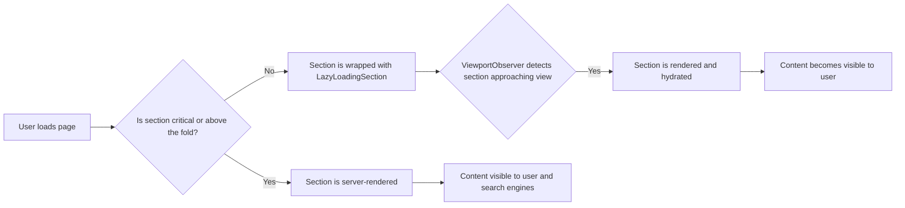

Lazy loading is a method that delays the loading of non-essential resources, such as images or sections of a page, until they are actually needed. FastStore uses lazy loading for all native store sections that are out of the viewport by default. Each section is wrapped in a component that checks if it is within the viewport. If it is not, it is loaded lazily.

This approach reduces initial page load time and improves the browsing experience, especially on slower devices and networks. However, since sections outside the viewport are not included in the initial HTML, there can be SEO implications, such as search engines not indexing them immediately.

This guide explains how to manage lazy loading for custom sections to balance SEO and performance.

> ❗ Disabling lazy loading will most likely increase initial page load time. Apply this practice only to critical, above-the-fold content or to sections with SEO-relevant content that must render on the initial page load. To help you decide, see [How lazy loading works in FastStore](#how-lazy-loading-works-in-faststore) and [Deciding when to lazy load](#deciding-when-to-lazy-load).

`LazyLoadingSection` and `ViewportObserver` work together in FastStore to improve initial page load speed.

* `LazyLoadingSection`: A React wrapper that delays the rendering of content (e.g., blocks) and hydration of non-critical blocks until the content and non-critical blocks approach the viewport.  
* `ViewportObserver`: A small utility that detects when content is approaching the viewport, triggering the `LazyLoadingSection` to render the content.

These two components work together to enable lazy loading. By delaying the rendering, hydration, and resource fetching until content is near the viewport, they greatly decrease the initial page load time, which is especially beneficial for users on slower devices and networks.



> ⚠️ Disabling lazy loading for too many elements will increase initial page load time, which impacts performance score; search engines penalize low performance. This practice should be applied only to critical, above-the-fold content or SEO-relevant sections that must render on initial page load. To help you decide when to disable lazy loading, see the [Deciding when to lazy load](?tab=t.t9r5zcseuwe4#heading=h.696ir3oal5ef) section.

### Server-Side Rendering (SSR) and lazy loading

Server-side rendering provides crucial HTML in the initial document, allowing users and crawlers to access content without executing JavaScript. **Sections wrapped with lazy loading are not included in this initial HTML.** They are only rendered and hydrated when the sections are near the viewport.

When creating custom sections, you can add the **Skip lazy loading** flag to a section to disable lazy loading for that section only in FastStore's PDP and PLP templates. With lazy loading disabled, bots can access all content immediately without needing to scroll or run scripts, which may speed up the crawling process.

However, they still need to download and process all media files, which can quickly consume crawl budget, slow down the indexing of other pages, and reduce the number of pages indexed. Larger initial payloads can also negatively impact user experience and make the site seem slower to bots.


### SEO and performance trade-off

Search engines, such as Google, use crawlers to find and index web content. Although modern crawlers can run JavaScript to render pages, this process can be slow or incomplete. Therefore, it is important to ensure that key commerce content is included in the initial HTML so that it is indexed.

Lazy loading can improve Largest Contentful Paint (LCP) and Interaction to Next Paint (INP), which are important SEO ranking factors. By deferring heavy resources, lazy loading helps improve:

* **LCP:** By prioritizing the hero image and other above-the-fold content, the main content loads quickly.  
* **INP:** Deferring heavy JavaScript reduces main-thread contention, making the page more responsive.

On the other hand, rendering all content upfront can speed up discovery for crawlers, but it can also consume crawl budget, slow down the indexing of other pages on your site, and negatively impact user-perceived performance due to the increased initial payload size.

## Deciding when to lazy load

Use lazy loading strategically to prioritize the most important content for crawlers. If essential content is not present in the initial HTML, search engines may consume more crawl budget to execute \`js\` scripts, such as product grids on a PLP.

### When to implement lazy loading ✅


| Context | Benefit | Example |
| :---- | :---- | :---- |
| **To load content that isn't immediately visible** | Improves initial page load speed by delaying non-critical assets that are below the fold. | A homepage with promotional banners and lookbooks that load as the user scrolls down the page. |
| **To improve page speed for a media-heavy page** | Optimizes resource usage and ensures the most important content is prioritized and loads first. | A PDP includes a "Complete the Look" carousel at the bottom. Since this is a supplementary suggestion, lazy loading ensures the main product details are prioritized and the carousel images load only when the user scrolls to that section. |
| **The content doesn't affect SEO or crawling** | It will not negatively impact search engine visibility since the content isn't critical for SEO or structured data. | A store's homepage has a "Fashion Trends" slider in the footer with inspirational videos. Since this content does not impact structured data for SEO, lazy loading it will not negatively affect search engine visibility. |
| **To balance server load during high traffic** | It reduces server spikes by loading only the images visible on the screen, keeping the browsing experience fast. | Category pages like "Dresses" or "Jeans" may have hundreds of product image previews. With lazy loading, only the images visible above the fold load immediately, which reduces server spikes and keeps the browsing experience fast. |

### When to skip lazy loading ❌ 

| Context | Reason to avoid | Example |
| :---- | :---- | :---- |
| **There is a risk of hiding critical page elements from crawlers** | Search engines might not see all content if it is lazy-loaded, potentially harming your site's SEO. | A "New Arrivals" grid on your homepage displays featured items from several categories. Lazy loading is skipped here to ensure search engines can index all new products shown in this grid. |
| **Do not disable lazy loading globally** | Apply lazy loading selectively. Rendering everything upfront increases payloads, exhausts crawl budget, and slows indexing. | A homepage with numerous campaign images should lazy load secondary media while keeping critical content immediately available. |

## Before you begin

<Steps>

### Update the `@faststore/cli` package

Make sure the `@faststore/cli` package is updated to the latest version. To update it, follow the instructions in [Updating the `@faststore/cli` package version](https://developers.vtex.com/docs/guides/faststore/project-structure-updating-the-cli-package-version).

### Configure SEO for PLPs and PDPs

Set up title and description templates in the [`discovery.config.js`](https://developers.vtex.com/docs/guides/faststore/project-structure-config-options) file to dynamically generate metadata for PLPs and PDPs, such as collections, categories, subcategories, or brands.
For instructions, see the [Configuring SEO for PLPs and PDPs](https://developers.vtex.com/docs/guides/faststore/seo-configuring-seo-for-plp-and-pdp) guide.

</Steps>

## Instructions

### Step 1: Controlling lazy loading for custom sections

FastStore lazy-loads sections to improve store performance. However, some [custom sections](https://developers.vtex.com/docs/guides/faststore/building-sections-creating-a-new-section), such as those containing H1 headers, may need to appear in the initial HTML for SEO purposes. To disable lazy loading for these sections, consider the following:

1. Open the `cms/faststore/sections.json` file in your project.
2. Locate your custom section in the file, add the `skipLazyLoadingSection` property, and set it to `true`. For example, if your custom section is named `CustomSEOSection`, the configuration would look like this:

   ```json
   ...
   {
     "name": "CustomSEOSection",
     "schema": {
       "title": "SEO Section",
       "description": "Custom H1 configuration",
       "type": "object",
       "required": ["skipLazyLoadingSection"],
       "properties": {
         "skipLazyLoadingSection": {
           "title": "Skip lazy loading",
           "type": "boolean",
           "default": true
         }
       }
     }
   }
   ```

Turning this on ensures the section's content is included in the initial, server-rendered HTML (i.e., lazy loading is skipped for that section).

3. To display PLP data (e.g., collection names) in a custom section, use the [`usePLP()`](https://developers.vtex.com/docs/guides/faststore/api-extensions-consuming-api-extensions#consuming-api-extensions-data-from-custom-sections) hook. For PDP data (e.g., product titles), use the [`usePDP()`](https://developers.vtex.com/docs/guides/faststore/api-extensions-consuming-api-extensions#hooks-for-consuming-api-extension-data) hook.

<details>
<summary>`usePLP()` hook</summary>

   ```tsx
   import { usePLP } from "@faststore/core";

   export default function CustomPLPName() {
     const context = usePLP();

     return (
       <section>
         <h1>Testing - {context.data?.collection?.seo?.title ?? "PLP"}!</h1>
       </section>
     );
   }
   ```

</details>

<details>
<summary>`usePDP()` hook</summary>

   ```tsx
   import { usePDP } from "@faststore/core";

   export default function CustomPDPName() {
     const context = usePDP();

     return (
       <section>
         <h1>Testing - {context.data?.product?.seo?.title ?? "PDP"}!</h1>
       </section>
     );
   }
   ```

</details>

### Step 2: Sending the changes to the Headless CMS

1. Open the terminal and run `yarn cms-sync` to synchronize your local changes with the Headless CMS.
2. Go to the VTEX Admin and access **Storefront > Headless CMS**.
3. Access the **Product List Page** or **Product Details Page** Content Type. For this example, we will use the **Product List Page** Content Type.

   > ⚠ Repeat these steps for the **Product Details Page** Content Type if you are optimizing a PDP section.

4. Add the custom section you created. The **Skip lazy loading** option will appear at the end of the section.

   

5. Click `Save` and publish the changes you made.
6. Click `Preview`.
7. Search for a collection name to see the new section. For example, if you have a collection named "Just Arrived," you can view it by adding its slug to your store's URL (e.g., `https://mystore.vtex.app/just-arrived`). You will see something similar to the following:

   

    <details>
      <summary>**PDP example**</summary>
      
      For PDPs, test with a product URL (e.g., `https://mystore.vtex.app/p/blue-shirt`). The image below shows the **New Arrivals** title on the PDP.

    </details>

### Step 3: Checking if the custom section is visible to search engines

To ensure that the custom section is present in the initial HTML response, follow these steps:

1. In the browser, right-click anywhere on the page and select **Inspect** from the context menu.
2. In the **Developer Tools** panel, click the **Network** tab. Ensure that the **All filter** is selected.

   > ℹ To focus only on the main HTML document, you can filter by **Doc** in the filter bar. This will show only the initial HTML request, making it easier to inspect the page's source code.

3. Reload the page while the Developer Tools are open. This will capture all network requests made during the page load.
4. In the **Name** column of the **Network** tab, look for the request corresponding to the page you are inspecting. In our example, this would be `just-arrived`.
5. Click the **Response** tab in this panel.
6. If the section is in the initial HTML response, you will see the corresponding HTML code in the **Response** tab. For example:

   

If the section is in the initial HTML, as in the example above, it means it is not lazy-loaded and is visible to search engines, confirming it was rendered server-side (lazy loading was skipped).

## Best practices after lazy loading

After adjusting lazy loading, monitor its impact and iterate. Focus on measurable outcomes and protect both crawlability and Core Web Vitals.

### Verifying PLP and PDP settings

- PLP server-side HTML: Ensure the category title and first set of product tiles (name, price, primary image) are present in the initial HTML response.  
- PDP server-side HTML: Ensure the product title, price, first image, and variant selector renders in the initial HTML.  
- Images: The first visible image should not be lazy-loaded. Use `fetchpriority="high"` on the LCP image when appropriate; add `decoding="async"` and proper `srcset`/`sizes` for responsive images.  
- Placeholders: Reserve space (via `width`/`height` or `aspect-ratio`) for deferred content to prevent CLS.  
- Controls: Filters and sorting that are SEO-relevant should be usable without JavaScript for crawlability (progressive enhancement where feasible).

### Monitoring Core Web Vitals

- Track LCP, INP, and CLS using PageSpeed Insights, Lighthouse, and Search Console's Core Web Vitals report.  
- Identify the LCP element and confirm it is server-rendered and not lazy-loaded; preconnect/preload critical origins/assets when needed.  
- Defer non-critical scripts or schedule them with idle callbacks; move heavy third-party tags out of the initial viewport to protect INP.  
- Use skeletons or low-quality image placeholders (LQIP/blur) for deferred media; ensure reserved space to avoid shifts.

### Analyzing through Google Search Console

- Use URL Inspection \> Test Live URL to review the rendered HTML and screenshot of Googlebot's view.  
- Verify critical PLP/PDP content is present in the initial HTML and also visible post-render.  
- Avoid custom attributes for source URLs (e.g., `data-src`). Prefer standard `src` and apply `loading="lazy"` only to below-the-fold images.  
- Monitor Indexing/Coverage and Core Web Vitals (CWV) reports for templates you changed; compare before/after.

### Rollout and verification

- Roll out gradually and compare KPIs (CWV, bounce rate, time to first interaction, indexing) before full deployment.  
- For infinite scroll, expose crawlable pagination or a discoverable "Load more" URL pattern to deeper content.  
- In the Developer Tools' Network tab, verify the initial document Response includes the critical PLP/PDP HTML expected by crawlers.