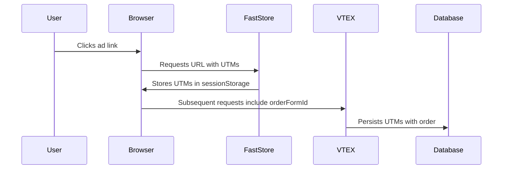

Validating UTM (Urchin Tracking Module) tracking ensures that your marketing campaigns are accurately measured and deliver personalized experiences to make conversions. When a customer clicks a campaign link, such as from an email, social media post, or paid ad, UTM parameters, such as `utm_source`, `utm_medium`, and `utm_campaign`, are attached to the URL. These parameters help identify where the traffic is coming from, which campaigns are driving engagement, and how users navigate through your store.

If UTM data is lost during navigation, search, or checkout, your analytics and promotional strategies may be impacted. For example, you might not be able to tell whether a sale came from a Google Ads campaign or an organic search. Also, if UTMs aren’t properly passed to the checkout, you won’t be able to apply UTM-based promotions such as 10% off for users from a winter sale campaign.

By validating UTM tracking, you confirm that:

- Campaign data is captured when users arrive on your site.
- UTM parameters persist as users browse, search, and add items to their cart.
- Checkout retains UTM data, enabling accurate order attribution in reports.

In this guide, learn how to verify that UTM parameters are correctly captured and persisted from your store entry to checkout.

## Before you begin


To capture and retain UTM data from a visitor’s session and attach it to their order, ensure your FastStore project is on version `3.27.0` or later. To update your store to the latest version, do the following:

1. Open the FastStore project in a code editor of your preference.
2. Open the terminal and run the following to update FastStore packages:

    ```bash
    yarn upgrade -L --scope @faststore
    ```

## Instructions

### Step 1: Test UTM capture in store session

To verify if UTMs are stored when a user visits your store, we will simulate a campaign visit to verify UTM storage in the session in your development environment.
 
1. Open the terminal and run `yarn dev` to start the server locally.
2. Open the localhost available and add a UTM parameter on its slug, for example:

    ```sh
    http://localhost:3000/?utm_source=google
    ```


    >  ℹ️ Adding `?utm_source=google` simulates a user arriving from a Google Ads campaign.

3. To confirm if the `utm_source=google` was captured when the user enters the store, open your browser’s Developer Tools and click the **Application** tab.
4. Go to the **Storage** section and navigate to **IndexedDB > keyval-store**.
5. Expand the **keyval-store** option and click **keyval**.
6. In the column **Value**, expand the `addressType`.
7. Find the field `marketingData` and expand it. There, you will see the parameter `utmSource: "google"`, which means that it was captured during the user’s session.

    

### Step 2: Verify checkout attribution

When a user arrives at your store via a link containing, for example, `?utm_source=google` and adds a product to the cart, the system does the following:



1. Creates an `orderFormId`, a cart identifier, for this user's cart.
2. Attaches the UTM data to the user’s cart.
3. Maintains UTM data throughout the purchase process for:
    - Accurate sales attribution so you know from which traffic this order came, such as Google Ads or organic traffic.
    - Campaign-specific promotions, such as 30% off for `utm_campaign=winter_sale`.

Another advantage of having the UTM data attached throughout the purchase process is when you want to apply campaign-specific discounts. For example, a customer finds in their email a newsletter from your store with a promotion of 30% off for your store's winter collection through a newsletter promotion, `https://store.com?utm_source=newsletter&utm_medium=email&utm_campaign=winter_sale`. When the user clicks on this link, they add a $100 product to the cart and go to checkout. The system makes sure to:

- Track the sale under `winter_sale`.
- Apply a 30% discount to the total price.

Now, let’s make sure the `utm_source=google` is attached to the order on the client-side:

1. Go to the store home page by accessing the localhost (`http://localhost:3000/?utm_source=google`).
2. Click on a product to go to its Product Details Page (PDP).
3. In the PDP, add the product by clicking `Add to Cart`.
4. Open your browser's Developer Tools and click the **Application** tab to find the `orderFormId` (the cart identifier).

    >  ℹ️ The `orderFormId` is a unique identifier assigned to a user’s shopping cart (or order form) in the store. This identifier tracks items added to the cart, user session details (e.g., UTM parameters, shipping preferences), pricing, promotions, and checkout progress.

5. Go to **Cookies** and find `checkout.vtex.com`.
6. Copy the cookie value after `__ofid=` and save it. For example, with you see the following, `__ofid=a1b2c2x4y5z`, copy only `a1b2c2x4y5z`.

### Step 3: Call the Checkout API to confirm the UTM is in the cart

So far, we confirmed that the `utm_source=google` parameter was captured client-side, so the browser received the UTM data. Now, let’s check if the UTM data was handled by the server-side and can persist to checkout. To do this, we will use the [`Get Cart by ID`](https://developers.vtex.com/docs/api-reference/checkout-api#get-/api/checkout/pub/orderForm/-orderFormId-) endpoint.

1. Use this endpoint by adding the cookie value you saved from [previous step](#step-2–verify-checkout-attribution). The base URL will be like this:

    ```sh
    https://{accountName}.{environment}.com.br/api/checkout/pub/orderForm/a1b2c2x4y5z
    ```

2. Run this endpoint. 
3. On the response body, look for the `marketingData` object field; inside it, you will find `utmSource: "google"`.

    > ℹ️ The `marketingData` object in the Checkout API contains promotion data such as coupon tracking information and internal or external UTMs.

With these local tests, you can see that UTM data is handled client-side and server-side and will persist from the user's entry into your store to the checkout.
