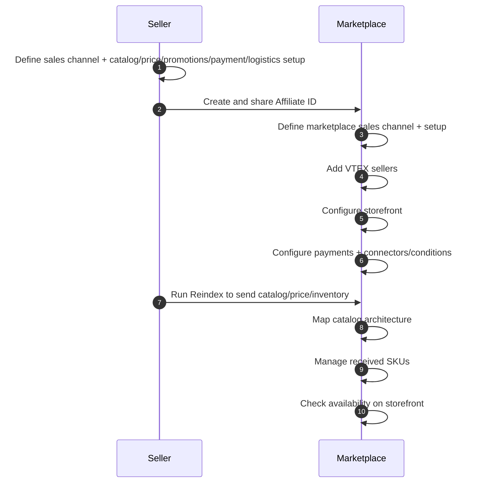

The VTEX architecture allows stores to operate both as marketplaces and sellers, creating a collaborative commerce model within the VTEX ecosystem. This guide shows you how to establish connections between VTEX stores, configure the necessary settings, and manage the integration to expand your sales channels or product assortment.

You'll learn how to set your store to:

* [Act as seller](#acting-as-seller)
* [Act as marketplace](#acting-as-marketplace)

## Understanding the integration flow

The integration between VTEX stores involves bidirectional communication. The following diagram illustrates the process:

The following table provides an overview of the required steps and who is responsible for each:

| Step | Responsibility | Description |
|------|----------------|-------------|
| [Define sales channels for marketplace integration](#define-sales-channels-for-marketplace-integration) | Seller | Decide whether to use an existing or new **sales channel (trade policy)** for marketplace sales and configure catalog, pricing, promotions, payments, and logistics as needed. |
| [Create affiliate ID](#create-an-affiliate-id) | Seller | Create an **affiliate** that uniquely identifies the marketplace, that links it to the correct sales channel and notification endpoint, and share the affiliate ID with the marketplace. |
| [Define sales channels for sellers in your marketplace](#define-sales-channels-for-sellers-in-your-marketplace) | Marketplace | Decide whether to use the default or a dedicated **sales channel** for marketplace operations and configure catalog, pricing, promotions, payments, and logistics for seller sales. |
| [Add VTEX sellers](#add-sellers-to-your-marketplace) | Marketplace | Add VTEX sellers in **Marketplace > Management** and configure seller information, affiliate ID, sales channels, commissions, and commercial conditions. |
| [Configure storefront](#configure-the-storefront) | Marketplace | Configure the marketplace storefront to display seller information and offers throughout the shopping journey, enabling customers to view and select available sellers. |
| [Configure payments](#configure-payments) | Marketplace | Define whether **marketplace**, **seller**, or **split payments** will be used and configure payment connectors, conditions, and gateway affiliations accordingly in VTEX Payments. |
| [Reindex database](#reindex-the-database) | Seller | Run the **Reindex database (FullCleanUp)** process to send catalog, price, and inventory information to the marketplace and update the marketplace with the current assortment. |
| [Map catalog](#map-catalog-architecture) | Marketplace | Map **categories, brands, and specifications** from each seller to the marketplace catalog so products are correctly categorized and attributes are visible on the storefront. |
| [Approve and catalog received SKUs](#approve-and-catalog-seller-products) | Marketplace | Review SKUs received from sellers (content, images, price, inventory) and **approve, link, or reject** them to control the products that are listed on the marketplace. |
| [Check product availability](#check-product-availability) | Marketplace | Check the storefront to confirm that approved products are visible, correctly displayed, available for purchase, and that seller information displays as configured. |

## Acting as seller

This section guides sellers through the necessary configuration to sell products on VTEX marketplaces.

### Define sales channels for marketplace integration

Determine the sales channel configuration for your marketplace integration:

1. Evaluate if you need to configure specific settings for the marketplace integration or if you can use your default sales channel.
2. If necessary, [configure a marketplace sales channel](https://help.vtex.com/docs/tutorials/configuring-a-marketplace-trade-policy) with the appropriate settings for product assortment, pricing, promotions, and logistics.

> ℹ️ You can use the same sales channel to integrate with multiple marketplaces. [Requesting an additional sales channel](https://help.vtex.com/docs/tutorials/requesting-an-additional-trade-policy) to integrate with other VTEX stores is free of charge.

**Catalog settings:**

* Use sales channels to control the products you want to send to the marketplace.
* Avoid using [collections](https://help.vtex.com/docs/tutorials/creating-a-product-collection) as the main control mechanism, as they are designed for storefront merchandising, not for core catalog logic.

**Promotions settings:**

* You don't need a marketplace-specific sales channel dedicated to promotions. Segment promotions using the [affiliate](https://help.vtex.com/docs/tutorials/what-is-an-affiliate) configuration.
* See [Configuring promotions for marketplaces](https://help.vtex.com/docs/tutorials/configuring-promotions-for-marketplaces) for more information.

### Create an affiliate ID

> ℹ️ Make sure you have Admin access to configure affiliates. For more information, see the release note [New permissions for accessing order configurations](https://help.vtex.com/announcements/2025-10-21-new-license-manager-resources-order-configurations).

The [affiliate](https://help.vtex.com/docs/tutorials/what-is-an-affiliate) code identifies the marketplace where your products will be sold. Each marketplace must have a unique affiliate ID.

To create an affiliate ID:

1. In the VTEX Admin, go to **Store Settings > Orders > Settings**.
2. In the **Affiliates** tab, click `+ New Affiliate`.
3. Complete the required fields. For detailed information about these fields, see [Configuring affiliates](https://help.vtex.com/docs/tutorials/configuring-affiliates).
4. Click `Save` to create the affiliate.

> ℹ️ After creating the affiliate, provide the affiliate ID to the marketplace operator. The marketplace will use this ID when adding your store as a seller.

### Reindex the database

After the marketplace adds the seller, it's time to send their product catalog by reindexing the database. This process:

* Prepares SKU and product information.
* Sends catalog, price, and inventory information to the marketplace.
* Updates the marketplace with the current product assortment.

To reindex the database:

1. Open your browser and access the following URL, replacing `{storename}` with the account name of your store:

   `{storename}.vtexcommercestable.com.br/admin/Site/FullCleanUp.aspx`

2. Click the `Reindex database` button to start the process.
3. Track the reindexing progress in the VTEX Admin through **Catalog > Reports**.

> ℹ️ Only the [sponsor user (owner)](https://help.vtex.com/docs/tracks/what-is-the-master-user) has permission to reindex the database. During reindexing, products remain available for sale in the store while being queued for information updates.

After the seller sends products to the marketplace, the marketplace must map the seller catalog to match its own structure.

## Acting as marketplace

This section guides marketplace operators through the necessary configuration to receive and sell products from VTEX sellers.

### Define sales channels for sellers in your marketplace

[Sales channels](https://help.vtex.com/docs/tutorials/how-trade-policies-work) determine the product assortment, prices, payments, promotions, customer segmentation, and shipping strategy for your marketplace.

To define sales channels for your marketplace:

1. Evaluate if you need different configurations for sellers in your marketplace. If all sellers use the same configuration, use your default sales channel.
2. If you need to configure specific settings, [create a new sales channel](https://help.vtex.com/docs/tutorials/creating-a-trade-policy) for marketplace operations.
3. Configure the sales channel with the appropriate settings for catalog, pricing, promotions, and logistics.

> ℹ️ The same sales channel can be used to integrate with multiple sellers. [Requesting additional sales channels](https://help.vtex.com/docs/tutorials/requesting-an-additional-trade-policy) to integrate with other VTEX stores is free of charge.

### Add sellers to your marketplace

> ℹ️ Make sure you have Admin access to manage sellers. Learn more in [Seller Manager](https://help.vtex.com/docs/tutorials/predefined-roles#seller-manager).

After defining sales channels, add VTEX sellers to your marketplace:

1. In the VTEX Admin, go to **Marketplace > Sellers > Management**.
2. Click `Add Seller`.
3. Select **VTEX seller** as the integration type.
4. Complete the required fields. For detailed information about these fields, see [Adding a seller](https://help.vtex.com/docs/tutorials/adding-a-seller).
5. Click `Save` to add the seller to your marketplace.

> ℹ️ In a VTEX-VTEX integration, the seller is displayed in the marketplace storefront, allowing shoppers to choose from available sellers during their shopping experience.

### Configure the storefront

Configure your marketplace storefront to display seller information during the shopping experience.

**For CMS Portal (Legacy) stores:**

Add the following controls to your ecommerce templates:

* `<vtex.cmc:sellerDescription />`: Displays the seller name and logo for the product.
* `<vtex.cmc:SellerOptions />`: Shows sellers offering the product, prices, and installment options.
* `<vtex.cmc:sellerInfo />`: Displays detailed seller information on the seller details page.

Learn more in the [List of template controls](https://developers.vtex.com/docs/guides/list-of-controls-for-templates) guide.

**For VTEX IO stores:**

Install the [Seller Selector](https://developers.vtex.com/docs/apps/vtex.seller-selector) app to:

* Display the number of sellers offering each product.
* Allow customers to compare prices from different sellers.
* Enable customers to add products from their preferred seller to the cart.

### Configure payments

Configure payment processing for your marketplace. There are different scenarios for payment processing in VTEX marketplaces:

* **Marketplace processes payments:** The marketplace receives payments and distributes the amounts to sellers based on commission agreements.
* **Seller processes payments:** Each seller receives payments directly for their orders.
* **Split payment:** Payment is divided between the marketplace and the seller based on predefined rules.

For detailed information about payment settings, see [Payments in VTEX Marketplace](https://help.vtex.com/docs/tutorials/payments-in-vtex-marketplaces).

### Map catalog architecture

After the seller sends products to the marketplace by reindexing their database, the marketplace must map the seller catalog to match its own structure. This ensures products are properly categorized and displayed on the marketplace.

1. In the VTEX Admin, go to **Marketplace > Sellers > Catalog Mapping**.
2. Select the seller whose catalog you want to map.
3. For each unmapped category, brand, and specification, select the corresponding category, brand, or specification from your marketplace catalog.
4. Create a new category, brand, or specification in your catalog if necessary before mapping.
5. Click `Save` to confirm the mappings.

For detailed mapping instructions, see [Mapping categories, brands, and specifications for the marketplace](https://help.vtex.com/docs/tutorials/mapping-categories-and-brands-for-the-marketplace).

### Approve and catalog seller products

After mapping the catalog architecture, the marketplace must approve and catalog seller products before they become available to customers.

To review the SKUs sent by the seller:

1. In the VTEX Admin, go to **Marketplace > Sellers > Received SKUs**.
2. Filter by seller to view their submitted SKUs.
3. Review product information, images, descriptions, and specifications.
4. Check pricing and inventory information.

Then, to approve SKUs to make them available on your marketplace:

1. Select the SKUs you want to approve.
2. Click `Approve` to add them to your marketplace catalog.
3. The approved SKUs will be associated with the mapped categories, brands, and specifications.

> ℹ️ You can set up automatic approval for trusted sellers to streamline cataloging. This can only be done through Rest API. For more information, see [Save seller's approval settings](https://developers.vtex.com/docs/api-reference/marketplace-apis-suggestions#put-/suggestions/configuration/seller/-sellerId-).

### Check product availability

After approval, check that products display correctly on your marketplace:

1. Check the marketplace storefront to confirm products are visible.
2. Check that product information, images, and prices display correctly.
3. Test the purchase flow to make sure orders can be placed successfully.
4. Check that seller information displays correctly when configured to be visible.
