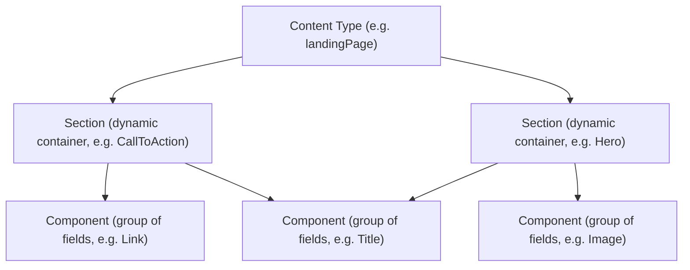

**Components** and **Sections** are the building blocks editors and developers use to assemble FastStore pages through the CMS. Understanding the difference between them is key to deciding what to create when you want to expose new content for editing in the VTEX Admin and where it should live in your project.

This guide explains both concepts, shows how they relate to **Content Types**, and lists common Section examples shipped with FastStore.

## Content hierarchy

In the CMS for FastStore, content is organized in a hierarchy: a **Content Type** declares which **Sections** are available on a page, and each Section is composed of one or more **Components** (groups of fields).



## Components

A **Component** is a **group of fields** declared with [JSON Schema](https://json-schema.org/). It defines the data structure (such as a title, an image, or a link) that editors fill in through the CMS Admin form.

In the CMS, each Component lives in its own `.jsonc` file using the naming convention `cms_component__ComponentName.jsonc`. The schema relies on a few CMS-specific keywords:

| Keyword | Purpose |
| :---- | :---- |
| `$componentKey` | Unique identifier for the Component. |
| `$componentTitle` | Display name shown in the CMS interface. |
| `$extends` | Inherits properties from base schemas (for example, `#/$defs/base-component`). |

For more details on schema declarations, see [Understanding CMS architecture and schema declarations](https://developers.vtex.com/docs/guides/understanding-cms-architecture-and-schema-declarations).

### `Link` Component example

The schema below declares a reusable `Link` Component made of two fields (`text` and `url`):

```jsonc
{
  "$extends": ["#/$defs/base-component"],
  "$componentKey": "Link",
  "$componentTitle": "Link",
  "type": "object",
  "required": ["text", "url"],
  "properties": {
    "text": {
      "title": "Text",
      "type": "string"
    },
    "url": {
      "title": "URL",
      "type": "string"
    }
  }
}
```

> ℹ️ A plain Component is not directly placed on a page on its own. It is meant to be reused **inside** a Section or composed into another Component as a field.

## Sections

A **Section** is a **type of Component** that acts as a **dynamic container** of other components. Sections are the units that editors drag, reorder, and configure on a page in the CMS Admin. Sections are native components that group other components to create specific parts of a store page (such as a hero banner, a product shelf, or a call-to-action block).

A Section uses the same JSON Schema mechanics as a regular Component, but it is also referenced from a [Content Type](https://developers.vtex.com/docs/guides/understanding-cms-architecture-and-schema-declarations) so it becomes available in the page editor. Each Section has a corresponding React component in `src/components/`, exported through `src/components/index.tsx`, that renders the data editors configure in the Admin.

### `CallToAction` Section example

The schema below declares a `CallToAction` Section composed of a `title` field and a nested `link` object (which mirrors the `Link` Component shape):

```jsonc
{
  "$extends": ["#/$defs/base-component"],
  "$componentKey": "CallToAction",
  "$componentTitle": "Call To Action",
  "title": "Call To Action",
  "description": "Get your 20% off on the first purchase!",
  "type": "object",
  "required": ["title", "link"],
  "properties": {
    "title": {
      "title": "Title",
      "type": "string"
    },
    "link": {
      "title": "Link Path",
      "type": "object",
      "required": ["text", "url"],
      "properties": {
        "text": {
          "title": "Text",
          "type": "string"
        },
        "url": {
          "title": "URL",
          "type": "string"
        }
      }
    }
  }
}
```

> ℹ️ To see a Section being created end-to-end, follow the [Extending a component](https://developers.vtex.com/docs/guides/cms-extending-a-component) guide.

## Differences between Components and Sections

The distinction is subtle because both are declared with the same schema mechanics. Use the following criteria to decide which one you are building:

| Criteria | Component | Section |
| :---- | :---- | :---- |
| **Purpose** | Defines a data shape. | Page-placeable container of Components. |
| **Scope** | Reused inside Sections or other Components. | Exposed in the CMS page editor for editors to add to a page. |
| **Schema file** | `cms_component__*.jsonc`. | `cms_component__*.jsonc`. |
| **Referenced from a Content Type** | No. | Yes (from a `cms_content_type__*.jsonc` schema). |
| **Rendering** | Data is consumed by a parent React component. | Maps directly to a React component in `src/components/` that renders an entire page block. |

## Native Sections in FastStore

FastStore ships with several native Sections you can reuse or override before creating new ones. Some examples:

- [`Hero`](https://developers.vtex.com/docs/guides/faststore/organisms-hero) — full-width banner used above the fold.
- [`ProductGrid`](https://developers.vtex.com/docs/guides/faststore/organisms-product-grid) — product list typically used on PLP pages.
- [`Navbar`](https://developers.vtex.com/docs/guides/faststore/organisms-navbar) — top navigation bar.
- `RegionPopover` — manages user location inputs for delivery features.
- `Banner`, `MegaMenu`, `ProductShelf`, `RecommendationShelf`, `CallToAction` — additional building blocks referenced across the FastStore documentation.

## Relationship with Content Types

A **Content Type** (such as `home`, `pdp`, `plp`, or `landingPage`) defines a page structure and declares which Sections editors can add to that page. When you create a new Section, you make it available to editors by referencing it from one or more Content Type schemas.

For a deeper dive into how schemas are organized, validated, and deployed, see [Understanding CMS architecture and schema declarations](https://developers.vtex.com/docs/guides/understanding-cms-architecture-and-schema-declarations).

## Next steps

<Flex>

<WhatsNextCard
  linkTo="https://developers.vtex.com/docs/guides/cms-extending-a-component"
  title="Extending a component"
  description="Learn how to extend an existing component, such as the CallToAction Section, in your FastStore project."
  linkTitle="See more"
/>

<WhatsNextCard
  linkTo="https://developers.vtex.com/docs/guides/content-plugin"
  title="Content plugin"
  description="Manage CMS schemas, organize components, and define Content Types from the terminal using the Content plugin."
  linkTitle="See more"
/>

</Flex>
