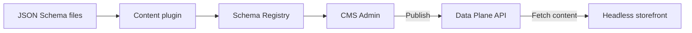

The CMS is the VTEX content management system for defining, storing, and delivering storefront content. In a headless store, it provides the content infrastructure and editorial experience while your team controls the frontend technology, routing, and rendering.

This separation allows developers to model content independently of the storefront implementation and allows editors to create and publish content in the VTEX Admin without changing application code.

## How the integration works

Developers define Content Types and components as JSON Schema files in the storefront repository. The [Content plugin](https://developers.vtex.com/docs/guides/content-plugin) combines these files into a schema bundle and uploads it to the Schema Registry.

After the schema is available, editors create and publish entries in the CMS Admin. The headless storefront then retrieves the published content from the Data Plane API and maps each component in the response to a corresponding UI component.

## Technical overview

| Aspect | Description |
| :---- | :---- |
| **Content model** | Schema-first structures defined with JSON Schema and VTEX-specific keywords. |
| **Storefront technology** | Framework-independent. Your storefront can use any technology capable of consuming the CMS APIs. |
| **Content authoring** | Editors create, preview, organize, and publish entries through the CMS Admin. |
| **Content delivery** | Published entries are available through the Data Plane REST and GraphQL APIs. |
| **Rendering** | The storefront maps the `componentKey` values returned by the API to its UI components. |
| **Routing** | The storefront maps routes and slugs to the appropriate Content Types and entries. |
| **Localization** | Content can be requested by locale, with language fallback support. |

## Main features

### Content modeling

Define the content structures required by your storefront using:

- **Content Types**: Page-level or global structures from which editors create entries, such as `home`, `landingPage`, `blogPost`, `globalHeader`, and `globalFooter`.
- **Components**: Reusable content blocks, such as promotional banners, navigation menus, and rich text sections.
- **Fields**: Typed and validated values, including strings, numbers, booleans, objects, arrays, references, and media.
- **Composition**: Reuse definitions with `$ref` and shared properties with `$extends`.
- **Singletons**: Model content that has only one entry, such as a home page, header, or footer.

The headless base schema provides the core platform definitions, while your team defines the Content Types and components required by the storefront. For modeling guidance and recommended patterns, see [Content modeling and architecture for headless stores](https://developers.vtex.com/docs/guides/content-modeling-and-architecture-for-headless-stores).

### Content editing

Editors manage content through the VTEX Admin with:

- Branches for creating and reviewing changes in isolation.
- Version history for comparing and restoring content.
- Scheduled publishing.
- Multi-user editing awareness.
- Media management for images and video references.
- Locale-specific content.

### Content delivery

After publication, the storefront can retrieve content by Content Type, slug, or other entry identifiers. It can also list entries for use cases such as blogs, campaign directories, and static generation.

The storefront can consume content through:

- **Data Plane REST API**: Retrieve individual entries, list entries, request localized content, and paginate through results.
- **GraphQL API**: Query content through generic or schema-generated fields. See [Using GraphQL API for querying CMS content](https://developers.vtex.com/docs/guides/using-graphql-api-for-querying-cms-content).

Commerce data such as products, prices, and availability continues to come from the corresponding VTEX Commerce APIs. CMS entries should define the editorial content and presentation configuration that the storefront combines with this commerce data.

## Responsibilities in a headless implementation

The CMS and the storefront have separate responsibilities:

| CMS provides | Your storefront provides |
| :---- | :---- |
| Schema storage and validation | Application routes and URL resolution |
| Content authoring and publishing | API integration, caching, and error handling |
| Branches, versions, and scheduling | Mapping `componentKey` values to UI components |
| Media references and localized entries | Rendering, styling, and responsive behavior |
| APIs for published content | Preview integration and deployment workflow |

Because the CMS doesn't impose a frontend framework or component library, schema changes and storefront code must stay aligned. When a developer introduces a new component, the storefront must include a renderer for its `componentKey` before editors publish content that uses it.

## Next steps

<Flex>

<WhatsNextCard
  linkTo="https://developers.vtex.com/docs/guides/content-modeling-and-architecture-for-headless-stores"
  title="Content modeling and architecture"
  description="Learn the core concepts, architecture, and recommended modeling patterns for headless stores."
  linkTitle="See more"
/>

<WhatsNextCard
  linkTo="https://developers.vtex.com/docs/guides/defining-components"
  title="Defining components"
  description="Create reusable fields and sections and make them available to your Content Types."
  linkTitle="See more"
/>

<WhatsNextCard
  linkTo="https://developers.vtex.com/docs/guides/defining-content-types"
  title="Defining Content Types"
  description="Define the page-level and global structures from which editors create entries."
  linkTitle="See more"
/>

</Flex>
