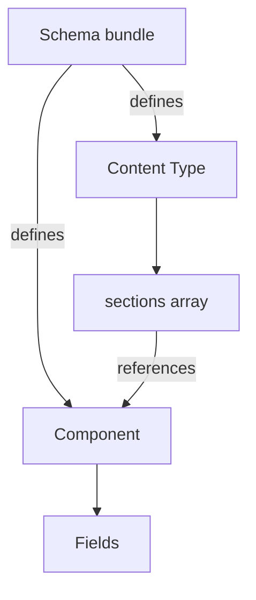

Content modeling defines what can be created on the CMS and the architecture defines how that content moves from your repository to the CMS Admin and, after publishing, to your storefront.

 This guide details both layers for headless integrations, covering core concepts, design principles, JSON Schema rules, consumption patterns, and recommended Content Type structures.

> ℹ️ For platform architecture (CQRS, schema upload lifecycle, file organization), see [Understanding CMS architecture and schema declarations](https://developers.vtex.com/docs/guides/understanding-cms-architecture-and-schema-declarations).

## Before you begin

Before modeling content for a headless store, you need three foundations in place.

### JSON Schema basics

The CMS uses [JSON Schema](https://json-schema.org/) to declare every Content Type, component, and field. You do not need to master the full specification, but you should be comfortable with:

| Concept | Role in the CMS |
| :---- | :---- |
| `type` | Declares the data shape (`string`, `number`, `boolean`, `object`, `array`). |
| `properties` | Lists the fields inside an `object`. |
| `required` | Names fields that must be completed before saving. |
| `items` | Defines the shape of each element in an `array`. |
| `$ref` | Points to another definition in the same schema bundle. |

A minimal field declaration looks like this:

```jsonc
"title": {
  "title": "Title",       // Label shown in the CMS Admin
  "type": "string",
  "description": "Main heading displayed on the page"
}
```

Learn more in the [JSON Schema step-by-step guide](https://json-schema.org/learn/getting-started-step-by-step).

### Content plugin (CLI)

Schemas are authored as `.jsonc` files in your project and uploaded through the [Content plugin](https://developers.vtex.com/docs/guides/content-plugin) (`@vtex/cli-plugin-content`):

```shell
vtex plugins install @vtex/cli-plugin-content
```

Typical workflow:

1. Author component and Content Type files in your repository.  
2. Run `vtex content generate-schema` to produce a unified bundle.  
3. Run `vtex content upload-schema` to publish it to the Schema Registry.

For headless stores, the `generate-schema` command requires two extra arguments: the paths to your component and Content Type directories, and `--base vtex.headless`:

```shell
vtex content generate-schema <components-dir> <pages-dir> --out <output-file> --base vtex.headless
```

For example:

```shell
vtex content generate-schema cms/mystore/components cms/mystore/pages --out cms/mystore/schema.json --base vtex.headless
```

### Headless store setup

| Requirement | Details |
| :---- | :---- |
| CMS enabled | CMS Admin available in your VTEX account. |
| Headless store | A store created with storefront type Headless in **Storefront > Content**. |
| Frontend integration | An app that fetches published entries from the Data Plane API and maps `componentKey` values to UI components. |

Your team owns rendering, preview wiring, and CI/CD. The CMS provides schemas, authoring, and published content delivery.

## Key concepts

| Term | Definition |
| :---- | :---- |
| **Schema** | A versioned bundle that defines all Content Types and components for your store. Identified as `account.name@version` (for example, `mystore.myheadlessstore@1.0.0`) and stored in the Schema Registry. Contains `components`, `content-types`, optional `$defs`, and a `$base` reference to `vtex.headless`. |
| **Content Type** | A page-level template, for example, Home or Landing Page. Defined under the `content-types` key. You can create **entries** from Content Types. |
| **Entry** | One content instance of a Content Type (for example, a landing page with slug `summer-sale`). |
| **Component** | A reusable building block, for example, a banner or navigation bar. Defined under the `components` key. Can appear on multiple Content Types. |
| **Section** | A component that can be added to a page through a Content Type's `sections` array. See [Understanding components and sections](https://developers.vtex.com/docs/guides/understanding-components-and-sections). |
| **Field** | A single property inside a Component or Content Type (`string`, `number`, `boolean`, `object`, or `array`), defined in `properties`. |
| **Base schema** | A shared template in `$defs` (or inherited via `$base`). Other definitions reuse it through `$extends` to avoid duplication. |

## How Content Types and components relate

A **Content Type** describes the shape of a page. **Components** are the building blocks you arrange inside it.



**Relationship in practice:**

| Layer | Declares | Example |
| :---- | :---- | :---- |
| Content Type | Page structure and which components are available | `landingPage` with `slug`, `seo`, and `sections` |
| Component | Reusable block with its own fields | `PromoBanner` with `title`, `image`, `link` |
| Field | Atomic editable value | `title` (string), `image.src` (string \+ media widget) |

A Content Type holds fixed fields (always present on every entry) and a dynamic `sections` array (you choose which components appear and in what order).

### Using a Content Type or a component

| Scenario | Content Type | Component |
| :---- | :---- | :---- |
| Represents a routable **page** | ✅ | |
| Needs **multiple instances** (many landing pages) | ✅ | |
| Only **one instance** store-wide | ✅ (`$singleton: true`) | |
| **Reusable UI block** on one or more pages | | ✅ |
| **Nested inside** another component | | ✅ |
| Needs a **slug** or identifier field | ✅ | |
| Shared across the store (header, footer) | ✅ (singleton Content Type) | ✅ (component inside it) |

> ℹ️ If it has a URL, model it as a Content Type. If it renders a block on a page, model it as a component.

## Design principles

Well-structured schemas reuse definitions instead of duplicating fields. The CMS supports three complementary mechanisms.

### Base schemas

| Level | Mechanism | Purpose |
| :---- | :---- | :---- |
| **Platform** | `"$base": "vtex.headless"` | Inherits the headless platform bundle when you upload your store schema. |
| **Component** | `"$extends": ["#/$defs/base-component"]` | Inherits shared component structure from your base bundle, when available. |
| **Content Type** | `"$extends": ["#/$defs/base-page-template"]` | Shares common page properties across Content Types, when you define a template. |

The `vtex.headless` base provides core platform definitions — not a full page library. You add the `components` and `content-types` your storefront needs.

```jsonc
// Store schema bundle (simplified)
{
  "$id": "youraccount.yourstore@1.0.0",
  "$base": "vtex.headless",
  "components": { /* components you define */ },
  "content-types": { /* Content Types you define */ }
}
```

> ℹ️ Definitions such as `base-component` or `base-page-template` may be provided by your base bundle. Check the merged output of `vtex content generate-schema` before referencing them with `$extends`.

### Extension (`$extends`)

`$extends` inherits properties from one or more definitions in the same bundle. Child properties override parent properties with the same name.

```jsonc
{
  "$extends": ["#/$defs/base-component"],
  "$componentKey": "PromoBanner",
  "$componentTitle": "Promotional Banner",
  "properties": {
    "discountPercentage": {
      "title": "Discount %",
      "type": "number"
    }
  }
}
```

Use `$extends` when multiple components share fields (dates, color variants, link objects) or when Content Types share a common page skeleton.

### Referencing (`$ref`)

`$ref` embeds or reuses a definition without copying it:

| Pattern | Example | Use when |
| :---- | :---- | :---- |
| **Embed a component** | `"seo": { "$ref": "#/components/SEO" }` | Every entry of a Content Type needs the same block. |
| **Open section picker** | `"sections": { "$ref": "#/$defs/$ALLOW_ALL_COMPONENTS" }` | You need to add any component you registered. |
| **Restricted sections** | `"sections": { "type": "array", "items": { "anyOf": [...] } } }` | Only certain components are allowed on a page. |

```jsonc
"seo": {
  "$ref": "#/components/SEO"
}

"sections": {
  "$ref": "#/$defs/$ALLOW_ALL_COMPONENTS"
}
```

> ℹ️ `$ALLOW_ALL_COMPONENTS` is generated when you run `vtex content generate-schema`. It lists every component in your bundle as an `anyOf` array. Reference it in Content Types. Do not hand-author this definition in individual `.jsonc` files.

## JSON Schema fundamentals

### Supported draft

The CMS uses JSON Schema draft [2019-09](https://json-schema.org/draft/2019-09/json-schema-validation) with a VTEX-specific vocabulary for CMS keywords and widgets.

### CMS-specific keywords

These keywords extend standard JSON Schema. They are resolved when you upload a bundle.

| Keyword | Applies to | Purpose |
| :---- | :---- | :---- |
| `$base` | Schema bundle | Inherits the `vtex.headless` platform schema. |
| `$extends` | Component, Content Type | Inherits properties from other definitions in the bundle. |
| `$componentKey` | Component | Unique identifier used in API responses and frontend mapping. |
| `$componentTitle` | Component | Display name in the CMS Admin. |
| `$singleton` | Content Type | Limits the Content Type to a single entry (for example, `home`, `globalHeader`). |
| `$abstract` | Component | Marks a template-only component that you can’t add to pages. |
| `identifierKeys` | Content Type | Fields that uniquely identify entries (for example, `["slug"]`). |
| `widget` | Field | Controls the Admin UI control (`ui:widget`). |
| `enumNames` | Field | Human-readable labels for `enum` values. |

For schema file naming and upload workflow, see [Understanding CMS architecture and schema declarations](https://developers.vtex.com/docs/guides/understanding-cms-architecture-and-schema-declarations).

### Field types and schema mappings

| Field type | JSON Schema | Description |
| :---- | :---- | :---- |
| Short text | `{ "type": "string" }` | Default text input. |
| Long text | `string` \+ `"ui:widget": "text-area"` | Multi-line input. |
| URL slug | `string` \+ `"ui:widget": "slug"` | Normalized with `/` prefix. |
| Number | `{ "type": "number" }` or `"integer"` | Integers for counts and limits. |
| Toggle | `{ "type": "boolean" }` | Checkbox. |
| Select | `enum` \+ optional `enumNames` | Dropdown. |
| Date and time | `string` \+ `"ui:widget": "date-time"` | Stored as ISO 8601 string. |
| Image or video | `string` \+ `"ui:widget": "media-gallery"` | References Media Gallery assets. |
| Rich text | `string` \+ `"ui:widget": "draftjs-rich-text"` | Formatted text stored as a JSON string. |
| Group of fields | `{ "type": "object", "properties": {…} }` | Nested form section. |
| List of items | `{ "type": "array", "items": {…} }` | Repeatable blocks (footer links, nav items). |

### Validation rules and constraints

Standard JSON Schema validation runs when you save content. Common constraints:

| Constraint | Example | Effect |
| :---- | :---- | :---- |
| `required` | `"required": ["title", "slug"]` | Named fields must be filled. |
| `minLength` / `maxLength` | `"minLength": 10` on a slug | Enforces string length. |
| `minimum` / `maximum` | `"maximum": 5` on item count | Bounds numeric values. |
| `minItems` / `maxItems` | `"minItems": 1, "maxItems": 8` on a link array | Limits array size. |
| `enum` | `"enum": ["primary", "secondary"]` | Restricts to allowed values. |
| `default` | `"default": "primary"` | Pre-fills new entries. |

Invalid data is rejected when saving, before content is published.

## Consuming content

After you upload schemas and publish content, your headless storefront reads published entries from the Data Plane API. The schema you defined shapes the JSON your app receives: field names, section structure, and `componentKey` values.

For the full lifecycle (schema upload, authoring, publishing, sync), see [Understanding CMS architecture and schema declarations](https://developers.vtex.com/docs/guides/understanding-cms-architecture-and-schema-declarations).

Your storefront owns:

- **Routing**: Mapping URLs to Content Types and slugs.  
- **Locale**: Passing the `locale` query parameter when fetching entries.  
- **Rendering**: Mapping each `componentKey` to a UI component in your framework.

The sections below cover the most common consumption patterns.

### Fetch a page by route or slug

Use this pattern when a URL arrives at your frontend and you need to load the corresponding CMS entry. Pass the slug as a path segment after `entries/slug/`. Multi-segment slugs (for example, `en/promo`) are supported.

```shell
GET https://{account}.vtexcommercestable.com.br/api/content-platform/data/{account}/{storeId}/{contentType}/entries/slug/summer-sale
```

**Response shape (simplified):**

```json
{
  "componentKey": "landingPage",
  "slug": "summer-sale",
  "sections": [
    {
      "componentKey": "PromoBanner",
      "title": "Summer Sale",
      "image": { "src": "https://...", "alt": "Banner" }
    }
  ]
}
```

To request a localized version, add the `locale` query parameter:

```shell
GET https://{account}.vtexcommercestable.com.br/api/content-platform/data/{account}/{storeId}/landingPage/entries/slug/summer-sale?locale=pt-BR
```

### Fetch all entries of a content type

Use this pattern to build listing pages (for example, a blog index or a campaign directory), or to pre-render all entries at build time.

```shell
GET https://{account}.vtexcommercestable.com.br/api/content-platform/data/{account}/{storeId}/blogPost/entries
```

**Response shape (simplified):**

```json
{
  "entries": [
    {
      "id": "abc123",
      "name": "Summer trends",
      "createdAt": "2024-06-01T00:00:00Z",
      "updatedAt": "2024-06-15T12:00:00Z"
    },
    {
      "id": "def456",
      "name": "Back to school guide",
      "createdAt": "2024-07-01T00:00:00Z",
      "updatedAt": "2024-07-10T09:00:00Z"
    }
  ],
  "scroll": "eyJzb3J0IjoidXBkYXRlZEF0Iiw..."
}
```

By default, only entry metadata is returned. To include the full content blob for each entry, add `?content=all`:

```shell
GET https://{account}.vtexcommercestable.com.br/api/content-platform/data/{account}/{storeId}/blogPost/entries?content=all
```

### Paginate through entries

The Data Plane API uses scroll-based pagination. Each response returns a `scroll` token when more entries exist. Pass it as the `scroll` query parameter to fetch the next page. Each page contains up to 20 entries.

**First request:**

```shell
GET https://{account}.vtexcommercestable.com.br/api/content-platform/data/{account}/{storeId}/blogPost/entries


```

```jsonc
{
  "entries": [ /* 20 entries */ ],
  "scroll": "eyJzb3J0IjoidXBkYXRlZEF0Iiw..."
}
```

**Next page:**

```shell
GET https://{account}.vtexcommercestable.com.br/api/content-platform/data/{account}/{storeId}/blogPost/entries?scroll=eyJzb3J0IjoidXBkYXRlZEF0Iiw...
```

When `scroll` is absent from the response, you have reached the last page.

You can also control sort order:

```shell
GET https://{account}.vtexcommercestable.com.br/api/content-platform/data/{account}/{storeId}/blogPost/entries?sort=createdAt&order=asc
```

### Fetch singleton or global content

Singleton Content Types (defined with `"$singleton": true`) have exactly one entry store-wide — no slug is needed. Fetch them by listing the Content Type's entries and reading the first (and only) result. This is the standard pattern for headers, footers, and global navigation.

```shell
GET https://{account}.vtexcommercestable.com.br/api/content-platform/data/{account}/{storeId}/globalHeader/entries?content=all
```

```json
{
  "entries": [
    {
      "id": "xyz789",
      "name": "Global Header",
      "blobContent": {
        "componentKey": "globalHeader",
        "sections": [
          {
            "componentKey": "SiteHeader",
            "logo": { "src": "https://...", "alt": "My Store" },
            "links": [
              { "label": "Sale", "href": "/sale" }
            ]
          }
        ]
      }
    }
  ]
}
```

### Map `componentKey` to UI components

Every section object in an API response includes a `componentKey` that identifies which component to render. Your frontend is responsible for mapping these keys to actual UI components.

A typical implementation in React:

```tsx
import { PromoBanner } from '@/components/PromoBanner'
import { SiteHeader } from '@/components/SiteHeader'
import { RichText } from '@/components/RichText'

const COMPONENT_MAP: Record<string, React.ComponentType<unknown>> = {
  PromoBanner,
  SiteHeader,
  RichText,
}

function Sections({ sections }: { sections: { componentKey: string; [key: string]: unknown }[] }) {
  return (
    <>
      {sections.map((section, index) => {
        const Component = COMPONENT_MAP[section.componentKey]
        if (!Component) {
          return null
        }
        return <Component key={index} {...section} />
      })}
    </>
  )
}
```

Each component receives the full section object as props, so field names in your JSON Schema map directly to the props your component expects. If a `componentKey` is not in your map, the section is silently skipped — this is a safe default during incremental rollout.

<!-- For full query parameter documentation (`locale`, `sort`, `order`, `content`, `scroll`), see the [Data Plane API reference](https://developers.vtex.com/docs/api-reference/data-plane-api). -->

## Recommended content modeling patterns

The patterns below are common conventions for headless commerce storefronts. Names, components, and routes are yours to define. Nothing in this section exists until you add it to your schema bundle.

### Partial and reusable Content Types

Some content applies across every page rather than to a single route.

| Pattern | Suggested Content Type name | Components you might define | Purpose |
| :---- | :---- | :---- | :---- |
| **Header** | `globalHeader` | `SiteHeader`, `AnnouncementBar` | Top navigation, logo, utility links. |
| **Footer** | `globalFooter` | `SiteFooter` | Links, social icons, copyright. |
| **Navigation** | Inside a header component | Link arrays, menu items | Main menu is maintained once. |
| **Banners** | On page Content Types | `PromoBanner`, `TextBanner` | Promotional blocks per page. |

```jsonc
// cms/pages/cms_content_type__globalHeader.jsonc
{
  "title": "Global Header",
  "type": "object",
  "$singleton": true,
  "identifierKeys": [],
  "properties": {
    "sections": {
      "$ref": "#/$defs/$ALLOW_ALL_COMPONENTS"
    }
  }
}
```

Fetch singleton entries by Content Type name (no slug) and wrap every page layout with the returned sections.

> ℹ️ **Navigation** is usually a component inside a header singleton, not its own page Content Type. **Banners** are components on page-level Content Types. Each page chooses its own banner stack.

### Page Content Types

| Page type | `$singleton` | `identifierKeys` | Components you might use | Example route |
| :---- | :---- | :---- | :---- | :---- |
| **Home** | `true` | `[]` | Promo banners, featured collections | `/` |
| **Landing page** | `false` | `["slug"]` | Banners, rich text, CTA | `/{slug}` |
| **PLP** | `false` | `["slug"]` | Breadcrumb, layout config | `/category/{slug}` |
| **PDP** | `false` | `["slug"]` | Product layout, cross-sell blocks | `/product/{slug}` |
| **Blog category** | `false` | `["slug"]` | Category header, article list | `/blog/{slug}` |
| **Blog post** | `false` | `["slug"]` | Article body, related content | `/blog/post/{slug}` |

**Home**: One entry, no slug:

```jsonc
{
  "title": "Home",
  "type": "object",
  "$singleton": true,
  "identifierKeys": [],
  "properties": {
    "seo": { "$ref": "#/components/SEO" },
    "sections": { "$ref": "#/$defs/$ALLOW_ALL_COMPONENTS" }
  }
}
```

**Landing page**: Many entries, slug required:

```jsonc
{
  "title": "Landing Page",
  "type": "object",
  "$singleton": false,
  "identifierKeys": ["slug"],
  "properties": {
    "slug": {
      "title": "Slug",
      "type": "string",
      "widget": { "ui:widget": "slug" }
    },
    "sections": { "$ref": "#/$defs/$ALLOW_ALL_COMPONENTS" }
  }
}
```

**PLP and PDP**: The CMS entry controls layout and display configuration. Product data (catalog, prices, stock) still comes from VTEX commerce APIs.

**Blog**: Define `blogCategory` and `blogPost` Content Types when your storefront needs editorial content:

```jsonc
// cms/pages/cms_content_type__blogPost.jsonc
{
  "title": "Blog Post",
  "type": "object",
  "$singleton": false,
  "identifierKeys": ["slug"],
  "properties": {
    "slug": {
      "title": "Slug",
      "type": "string",
      "widget": { "ui:widget": "slug" }
    },
    "title": { "title": "Title", "type": "string" },
    "body": {
      "title": "Body",
      "type": "string",
      "widget": { "ui:widget": "draftjs-rich-text" }
    },
    "sections": {
      "type": "array",
      "items": {
        "anyOf": [
          { "$ref": "#/components/RelatedArticles" },
          { "$ref": "#/components/AuthorBio" }
        ]
      }
    }
  }
}
```

Restricting `sections` with a custom `anyOf` (instead of `$ALLOW_ALL_COMPONENTS`) keeps commerce components off article pages.

## Related resources

<Flex>

<WhatsNextCard  
  linkTo="https://developers.vtex.com/docs/guides/understanding-cms-architecture-and-schema-declarations"  
  title="Understanding CMS architecture and schema declarations"  
  description="Learn about CQRS, schema file organization, and the content lifecycle."  
  linkTitle="See more"  
/>

<WhatsNextCard  
  linkTo="https://developers.vtex.com/docs/guides/content-plugin"  
  title="Content plugin"  
  description="Generate and upload schema bundles for your headless store."  
  linkTitle="See more"  
/>

</Flex>
