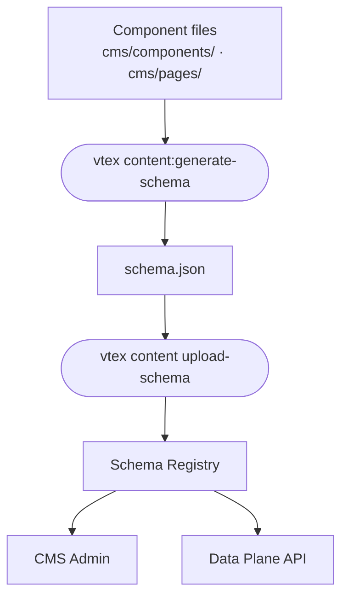

A component is a reusable JSON Schema object that groups related fields, a link, a banner, an SEO block, or a full page section. In a headless project, you declare each component in its own `.jsonc` file under `cms/components/`, merge them into a schema bundle with the [Content plugin](https://developers.vtex.com/docs/guides/content-plugin), and upload the bundle to the Schema Registry.

This guide covers how to define components, including file structure, required properties, and four annotated examples: a reusable building block, a page section, nested composition with `$ref`, and polymorphic fields.

<!-- TODO: Uncomment when "Understanding content modeling and architecture for headless stores" is published.
> ℹ️ For modeling concepts (Content Type vs. component, singleton patterns, recommended page structures), see [Understanding content modeling and architecture for headless stores](https://developers.vtex.com/docs/guides/content-modeling-and-architecture-for-headless-stores). 
!-->



## Before you begin

The Content plugin provides the CLI commands used in this guide to generate and upload your schema bundle. Make sure it is installed before proceeding by following the [Content plugin](https://developers.vtex.com/docs/guides/content-plugin) guide.

<!-- TODO: Uncomment when companion guides are published.
 * [Understanding content modeling and architecture for headless stores](https://developers.vtex.com/docs/guides/content-modeling-and-architecture-for-headless-stores)
 * [Defining content types for headless stores](https://developers.vtex.com/docs/guides/defining-content-types-for-headless-stores) !-->

## Distinguishing components from Content Types

Both components and Content Types are JSON Schema objects, but they play different roles:

| Criteria | Component | Content Type |
| :---- | :---- | :---- |
| **Purpose** | Defines a reusable data shape or a page block to add to a page. | Defines a page template to create entries from. |
| **Schema key** | `components` | `content-types` |
| **File prefix** | `cms_component__` | `cms_content_type__` |
| **Identifiers** | `$componentKey`, `$componentTitle` | `identifierKeys`, `$singleton` |
| **Referenced from pages** | Embedded with `$ref` or listed in a `sections` array. | Creates entries fetched by Content Type name or slug. |
| **Storefront mapping** | Map `$componentKey` to a UI block or nested field renderer. | Map Content Type name to a page route and layout. |

<!-- TODO: Uncomment when "Understanding content modeling and architecture for headless stores" is published.
> ℹ️ If it has a URL, model it as a Content Type. If it renders a block on a page or groups fields reused elsewhere, model it as a component. See [Choosing between a Content Type and a component](https://developers.vtex.com/docs/guides/content-modeling-and-architecture-for-headless-stores#choosing-between-a-content-type-and-a-component). !-->

Sections are components that you add to a page through a Content Type's `sections` array. Reusable building blocks (such as `Link` or `SEO`) are usually embedded inside sections or Content Types with `$ref` instead of appearing in the section picker.

## Organizing component files

Each component lives in its own file. The [Content plugin](https://developers.vtex.com/docs/guides/content-plugin) discovers files by prefix and merges them into the `components` key of your schema bundle.

### Structuring directories

Keep component schemas separate from Content Type files:

```shell
your-headless-project/
├── cms/
│   ├── components/
│   │   ├── cms_component__Link.jsonc
│   │   ├── cms_component__SEO.jsonc
│   │   ├── cms_component__CallToAction.jsonc
│   │   └── cms_component__PromoBanner.jsonc
│   └── pages/
│       ├── cms_content_type__home.jsonc
│       └── cms_content_type__landingPage.jsonc
└── src/
    └── …                          # Your storefront implementation
```

You can use a different directory. The CLI accepts custom paths as arguments. The file prefix is what determines discovery.

### Naming component files

| Rule | Example | Result in schema bundle |
| :---- | :---- | :---- |
| File prefix | `cms_component__` | Required. Files without this prefix are ignored. |
| Component ID | `cms_component__PromoBanner.jsonc` | Becomes the key `PromoBanner` under `components`. |
| Casing | Use PascalCase for the ID segment | `PromoBanner`, `CallToAction`, `SEO` |
| Extension | `.jsonc` (recommended) or `.json` | `.jsonc` allows inline comments for documentation. |

> ⚠️ The component ID (the segment after `cms_component__`) must match `$componentKey` in the file. This value appears in published JSON and is what your storefront uses to pick a renderer.

### Uploading the schema bundle

Generate and upload the bundle:

```shell
vtex content:generate-schema cms/components cms/pages
  --out schema.json
```

> ⚠️ For headless projects that use a custom base schema, pass `--remote <url>` to point to a publicly accessible JSON Schema file, or `--local <path>` to use a local file. If your project extends `vtex.faststore`, omit both flags. The command fetches the FastStore schema automatically.

```shell
vtex content upload-schema schema.json
```

On success, the CLI prints:

```shell
✓ Validating schema.json
✓ Uploading schema to registry for account: <yourstore>
✓ Schema uploaded successfully
```

The `generate-schema` command also creates `#/$defs/$ALLOW_ALL_COMPONENTS`, a generated list of every component in your bundle. Content Types reference it for open section pickers. See [Making components available on pages](#making-components-available-on-pages). Do not hand-author this definition in individual files.

## Declaring required and optional properties

A component schema is a JSON Schema `object` with CMS-specific metadata.

### CMS-specific properties

| Property | Required | Description |
| :---- | :---- | :---- |
| `$componentKey` | ✅ | Unique identifier used in API responses and storefront mapping. |
| `$componentTitle` | ✅ | Display name in the CMS Admin section picker and forms. |
| `type` | ✅ | Must be `"object"`. |
| `properties` | ✅ | Field definitions for the component. |
| `$extends` | Optional | Inherits structure from base definitions (for example, `#/$defs/base-component`). |
| `$abstract` | Optional | When `true`, marks a template-only component that cannot be added directly to pages. Use on building blocks embedded with `$ref`. |
| `title` | Optional | Form section title (often matches `$componentTitle` for sections). |
| `description` | Optional | Help text shown in the Admin form. |
| `required` | Optional | Lists fields that must be filled before saving. |
| `widget` | Optional | Applied to individual field definitions inside `properties` (not at the component root). Overrides the default Admin form widget for that field. For example, `{ "ui:widget": "media-gallery" }` renders a media picker instead of a plain text input. |

### Reusable building blocks and page sections

| Pattern | Typical `$abstract` | Appears in section picker | Example |
| :---- | :---- | :---- | :---- |
| **Reusable building block** | `true` | No. Embedded with `$ref` only | `Link`, `SEO`, shared promo base |
| **Page section** | `false` (default) | Yes. When referenced from a Content Type's `sections` | `CallToAction`, `PromoBanner`, `RichTextBlock` |

Set `$abstract: true` on building blocks that should never be placed directly on a page. Leave it unset (or `false`) on sections you add through the page editor.

## Defining a reusable building block

The example below defines a `Link` component with three fields. `Link` is never added as a standalone section. Other components and Content Types embed it with `$ref`.

**File:** `cms/components/cms_component__Link.jsonc`

```jsonc
{
  // Unique ID: must match the filename segment after cms_component__
  "$componentKey": "Link",
  "$componentTitle": "Link",

  // Template-only: excluded from the section picker
  "$abstract": true,

  "type": "object",
  "required": ["text", "url"],

  "properties": {
    "text": {
      "title": "Text",
      "type": "string"
    },
    "url": {
      "title": "URL",
      "type": "string"
    },
    "linkTargetBlank": {
      "title": "Open link in new window?",
      "type": "boolean",
      "default": false
    }
  }
}
```

**What you get in the Admin:** a reusable link form wherever another schema references `#/components/Link`.

**What your storefront does:** render the nested `link` object inside a parent section or Content Type field. No separate `componentKey` lookup for `Link` unless you fetch it as an embedded object.

## Defining a page section

The example below defines a `CallToAction` section, a page block you add through a Content Type's `sections` array. It includes a title and a nested link object.

**File:** `cms/components/cms_component__CallToAction.jsonc`

```jsonc
{
  "$componentKey": "CallToAction",
  "$componentTitle": "Call To Action",

  "title": "Call To Action",
  "description": "Promotional block with a headline and link.",
  "type": "object",
  "required": ["title", "link"],

  "properties": {
    "title": {
      "title": "Title",
      "type": "string"
    },
    "link": {
      "title": "Link",
      "type": "object",
      "required": ["text", "url"],
      "properties": {
        "text": {
          "title": "Text",
          "type": "string"
        },
        "url": {
          "title": "URL",
          "type": "string"
        }
      }
    }
  }
}
```

Adding this component to a Content Type affects two places:

- In the Admin: a section you can add, reorder, and configure on any Content Type that exposes `$ALLOW_ALL_COMPONENTS` (or a restricted `anyOf` list that includes `CallToAction`).

- In the storefront: map `componentKey: "CallToAction"` to a UI component and render `title` and `link` from the published JSON.

## Composing components with `$ref`

When the same field shape appears in multiple components, define it once and reference it with `$ref` instead of duplicating properties.

The example below updates `CallToAction` to reuse the `Link` component from the previous section:

**File:** `cms/components/cms_component__CallToAction.jsonc`

```jsonc
{
  "$componentKey": "CallToAction",
  "$componentTitle": "Call To Action",

  "title": "Call To Action",
  "type": "object",
  "required": ["title", "link"],

  "properties": {
    "title": {
      "title": "Title",
      "type": "string"
    },
    "link": {
      "title": "Link",
      // Reuses the Link component: includes linkTargetBlank automatically
      "$ref": "#/components/Link"
    }
  }
}
```

Both components must exist in the same schema bundle before upload. The Schema Registry resolves `$ref` pointers when the bundle is saved, so the Admin form and validation use the merged `Link` definition.

| Approach | Use when |
| :---- | :---- |
| **Inline object** | The nested shape is used in one place only and is unlikely to change. |
| **`$ref` to another component** | The same shape is reused across multiple components or Content Types (links, SEO blocks, media objects). |
| **`$extends` on the component** | Multiple components share a base set of fields (promotion dates, color variants). |

## Defining polymorphic fields inside a component

Polymorphic fields accept more than one shape depending on what you choose. Instead of a fixed object, you declare a set of variants using `anyOf` or `oneOf`, and the CMS Admin presents you with a picker to select which variant to fill in.

The two JSON Schema keywords work the same way structurally but enforce different validation rules. Use `oneOf` when exactly one variant must match, and `anyOf` when one or more can match. Beyond validation, the main practical difference is whether the field is **a single object** or **an array of items**. That is what changes the UI behavior, not the keyword itself.

| Keyword | Validation rule | Notes |
| :---- | :---- | :---- |
| `oneOf` | Exactly one schema must match. | Can be used on a single field or on array items. |
| `anyOf` | One or more schemas may match. | Can be used on a single field or on array items. |

> ⚠️ Keep `$componentKey` values stable across schema versions. Changing a key breaks existing published content that references the old value, and storefront renderers that map on `componentKey` will stop matching.

The examples below use a `CustomCarousel` component to illustrate both patterns.

### Single field without an array

The example below uses `oneOf` on a single `card` field. You pick exactly one variant, image card or text card, and fill in its fields. You could also use `anyOf` here with the same structural result. The keyword choice depends on your validation intent.

**File:** `cms/components/cms_component__CustomCarouselOneOf.jsonc`

```jsonc
{
  "$componentKey": "CustomCarouselOneOf",
  "$componentTitle": "Custom Carousel oneOf",
  "$abstract": false,
  "title": "Custom Carousel oneOf",
  "description": "Custom Carousel with oneOf object",
  "type": "object",
  "required": [],

  "properties": {
    "card": {
      "title": "Card",
      "oneOf": [
        {
          "title": "Image Card",
          "type": "object",
          "properties": {
            "image": {
              "title": "Image URL",
              "type": "string",
              // Renders a media picker in the Admin form instead of a plain text input
              "widget": { "ui:widget": "media-gallery" }
            },
            "link": {
              "title": "Link URL",
              "type": "string",
              "format": "uri"
            }
          }
        },
        {
          "title": "Text Card",
          "type": "object",
          "properties": {
            "text": {
              "title": "Text Content",
              "type": "string"
            },
            "link": {
              "title": "Link URL",
              "type": "string",
              "format": "uri"
            }
          }
        }
      ]
    }
  }
}
```

Using `oneOf` on a single field changes behavior in two places:

- In the Admin: a single `Card` field with a type picker. You choose "Image Card" or "Text Card" and fill in its fields. Only one variant is active at a time.

- In the storefront:  read the published `card` object and branch on which properties are present (`image` vs. `text`) to decide which renderer to use.

### Array field with multiple items

The example below uses `anyOf` on the `items` of a `cards` array. Multiple items of different types can be added in any order and combination. You could also use `oneOf` on array items. The keyword choice again depends on validation intent.

**File:** `cms/components/cms_component__CustomCarouselAnyOf.jsonc`

```jsonc
{
  "$componentKey": "CustomCarouselAnyOf",
  "$componentTitle": "Custom Carousel anyOf",
  "$abstract": false,
  "title": "Custom Carousel anyOf",
  "description": "Custom Carousel with anyOf object",
  "type": "object",
  "required": [],

  "properties": {
    "cards": {
      "title": "Cards",
      "type": "array",
      "items": {
        "anyOf": [
          {
            "title": "Image Card",
            "type": "object",
            "properties": {
              "image": {
                "title": "Image URL",
                "type": "string",
                // Renders a media picker in the Admin form instead of a plain text input
                "widget": { "ui:widget": "media-gallery" }
              },
              "link": {
                "title": "Link URL",
                "type": "string",
                "format": "uri"
              }
            }
          },
          {
            "title": "Text Card",
            "type": "object",
            "properties": {
              "text": {
                "title": "Text Content",
                "type": "string"
              },
              "link": {
                "title": "Link URL",
                "type": "string",
                "format": "uri"
              }
            }
          }
        ]
      }
    }
  }
}
```

**What you get in the Admin:** a `Cards` list with an **Add item** dropdown. Each click adds a new item, you pick "Image Card" or "Text Card" per item, and items of different types can be freely mixed and reordered in the same list.


In the image above, there's the `Custom Carousel anyOf` section in the CMS Admin. The `Cards` array accepts Image Card and Text Card items in any order and combination.

**What your storefront does:** iterate over the `cards` array and dispatch each item to the appropriate renderer based on which properties are present.

> ℹ️ The examples above illustrate two different **array contexts**, not a rule about which keyword to use where. `anyOf` and `oneOf` can each appear on a single field or on array items. What changes the UI behavior is the array context: a single field renders a type-picker, while an array renders a growable list with per-item type selection.

## Making components available on pages

Components become editable page blocks when a Content Type references them through a `sections` property.

### Opening the section picker to all components

Reference the generated `$ALLOW_ALL_COMPONENTS` definition:

```jsonc
// cms/pages/cms_content_type__landingPage.jsonc
{
  "properties": {
    "sections": {
      "title": "Page sections",
      "$ref": "#/$defs/$ALLOW_ALL_COMPONENTS"
    }
  }
}
```

Every component in your bundle (including `CallToAction` and `PromoBanner`) appears in the Admin section picker. Building blocks such as `Link` and `SEO` are meant to be embedded with `$ref`, not added as standalone sections. Mark them with `$abstract: true` to signal that intent to the Admin.

### Restricting sections

When a Content Type should allow only certain sections, replace `$ALLOW_ALL_COMPONENTS` with an explicit `anyOf` list:

```jsonc
"sections": {
  "title": "Page sections",
  "type": "array",
  "items": {
    "anyOf": [
      { "$ref": "#/components/CallToAction" },
      { "$ref": "#/components/PromoBanner" },
      { "$ref": "#/components/RichTextBlock" }
    ]
  }
}
```

Use restricted lists on Content Types where commerce or promotional sections would not make sense, for example, blog posts or legal pages.

## Reviewing the published component shape

After adding a `CallToAction` section to a landing page and publishing it, the Data Plane returns content shaped like this:

```jsonc
{
  "componentKey": "landingPage",
  "slug": "summer-sale",
  "sections": [
    {
      "componentKey": "CallToAction",
      "title": "Get 20% off your first order",
      "link": {
        "text": "Shop now",
        "url": "/sale",
        "linkTargetBlank": false
      }
    }
  ]
}
```

Each item in `sections` includes a `componentKey` your storefront uses to select a renderer. Nested objects from `$ref` (such as `link`) do not get their own top-level `componentKey` unless the schema defines them as embedded components at the Content Type level (as with `seo` on a landing page).

## Rendering components in headless storefronts

Your storefront owns the mapping from schema to UI:

1. Fetch the entry from the Data Plane API by Content Type name or slug.
2. Loop through `sections` (or fixed component fields such as `seo`).
3. Match `componentKey` to a component in your framework (React, Vue, Svelte, or server templates).
4. Pass field values as props or template context.

Unlike FastStore integrations, headless projects do not ship with a predefined component library. You define both the schemas in `cms/components/` and the renderers in your codebase. Keep `$componentKey` values stable: changing them breaks existing published content and storefront mappings.

For the full content lifecycle (schema upload, authoring, publishing, delivery), see [Understanding CMS architecture and schema declarations](https://developers.vtex.com/docs/guides/understanding-cms-architecture-and-schema-declarations).

---

## Related resources

<Flex>

<WhatsNextCard
  linkTo="https://developers.vtex.com/docs/guides/defining-content-types-for-headless-stores"
  title="Defining content types for headless stores"
  description="Declare Content Types that expose your components through sections arrays and embedded relations."
  linkTitle="See more"
/>

<WhatsNextCard
  linkTo="https://developers.vtex.com/docs/guides/understanding-components-and-sections"
  title="Understanding components and sections"
  description="Learn how components and sections relate in CMS page assembly."
  linkTitle="See more"
/>

</Flex>
