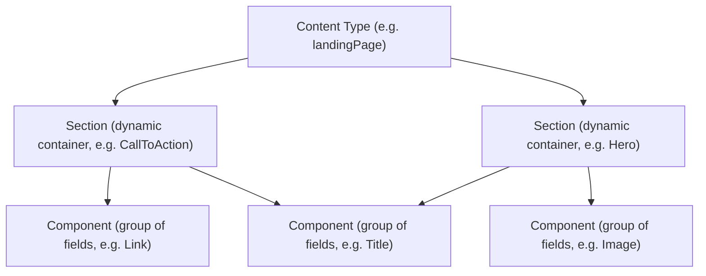

**Components** and **Sections** are the building blocks editors and developers use to assemble storefront pages through the CMS. Understanding the difference between them is key to deciding what to create when you want to expose new content for editing in VTEX Admin and where it should live in your project.

This guide explains both concepts, shows how they relate to [Content Types](https://developers.vtex.com/docs/guides/understanding-cms-architecture-and-schema-declarations), and lists common Section examples shipped with FastStore.

## Content hierarchy

In the CMS, content is organized in a hierarchy: a **Content Type** declares which **Sections** are available on a page, and each Section is composed of one or more **Components** (groups of fields).



At runtime, your storefront (FastStore or another headless storefront) is responsible for mapping this hierarchy, Content Types, Sections, and Components, into actual UI components and HTML.

## Components

A **Component** is a **group of fields** declared with [JSON Schema](https://json-schema.org/). It defines the data structure (such as a title, an image, or a link) that editors fill in through the CMS Admin form.

Regardless of the storefront technology you use, a Component:

- Declares which fields exist and their data types.
- Controls how fields appear in Admin (labels, descriptions, validation).
- Is reused across different Sections and Content Types.

### Schema files for Components

Each Component lives in its own `.jsonc` file using the naming convention `cms_component__ComponentName.jsonc`. The schema relies on a few CMS-specific keywords:

| Keyword | Purpose |
| :---- | :---- |
| `$componentKey` | Unique identifier for the Component. |
| `$componentTitle` | Display name shown in the CMS interface. |
| `$extends` | Inherits properties from base schemas (for example, `#/$defs/base-component`). |

For more details on schema declarations, see [Understanding CMS architecture and schema declarations](https://developers.vtex.com/docs/guides/understanding-cms-architecture-and-schema-declarations).

### `Link` Component example

The schema below declares a reusable `Link` Component made of two fields (`text` and `url`) in a [FastStore project](https://developers.vtex.com/docs/guides/cms-for-faststore-storefronts).

```jsonc
{
  "$extends": ["#/$defs/base-component"],
  "$componentKey": "Link",
  "$componentTitle": "Link",
  "type": "object",
  "required": ["text", "url"],
  "properties": {
    "text": {
      "title": "Text",
      "type": "string"
    },
    "url": {
      "title": "URL",
      "type": "string"
    }
  }
}
```

> ℹ️ A plain Component is not directly placed on a page on its own. It is meant to be reused **inside** a Section or composed into another Component as a field.

## Sections

A **Section** is a type of Component that acts as a dynamic container of other components. Sections are the units that editors drag, reorder, and configure on a page in the CMS Admin. They group other Components to create specific parts of a storefront page (such as a hero banner, a product shelf, or a call-to-action block).

Conceptually, a Section:

- Uses the same JSON Schema mechanics as a regular Component.
- Is referenced from a **Content Type**, so it becomes available in the page editor.
- Encapsulates a part of the page (for example, "Hero", "Footer", "Product shelf").

### Rendering Sections in storefronts

How a Section is rendered depends on the storefront:

- In **FastStore projects**, each Section has a corresponding React component in `src/components/`, exported through `src/components/index.tsx`, that renders the data editors configure in Admin.
- In **other headless storefronts**, you can map Section identifiers (for example, `$componentKey: "Hero"`) to your own Vue, React, or server-side templates, following the same principle.

### `CallToAction` Section example

The schema below declares a `CallToAction` Section in a FastStore project, composed of a `title` field and a nested `link` object (which mirrors the `Link` Component shape):

```jsonc
{
  "$extends": ["#/$defs/base-component"],
  "$componentKey": "CallToAction",
  "$componentTitle": "Call To Action",
  "title": "Call To Action",
  "description": "Get your 20% off on the first purchase!",
  "type": "object",
  "required": ["title", "link"],
  "properties": {
    "title": {
      "title": "Title",
      "type": "string"
    },
    "link": {
      "title": "Link Path",
      "type": "object",
      "required": ["text", "url"],
      "properties": {
        "text": {
          "title": "Text",
          "type": "string"
        },
        "url": {
          "title": "URL",
          "type": "string"
        }
      }
    }
  }
}
```
<!-- Add the following callout once we have the following guide published
> ℹ️ To see a Section being created end-to-end in a FastStore project, follow the [Extending a component](https://developers.vtex.com/docs/guides/cms-extending-a-component) guide.-->

## Differences between Components and Sections

| Criteria | Component | Section |
| :---- | :---- | :---- |
| **Purpose** | Defines a reusable data shape (for example, a link, badge, or media block). | Page-placeable container of Components that represents a full page block (for example, hero, shelf, footer). |
| **Scope** | Reused inside Sections or other Components. | Exposed in the CMS page editor for editors to add to a page. |
| **Schema file** | Stored as a component schema file (for example, `cms_component__*.jsonc` in FastStore projects). | Also stored as a component schema file; Sections are distinguished by how they are used (referenced by Content Types and rendered as page blocks). |
| **Referenced from a Content Type** | Typically **no**. Used as nested objects or arrays inside Sections and other Components. | **Yes.** Listed in one or more Content Type schemas so editors can add them to pages. |
| **Rendering** | Data is consumed by a parent component or template. | Maps directly to a storefront component or template that renders an entire page block. |

## Relationship with Content Types

A **Content Type** (such as `home`, `pdp`, `plp`, or `landingPage`) defines a page structure and declares which Sections editors can add to that page. When you create a new Section, you make it available to editors by referencing it from one or more Content Type schemas.

In any storefront integration:

- Components and Sections define **what** can be edited.
- Content Types define **where** those Sections can appear and how the page is structured.
- Your storefront code is responsible for fetching Content Type entries and rendering the referenced Sections and Components.

For a deeper dive into how schemas are organized, validated, and deployed, see [Understanding CMS architecture and schema declarations](https://developers.vtex.com/docs/guides/understanding-cms-architecture-and-schema-declarations).

## Native Sections in FastStore

FastStore ships with several native Sections you can reuse or override before creating new ones. These examples apply specifically to FastStore projects, but the underlying concepts (page-placeable Sections composed of Components) apply to any storefront.

Some examples:

- [`Hero`](https://developers.vtex.com/docs/guides/faststore/organisms-hero): Full-width banner used above the fold.
- [`ProductGrid`](https://developers.vtex.com/docs/guides/faststore/organisms-product-grid): Product list typically used on PLP pages.
- [`Navbar`](https://developers.vtex.com/docs/guides/faststore/organisms-navbar): Top navigation bar.

## Next steps

<Flex>

<WhatsNextCard
  linkTo="https://developers.vtex.com/docs/guides/cms-extending-a-component"
  title="Extending a component"
  description="Learn how to extend an existing component, such as the CallToAction Section, in your FastStore project."
  linkTitle="See more"
/>

<WhatsNextCard
  linkTo="https://developers.vtex.com/docs/guides/content-plugin"
  title="Content plugin"
  description="Manage CMS schemas, organize components, and define Content Types from the terminal using the Content plugin."
  linkTitle="See more"
/>

</Flex>
