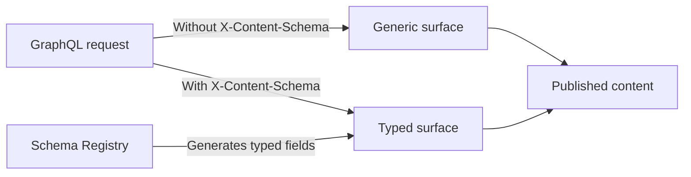

The CMS GraphQL API lets storefronts and other integrations retrieve content published with the [CMS](https://developers.vtex.com/docs/guides/getting-started-with-cms). It provides a single GraphQL endpoint with two ways to query content:

- **Generic queries** return the complete content document as JSON and work with any Content Type.
- **Typed queries** expose fields generated from a JSON Schema published to the Schema Registry, enabling field selection and type generation.

> ⚠️ Because the Data Plane serves published content, this API is read-only and doesn't support mutations.

## Endpoint

Send GraphQL queries as `POST` requests to:

```text
https://api.vtexcommercestable.com.br/api/content-platform/graphql/{account}/{storeId}
```

Replace the path parameters as follows:

| Path parameter | Description |
| :--- | :--- |
| `account` | VTEX account name. |
| `storeId` | Store or site identifier within the account, for example, `faststore`. |

If you don't know the store ID, list the stores in the account:

```http
GET https://api.vtexcommercestable.com.br/api/content-platform/manage/{account}/stores
Authorization: Bearer {token}
```

Use the `id` field from the response as the `storeId`.

## Authentication

Every request requires a bearer token in the `Authorization` header:

```http
Authorization: Bearer {token}
```

To get a token with the VTEX CLI, log in to the account and run:

```shell
vtex local token
```

The account used with `vtex login` must match the `{account}` segment in the request URL. Authentication is required for all queries, including queries through the generic surface.

## Schema overview

The API provides two query surfaces:



- **Generic surface:** Available by default and returns content as a JSON scalar. Use it for diagnostics, schema-independent tooling, or Content Types without a published schema.
- **Typed surface:** Enabled with the `X-Content-Schema` header and exposes fields generated from a schema in the Schema Registry.

## Generic surface

The generic surface exposes the `entry` and `entries` query fields for every Content Type.

| Field | Arguments | Description |
| :--- | :--- | :--- |
| `entry` | `contentTypeId`, exactly one of `id` or `slug`, `locale`, and optional `branchId` | Retrieves one published entry. |
| `entries` | `contentTypeId`, `locale`, and optional `branchId`, `scroll`, `sort`, and `order` | Retrieves a paginated list of published entries. |

### Get an entry

Use `entry` to retrieve one entry by `id` or `slug`:

```graphql
query Entry($contentTypeId: String!, $id: ID!, $locale: String!) {
  entry(contentTypeId: $contentTypeId, id: $id, locale: $locale) {
    id
    contentTypeId
    name
    createdAt
    updatedAt
    content
  }
}
```

The `content` field contains the complete stored document as a JSON scalar.

The lookup must contain exactly one of the following arguments:

| Argument | Type | Description |
| :--- | :--- | :--- |
| `id` | `ID` | Entry ID. |
| `slug` | `String` | Entry slug. |

To retrieve an entry by slug:

```graphql
query EntryBySlug($contentTypeId: String!, $slug: String!, $locale: String!) {
  entry(contentTypeId: $contentTypeId, slug: $slug, locale: $locale) {
    id
    content
  }
}
```

Slug matching checks `content.slug` first and then `content.seo.slug`. Slugs with and without a leading slash match, but including the leading slash, for example, `/black-friday`, is recommended.

### List entries

Use `entries` to retrieve entries of a Content Type:

```graphql
query Entries($contentTypeId: String!, $locale: String!, $scroll: String) {
  entries(contentTypeId: $contentTypeId, locale: $locale, scroll: $scroll) {
    entries {
      id
      name
      updatedAt
      content
    }
    scroll
  }
}
```

### Generic response fields

The generic entry object exposes the following fields:

| Field | Description |
| :--- | :--- |
| `id` | Entry ID. |
| `contentTypeId` | Content Type that defines the entry. |
| `name` | Entry name. |
| `createdAt` | Date and time when the entry was created. |
| `updatedAt` | Date and time when the entry was last updated. |
| `content` | Complete stored document as a JSON scalar. |

The `entries` result contains:

| Field | Description |
| :--- | :--- |
| `entries` | Entries in the current page. |
| `scroll` | Cursor for retrieving the next page, or `null` on the last page. |

## Typed surface

To query fields generated from a registered JSON Schema, send the `X-Content-Schema` header:

```http
X-Content-Schema: {account}.{name}[@version]
```

For example:

```http
X-Content-Schema: vtex.faststore
```

Schema versions are resolved as follows:

| Header value | Resolution |
| :--- | :--- |
| `vtex.faststore` | Latest published version, cached for approximately 60 seconds. |
| `vtex.faststore@latest` | Latest published version, cached for approximately 60 seconds. |
| `vtex.faststore@4.0.1` | Exact published version. Recommended for CI and code generation. |

The schema account prefix must match `{account}` in the URL. Shared schemas can use the `vtex` prefix, such as `vtex.faststore`. Otherwise, the API returns `400 Schema "..." does not belong to tenant "..."`.

If the header is missing, malformed, or can't be resolved to a valid schema, the request uses the generic surface instead of returning a schema-resolution error. If a query unexpectedly exposes only `entry` and `entries`, check the header value.

### Typed query fields

Each Content Type in the registered schema generates a camel-cased query root with:

- A field for retrieving one entry by `id` or `slug`.
- A `<contentType>List` field for retrieving multiple entries.
- A connection type containing the entries and pagination cursor.

For example, the `landingPage` Content Type generates:

```graphql
query Page($id: ID!, $locale: String!) {
  landingPage(id: $id, locale: $locale) {
    id
    slug
    seo {
      title
      description
    }
  }
}
```

The following table illustrates the naming convention:

| Content Type ID | Single lookup | List lookup |
| :--- | :--- | :--- |
| `landingPage` | `landingPage(id: ...)` or `landingPage(slug: ...)` | `landingPageList(...)` |
| `home` | `home(id: ...)` | `homeList(...)` |

For example, `landingPageList` returns a `LandingPageConnection`.

Content Type IDs that aren't valid GraphQL identifiers are sanitized. For example, `404` becomes the `Type404` type and the `type404` and `type404List` query fields:

```graphql
query {
  type404(id: "...", locale: "en-US") {
    id
  }
  type404List(locale: "en-US") {
    entries {
      id
    }
  }
}
```

## Query arguments

The following arguments apply to generic and typed queries:

| Argument | Required | Description |
| :--- | :---: | :--- |
| `locale` | Yes | Active locale whose projected content should be returned. |
| `branchId` | No | Content branch. Defaults to `main`. |

Omitting `locale` causes a `GRAPHQL_VALIDATION_FAILED` error before query execution. Passing an unknown or inactive locale causes a `BAD_USER_INPUT` error. When available in the store configuration, the error's `extensions.activeLocales` field lists the active locales.

## Pagination and sorting

The `entries` field and every typed `<contentType>List` field return up to 20 entries per page.

The response includes a `scroll` cursor:

```json
{
  "data": {
    "entries": {
      "entries": [],
      "scroll": "eyJ..."
    }
  }
}
```

Pass the returned cursor in the next query's `scroll` argument. A `null` cursor indicates the last page. Stale or modified cursors cause an `INVALID_SCROLL` error.

List queries support these sorting options:

| Argument | Values | Default |
| :--- | :--- | :--- |
| `sort` | `updatedAt`, `createdAt`, `name`, or `author` | `updatedAt` |
| `order` | `asc` or `desc` | `desc` |

The field used for sorting doesn't need to be included in the selection set.

## Discovering fields

GraphQL introspection is disabled. To inspect the available fields, append `/schema.graphql` to the tenant URL and send a `GET` request:

```http
GET https://api.vtexcommercestable.com.br/api/content-platform/graphql/{account}/{storeId}/schema.graphql
Authorization: Bearer {token}
```

Without a schema selection, this endpoint returns the generic schema. To retrieve a typed schema, use the `schema` query parameter:

```http
GET https://api.vtexcommercestable.com.br/api/content-platform/graphql/{account}/{storeId}/schema.graphql?schema=vtex.faststore@4.0.1
Authorization: Bearer {token}
```

You can also select the typed schema with the `X-Content-Schema` header. The header takes precedence if both the header and query parameter are present.

The endpoint returns the schema definition language (SDL) as `text/plain`. Responses are cached for 60 seconds and can be served stale while the schema is revalidated for 300 seconds. The typed SDL also includes the generic `entry` and `entries` fields.

### Code generation

Pin the schema version so a newly published version doesn't silently change generated types:

```shell
curl -s "https://api.vtexcommercestable.com.br/api/content-platform/graphql/{account}/{storeId}/schema.graphql?schema=vtex.faststore@4.0.1" \
  -H "Authorization: Bearer $TOKEN" \
  -o schema.graphql

graphql-codegen --schema schema.graphql
```

Update the pinned version deliberately when the store schema changes.

## Query limits

The maximum query depth is 12. Deeper queries are rejected before execution with the `QUERY_TOO_DEEP` code and the `extensions.maxDepth` and `extensions.actualDepth` fields. Fragments contribute to the query depth wherever they are spread.

## Errors

GraphQL errors follow the standard `errors[].extensions.code` format:

| Code | Cause |
| :--- | :--- |
| `BAD_USER_INPUT` | Neither or both of `id` and `slug` were provided, or `locale` is unknown or inactive. |
| `INVALID_SCROLL` | Pagination cursor is malformed or stale. |
| `QUERY_TOO_DEEP` | Query exceeds the maximum depth. |

Errors that occur before GraphQL query execution use HTTP status codes:

| Status | Cause |
| :---: | :--- |
| `400` | Missing or malformed `Authorization` header, incompatible `X-Content-Schema` account prefix, or some invalid-token cases. |
| `401` | Token is invalid or expired, or its account doesn't match `{account}` in the URL. |

## Request examples

The following examples assume that you exported a token:

```shell
export TOKEN=$(vtex local token)
```

### Generic entry by ID

```shell
curl -s "https://api.vtexcommercestable.com.br/api/content-platform/graphql/{account}/{storeId}" \
  -H "Content-Type: application/json" \
  -H "Authorization: Bearer $TOKEN" \
  -d '{
    "query": "query($id: ID!, $locale: String!) { entry(contentTypeId: \"landingPage\", id: $id, locale: $locale) { id content } }",
    "variables": { "id": "01J...", "locale": "en-US" }
  }'
```

### Generic entry by slug

```shell
curl -s "https://api.vtexcommercestable.com.br/api/content-platform/graphql/{account}/{storeId}" \
  -H "Content-Type: application/json" \
  -H "Authorization: Bearer $TOKEN" \
  -d '{
    "query": "query($slug: String!, $locale: String!) { entry(contentTypeId: \"landingPage\", slug: $slug, locale: $locale) { id content } }",
    "variables": { "slug": "/home", "locale": "en-US" }
  }'
```

### Generic paginated list

Request the first page:

```shell
curl -s "https://api.vtexcommercestable.com.br/api/content-platform/graphql/{account}/{storeId}" \
  -H "Content-Type: application/json" \
  -H "Authorization: Bearer $TOKEN" \
  -d '{
    "query": "query($locale: String!) { entries(contentTypeId: \"landingPage\", locale: $locale) { entries { id name } scroll } }",
    "variables": { "locale": "en-US" }
  }'
```

Pass the `scroll` value from the response to the next request. Repeat until `scroll` is `null`:

```shell
curl -s "https://api.vtexcommercestable.com.br/api/content-platform/graphql/{account}/{storeId}" \
  -H "Content-Type: application/json" \
  -H "Authorization: Bearer $TOKEN" \
  -d '{
    "query": "query($locale: String!, $scroll: String) { entries(contentTypeId: \"landingPage\", locale: $locale, scroll: $scroll) { entries { id name } scroll } }",
    "variables": { "locale": "en-US", "scroll": "eyJ..." }
  }'
```

The cursor in this example is a placeholder. Use the cursor returned by your store to avoid an `INVALID_SCROLL` error.

### Typed entry by slug

```shell
curl -s "https://api.vtexcommercestable.com.br/api/content-platform/graphql/{account}/{storeId}" \
  -H "Content-Type: application/json" \
  -H "Authorization: Bearer $TOKEN" \
  -H "X-Content-Schema: vtex.faststore@4.0.1" \
  -d '{
    "query": "query Page($slug: String!, $locale: String!) { landingPage(slug: $slug, locale: $locale) { id slug seo { title } } }",
    "variables": { "slug": "/home", "locale": "en-US" }
  }'
```

### Typed entry list

```shell
curl -s "https://api.vtexcommercestable.com.br/api/content-platform/graphql/{account}/{storeId}" \
  -H "Content-Type: application/json" \
  -H "Authorization: Bearer $TOKEN" \
  -H "X-Content-Schema: vtex.faststore@4.0.1" \
  -d '{
    "query": "query($locale: String!) { landingPageList(locale: $locale) { entries { id slug } scroll } }",
    "variables": { "locale": "en-US" }
  }'
```

### Generic SDL

```shell
curl -s "https://api.vtexcommercestable.com.br/api/content-platform/graphql/{account}/{storeId}/schema.graphql" \
  -H "Authorization: Bearer $TOKEN"
```

### Typed SDL

```shell
curl -s "https://api.vtexcommercestable.com.br/api/content-platform/graphql/{account}/{storeId}/schema.graphql?schema=vtex.faststore@4.0.1" \
  -H "Authorization: Bearer $TOKEN"
```
