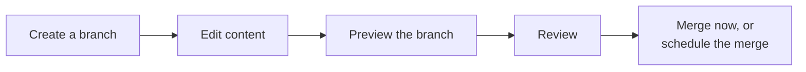

Once a developer has [modeled and published a schema](https://developers.vtex.com/docs/guides/getting-started-with-cms), content operators can create and publish content entirely inside the VTEX Admin, no code required. The CMS uses Git-like branches, per-branch preview, and an approval step before anything reaches the live storefront.

This workflow is documented in the VTEX Help Center within the following topics:

| Topic | Help Center resource |
| :---- | :---- |
| CMS concepts and the "All content" dashboard | [Content Management overview](https://help.vtex.com/en/docs/tutorials/cms-overview) |
| Creating branches, editing, previewing, merging now or scheduling a merge, restoring versions | [Versions and branches](https://help.vtex.com/en/docs/tutorials/managing-versions-and-branches) |
| Who can create, edit, and merge branches | [Roles and permissions](https://help.vtex.com/docs/tutorials/roles-and-permissions) — the CMS uses **Content Producer**, **Content Editor**, and **Content Administrator** roles, each with different branch and merge capabilities |
| Configuring the Preview URL and locales for a store | [Configuring stores](https://help.vtex.com/en/docs/tutorials/cms-configuring-stores) |

> ℹ️ This guide covers regular CMS branches, used for day-to-day content work. If you're a developer testing a new schema version against sample content, see [Working with development branches](https://developers.vtex.com/docs/guides/working-with-development-branches) instead.

## Next steps

<Flex>

<WhatsNextCard
  linkTo="https://developers.vtex.com/docs/guides/working-with-development-branches"
  title="Working with development branches"
  description="Learn how developers test new schema versions in isolation before content is built against them."
  linkTitle="See more"
/>

<WhatsNextCard
  linkTo="https://developers.vtex.com/docs/guides/translations-by-locale"
  title="Translations by locale"
  description="Understand how localized content and fallback behave, with links to the full Help Center guides."
  linkTitle="See more"
/>

</Flex>
