Every piece of content a shopper sees on your storefront starts the same way: a developer decides what can be edited, before a content operator ever opens the Admin. In the CMS, developers define the content structure, including which fields exist, their types, and their names, while content operators use the CMS Admin interface to create and publish pages based on that structure.


This guide is where the developer side begins: setting up your local environment so you can start writing the schemas that will later show up as editable fields in the Admin.

```mermaid
flowchart LR
  subgraph Developer["Developer track"]
    Setup["Set up your environment\nPrepare your local project"]
    S1["Model content\nDefine editable fields"]
    S2["Test locally\nPreview and validate changes"]
    S3["Generate and upload the schema\nMake it available in CMS"]

    Setup --> S1 --> S2 --> S3
  end

  subgraph ContentOp["Content operator track"]
    S4["Create and edit content\nWork with content in branches"]
    S5["Review and publish\nMake content available to shoppers"]

    S4 --> S5
  end

  S3 --> S4

  click Setup href "/docs/guides/cms/local-setup-and-development" "Set up your environment"
  click S1 href "/docs/guides/cms/defining-content-types" "Model content"
  click S2 href "/docs/guides/cms/local-setup-and-development#test-locally" "Test locally"
  click S3 href "/docs/guides/cms/managing-cms-component-schemas" "Generate and upload the schema"
  click S4 href "/docs/guides/cms/working-with-content-in-branches" "Create and edit content"
  click S5 href "/docs/guides/cms/reviewing-and-publishing-content" "Review and publish"
```



> ℹ️ Setting up the CMS is a one-time task per storefront project. Once it's done, you and your team will repeat steps 1-3 above every time you add or change a component, see [Local setup and development](https://developers.vtex.com/docs/guides/local-development-and-setup) for that daily loop. If you're a content operator looking for steps 4-5, see [Creating and publishing content](https://developers.vtex.com/docs/guides/creating-and-publishing-content) instead.

## Before you begin

Before starting, make sure you have:

* A VTEX account with the **Content Administrator** role assigned to you in [License Manager](https://help.vtex.com/en/tutorial/roles--7HKbd9jg39YZlsqhqZPHbR).  
* [Node.js](https://nodejs.org/) is installed on your machine.  
* A storefront project repository cloned locally (ex.:, a [FastStore](https://developers.vtex.com/docs/guides/faststore) project).

## Step 1 - Install the VTEX IO CLI

Every CMS command you'll run in this guide, and every day after, is an extension of the VTEX IO CLI. The [VTEX IO CLI](https://developers.vtex.com/docs/guides/vtex-io-documentation-vtex-io-cli-installation-and-command-reference) is the command-line interface for managing your VTEX account, installing apps, and running CMS commands. If you haven't installed it yet, run:

```shell
npm install -g vtex
```

After installing, log in to your VTEX account:

```shell
vtex login {accountName}
```

Replace `{accountName}` with your VTEX account name. You can verify you are logged in by running `vtex whoami`.

## Step 2 - Install the Content plugin

The [Content plugin](https://developers.vtex.com/docs/guides/content-plugin) extends the VTEX IO CLI with commands for managing CMS schemas. This plugin is what turns the schema files you'll write in Step 1 of the daily workflow into a package the CMS understands, `content generate-schema` and `content upload-schema` are what actually publish your content model to the Schema Registry. Install it by running:

```shell
vtex plugins install @vtex/cli-plugin-content
```

To confirm the installation, run:

```shell
vtex content
```

You should see an output listing the available CMS commands, such as `content generate-schema`, `content init`, and `content upload-schema`.

```shell
$ vtex content
Generate a single schema file for CMS

USAGE
  $ vtex content COMMAND

COMMANDS
  content generate-schema      Generate a single schema file for CMS
  content init                 Initialize CMS folder structure with example files.
  content split-components     Split CMS component files from sections.json
  content split-content-types  Split CMS content-type files from content-types.json        
  content upload-schema        Upload a local schema to Schema Registry.

```

## Step 3 - Install the CMS Admin app

The CMS Admin app (`vtex.admin-content-platform-ui`) provides the interface where editors manage content. You only need to install it once per account.

1. In the terminal, make sure you're logged in to your VTEX account.  
2. Run the following command:

    ```shell
    vtex install vtex.admin-content-platform-ui@0.x
    ```

3. Verify the installation by opening the following URL in your browser, replacing `{account}` with your VTEX account name:

    ```shell
    https://{account}.myvtex.com/admin/content-platform
    ```

    If you see the CMS menu items (e.g., **All content**, **Branches**, **Media**), the app is installed correctly.

    

    > ⚠️ If you receive a `Permission denied` error when accessing CMS in the Admin, check the [CMS schema sync errors](https://developers.vtex.com/docs/guides/cms-troubleshooting) troubleshooting guide.

## Step 4 - Scaffold the CMS folder structure

The CMS folder structure is what the CLI, your team's code reviews, and any CI/CD pipeline will expect from now on. This structure organizes your component schemas and page definitions. Run the following command from the root of your storefront project:

```shell
vtex content init
```

When prompted, enter the store ID for your project or press **Enter** to use the default (`faststore`). The command creates the following structure:

```shell
cms/
└── {storeId}/
    ├── components/    ← Component schemas go here
    └── pages/         ← Content type definitions go here
```

> ℹ️ **FastStore projects:** The store ID typically matches the folder name inside `cms/`. For other storefront technologies, use the store ID configured for your CMS integration.

Setup is done. From here, steps 1-3 of the developer track, modeling content, testing locally, and generating and uploading the schema, become the loop you'll repeat every time you add or change a component. Once your schema is live, the content operators can work in the store content.

## Next steps

<Flex>

<WhatsNextCard
  linkTo="https://developers.vtex.com/docs/guides/understanding-cms-architecture-and-schema-declarations"
  title="Understanding CMS architecture and schema declarations"
  description="Deep dive into CQRS architecture, schema declarations, and folder structure changes."
  linkTitle="See more"
/>

<WhatsNextCard
  linkTo="https://developers.vtex.com/docs/guides/local-setup-and-development"
  title="Local setup and development"
  description="Learn the daily workflow for creating component schema files, syncing them to the CMS, and verifying the result in the Admin."
  linkTitle="See more"
/>

<WhatsNextCard
  linkTo="https://developers.vtex.com/docs/guides/cms-troubleshooting"
  title="Troubleshooting"
  description="Find solutions for common errors during schema generation, upload, and Admin access, including permission issues and missing components in the section picker."
  linkTitle="See more"
/>

<WhatsNextCard
  linkTo="https://developers.vtex.com/docs/guides/creating-and-publishing-content"
  title="Creating and publishing content"
  description="Find the Help Center resources content operators use to create, review, and publish content once your schema is live."
  linkTitle="See more"
/>

</Flex>
