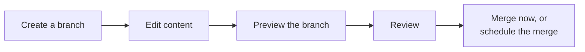

```mermaid
flowchart LR
  subgraph Developer["Developer track"]
    Setup["Set up your environment\nPrepare your local project"]
    S1["Model content\nDefine editable fields"]
    S2["Test locally\nPreview and validate changes"]
    S3["Generate and upload the schema\nMake it available in CMS"]

    Setup --> S1 --> S2 --> S3
  end

  subgraph ContentOp["Content operator track"]
    S4["Create and edit content\nWork with content in branches"]
    S5["Review and publish\nMake content available to shoppers"]

    S4 --> S5
  end

  S3 --> S4

  click Setup href "/docs/guides/cms/local-setup-and-development" "Set up your environment"
  click S1 href "/docs/guides/cms/defining-content-types" "Model content"
  click S2 href "/docs/guides/cms/local-setup-and-development#test-locally" "Test locally"
  click S3 href "/docs/guides/cms/managing-cms-component-schemas" "Generate and upload the schema"
  click S4 href "/docs/guides/cms/working-with-content-in-branches" "Create and edit content"
  click S5 href "/docs/guides/cms/reviewing-and-publishing-content" "Review and publish"
```

Every piece of content a shopper sees on your storefront starts the same way: a developer decides what can be edited, before a content operator ever opens the Admin. In the CMS, developers define the content structure, including which fields exist, their types, and their names, while content operators use the CMS Admin interface to create and publish pages based on that structure.

Use this guide to find your track, developer or content operator, understand what you're responsible for, and go straight to where you should go next.

| Track | Goal | Responsible for | Start here |
| :---- | :---- | :---- | :---- |
| **Developer** | Building or maintaining the storefront code. | Modeling content as schemas, testing locally, and publishing the schema so it becomes editable in the Admin. | [Setting up your CMS environment](https://developers.vtex.com/docs/guides/setting-up-your-cms-environment) |
| **Content operator** | Working in the VTEX Admin, no code required. | Creating, reviewing, and publishing content against the fields developers made available. | [Creating and publishing content](#creating-and-publishing-content) below |

> ℹ️ Setting up the CMS is a one-time task per storefront project. Once it's done, developers repeat "Model content → Test locally → Generate and upload the schema" every time they add or change a component, see [Local setup and development](https://developers.vtex.com/docs/guides/local-development-and-setup) for that daily loop.

## Creating and publishing content

Once a developer has published a schema, content operators can create and publish content entirely inside the VTEX Admin, no code required. The CMS uses Git-like branches, per-branch preview, and an approval step before anything reaches the live storefront:

This workflow is documented in the VTEX Help Center within the following topics:

| Topic | Help Center resource |
| :---- | :---- |
| CMS concepts and the "All content" dashboard | [Content Management overview](https://help.vtex.com/en/docs/tutorials/cms-overview) |
| Creating branches, editing, previewing, merging now or scheduling a merge, restoring versions | [Versions and branches](https://help.vtex.com/en/docs/tutorials/managing-versions-and-branches) |
| Who can create, edit, and merge branches | [Roles and permissions](https://help.vtex.com/docs/tutorials/roles-and-permissions) — the CMS uses **Content Producer**, **Content Editor**, and **Content Administrator** roles, each with different branch and merge capabilities |
| Configuring the Preview URL and locales for a store | [Configuring stores](https://help.vtex.com/en/docs/tutorials/cms-configuring-stores) |

> ℹ️ This covers regular CMS branches, used for day-to-day content work. If you're a developer testing a new schema version against sample content, see [Working with development branches](https://developers.vtex.com/docs/guides/working-with-development-branches) instead.

## Translations by locale

The CMS supports multiple locales, such as `en-US`, `pt-BR`, and `es-MX`. When a field isn't translated for a given locale, the CMS automatically falls back to a more general or default locale, so shoppers always see relevant content instead of a blank field.

> ⚠️ Right-to-left (RTL) languages, such as Arabic or Hebrew, aren't supported yet. Keep this in mind if you're evaluating the CMS for a market that requires RTL layouts.

Locale configuration and translation management happen in the VTEX Admin and are documented in the Help Center within the following topics:

| Topic | Help Center resource |
| :---- | :---- |
| Editing and translating content per locale, and how fallback applies to a field | [Localizing content overview](https://help.vtex.com/docs/tutorials/localizing-content) |
| Setting up locales and the default locale for a store | [Configuring locales](https://help.vtex.com/en/docs/tutorials/configuring-locales) |
| Choosing a fallback strategy (default-locale fallback vs. core-language fallback) | [Understanding locale fallback rules](https://help.vtex.com/en/docs/tutorials/understanding-locale-fallback-rules) |

## Next steps

<Flex>

<WhatsNextCard
  linkTo="https://developers.vtex.com/docs/guides/setting-up-your-cms-environment"
  title="Setting up your CMS environment"
  description="Install the CLI, the Content plugin, and the CMS Admin app, then scaffold your storefront project's folder structure."
  linkTitle="See more"
/>

<WhatsNextCard
  linkTo="https://developers.vtex.com/docs/guides/cms-media-gallery"
  title="Media gallery"
  description="Declare the media-gallery widget so editors can pick images and reference videos from a central gallery."
  linkTitle="See more"
/>

<WhatsNextCard
  linkTo="https://developers.vtex.com/docs/guides/schema-versioning"
  title="Schema versioning"
  description="Understand stable vs. pre-release schema versions before you upload your first schema."
  linkTitle="See more"
/>

<WhatsNextCard
  linkTo="https://developers.vtex.com/docs/guides/cms-for-faststore-storefronts"
  title="CMS for FastStore storefronts"
  description="Understand the CMS architecture, main features, and how it compares to Headless CMS (legacy)."
  linkTitle="See more"
/>

</Flex>
