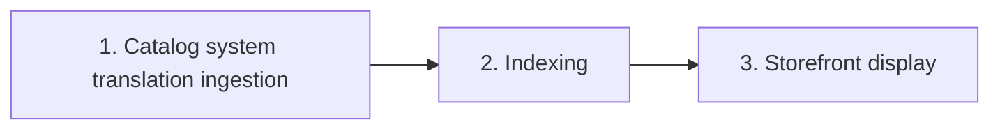

> ℹ️ This feature is in beta, which means that we are working to improve it. If you have any questions, please contact our [Support](https://support.vtex.com/hc/en-us/requests).

Learn how to create translations and integrate localized content for catalog entities with the multi-language feature.

## Overview

The [multi-language feature](https://developers.vtex.com/docs/api-reference/catalog-api#get-/api/catalog/pvt/product/-productId-/language) enables the following capabilities:

- **Granular content management:** Retrieve and store translations for products, SKUs, categories, brands, specifications, collections, and services.
- **Automated translation workflows:** Integrate with Translation Management Systems (TMS) for automated translation.
- **Multiple storefront technologies:** Consume translations across Store Framework and headless implementations.
- **Localized experience:** Provide customers with localized shopping experiences across multiple markets.

> ℹ️ To see the complete documentation of the multi-language endpoints, check the [Catalog API](https://developers.vtex.com/docs/api-reference/catalog-api#get-/api/catalog/pvt/product/-productId-/language).

## Use cases

The multi-language feature supports various integration scenarios:

| Use case | Description |
| :--- | :--- |
| Multilingual storefront | Displays translated product names, descriptions, and specifications based on the customer's locale as identified by the storefront. |
| TMS integration | Connects your Translation Management System (TMS) to automatically push and pull translations via the [Catalog API](https://developers.vtex.com/docs/api-reference/catalog-api#overview). |
| Business expansion | Seamlessly adapts your catalog for new geographic markets without duplicating products. |
| SEO optimization | Provides localized meta descriptions, keywords, and URL slugs for better search engine rankings in each market. |
| Headless commerce | Fetches translated catalog data for headless storefront applications. |

## How the multi-language feature works

When you send translated content using the multi-language feature, the workflow is as follows:



### Step 1: Catalog system translation ingestion

The merchant or an integrated TMS makes a request to create or update the translation of a catalog entity, such as [product](https://developers.vtex.com/docs/api-reference/catalog-api#put-/api/catalog/pvt/product/-productId-/language) or [category](https://developers.vtex.com/docs/api-reference/catalog-api#put-/api/catalog/pvt/category/-categoryId-/language). The Catalog system validates and stores the translated fields per [locale](#locale-format), then triggers an update event to Intelligent Search.

### Step 2: Indexing

Intelligent Search indexes or reindexes the translated entity content to make it searchable and filterable in the storefront by the selected locale. This process runs asynchronously and usually completes within a few minutes. Larger amounts of data may take longer.

### Step 3: Storefront display

The storefront queries Intelligent Search and the Catalog system at render time, so it automatically retrieves and displays the translations according to the customer's selected locale. No manual configuration or synchronization is needed.

> ℹ️ The valid storefront solutions for the multi-language feature are Store Framework and headless implementations.

## Consuming localized content

There are two main approaches to consuming translated catalog data, depending on your storefront implementation.

### Option 1: Via Intelligent Search (recommended)

For most storefront implementations, Intelligent Search is the recommended approach for consuming translated content. When using Intelligent Search:

- Translations are automatically indexed after being saved using the multi-language endpoints.
- Search results, filters, and facets display translated content based on the customer's locale.
- No additional API calls are required, since the storefront receives translated data automatically.

**When to use Intelligent Search:**

| Implementation | Intelligent Search usage |
| --- | --- |
| Store Framework | ✅ Yes (default behavior) |
| Headless with IS | ✅ Yes |
| Legacy CMS | ⚠️ May require additional configuration |

### Option 2: Via Catalog API (direct fetch)

When to use the direct Catalog API:

- You need specific entity translations not available in search results.
- You're building VTEX Admin tools or back-office integrations.
- You need to fetch translations for validation or synchronization.

## Implementation by storefront type

See below the implementation by storefront type for consuming localized content:

- [Store Framework](#store-framework-implementation)
- [Headless](#headless-implementation)

### Store Framework implementation

For stores built with [Store Framework](https://developers.vtex.com/docs/guides/store-framework), localized content is consumed automatically:

1. **Locale detection:** The store detects the consumer's locale from the URL binding (e.g., `store.com/es-ES/`) or browser settings.
2. **Automatic translation:** Intelligent Search returns translated content for the detected locale.
3. **Component rendering:** Store Framework components (product shelf, product details, search results) display the translated content without additional configuration.

> ℹ️ **No code changes are required**: Once you submit translations via the multi-language feature, they appear automatically in your Store Framework storefront.

### Headless implementation

For headless storefronts, you either use the Intelligent Search API or the Catalog API directly, depending on your needs.

#### Option A: Using Intelligent Search API

Query Intelligent Search with the desired locale to receive translated results:

```bash
curl -X GET "https://{accountName}.vtexcommercestable.com.br/api/io/_v/api/intelligent-search/product_search?locale=es-ES&query=camiseta" \
  -H "Accept: application/json"
```

**Advantages:**

- Full search functionality (filters, facets, relevance)
- Cached and optimized for performance
- Consistent with other storefront implementations

#### Option B: Use Catalog API directly

Query the Catalog API with the `Accept-Language` header:

```bash
curl -X GET "https://{accountName}.vtexcommercestable.com.br/api/catalog_system/pvt/sku/stockkeepingunitbyid/456" \
  -H "Accept-Language: es-ES" \
  -H "X-VTEX-API-AppKey: {appKey}" \
  -H "X-VTEX-API-AppToken: {appToken}"
```

**When to use direct Catalog API:**

- You need specific entity translations not available in search results.
- You're building VTEX Admin tools or back-office integrations.
- You need to fetch translations for validation or synchronization.

## Activation

Open a [support ticket](https://help.vtex.com/en/support) requesting the activation of the Catalog multi-language feature for your account. Once the VTEX team activates it, they will contact you to inform you that you can start using the feature.

> ❗ The simultaneous use of both the multi-language APIs and Messages APIs (GraphQL) is not supported for catalog entities. Therefore, once the new feature is activated, you will no longer be able to manage translations using GraphQL.

## Permissions

To successfully use the multi-language feature, the user or [API key](https://developers.vtex.com/docs/guides/authentication-overview#api-keys) must have the [License Manager resource](https://help.vtex.com/en/tutorial/license-manager-resources--3q6ztrC8YynQf6rdc6euk3) below; otherwise, they will receive a 403 error:

| Product | Category | Resource |
| :--- | :--- | :--- |
| Catalog | Content | Categories Management |

### Handling missing translations

When a translation is not available for a requested locale:

- **Intelligent Search:** Returns content in the store's default language.
- **Catalog API:** Returns only entities that have translations in the requested locale.

> ℹ️ Consider implementing fallback logic in headless implementations to handle missing translations gracefully.

## Using the multi-language feature

The solution is composed of a combination of two methods:

- **PUT:** Creates or updates translations for catalog entities.
- **GET:** Retrieves translations previously created using the `PUT` method. By default, it returns all existing translations for the entity, but you can filter results for a specific language using the `locale` query parameter.

They are supported for the following catalog entities:

- Products
- SKUs
- Specifications
- Categories
- Brands
- Attachments
- Collections
- Services

### Locale format

All locale codes follow the IETF BCP 47, for example:

| Locale | Description |
| :--- | :--- |
| `en-US` | English (United States) |
| `es-ES` | Spanish (Spain) |
| `pt-BR` | Portuguese (Brazil) |
| `fr-FR` | French (France) |
| `de-DE` | German (Germany) |

### Creating or updating translations for a product

See below an example of how the multi-language feature [works for a product](https://developers.vtex.com/docs/api-reference/catalog-api#put-/api/catalog/pvt/product/-productId-/language):

**Method:** `PUT`

**Endpoint:** `https://{accountName}.{environment}.com.br/api/catalog/pvt/product/{productId}/language`

**Request body example:**

```json
{
  "Locale": "en-US",
  "Name": "Classic Blue T-Shirt",
  "Title": "Classic Blue Tshirt",
  "Description": "A comfortable cotton t-shirt in classic blue color",
  "MetaTagDescription": "Buy the best classic blue t-shirt made with premium cotton",
  "DescriptionShort": "Comfortable cotton t-shirt",
  "Keywords": "t-shirt, blue, cotton, casual",
  "LinkId": "classic-blue-tshirt"
}
```

**Responses:**

- `201 Created`: The translation was created or updated successfully.
- `400 Bad Request`: The request body is invalid.
- `403 Forbidden`: The user or API key does not have the required [permissions](#permissions).
- `404 Not Found`: The product ID does not exist.
- `409 Conflict`: The translation already exists with the same fields.

> ℹ️ For information about how to handle errors, see the [Troubleshooting](#troubleshooting) section.

### Retrieving translations for a product

After creating translations for an entity, you can use the `GET` endpoint to retrieve them. See below an example of how to [retrieve translations for a product](https://developers.vtex.com/docs/api-reference/catalog-api#get-/api/catalog/pvt/product/-productId-/language).

**Method:** `GET`

**Endpoint:** `https://{accountName}.{environment}.com.br/api/catalog/pvt/product/{productId}/language`

**Query parameters:** `locale=en-US` (Optional)

> ℹ️ If you wish to retrieve translations for a specific language, use the query parameter `locale`, as described in the [Locale format](#locale-format) section. Otherwise, you will receive all translations for the entity.

**Response body example:** `200 OK`

```json
[
  {
    "Id": 2,
    "Locale": "en-US",
    "Name": "Men's Red T-Shirt",
    "Description": "The <strong>Men's Basic Red T-Shirt</strong> is the perfect piece for those who value both style and comfort in their everyday look. Made from <strong>soft, breathable cotton fabric</strong>, it offers a lightweight fit and a smooth touch on the skin. Its <strong>minimalist design</strong> makes it easy to match with different styles — from casual to modern — perfect to wear with jeans, shorts, or layered under a jacket.<ul><li><strong>Color:</strong> Red</li><li><strong>Fit:</strong> Regular</li><li><strong>Neckline:</strong> Crew neck</li><li><strong>Fabric:</strong> 100% cotton</li><li><strong>Ideal for:</strong> Casual wear, work, or leisure</li></ul>A versatile and essential piece in the modern man's wardrobe, combining practicality and good taste in one product.",
    "Title": "Men's Red T-Shirt",
    "MetaTagDescription": null,
    "DescriptionShort": null,
    "Keywords": "shirt, red, basic, cotton",
    "LinkId": null,
    "Category": {
      "Id": 18,
      "Locale": "en-US",
      "Name": "New Clothes",
      "Title": "New Clothes",
      "Description": "New Clothes for men",
      "Keywords": "New, Clothes",
      "LinkId": "new-clothes"
    },
    "Categories": [
      {
        "Id": 18,
        "Locale": "en-US",
        "Name": "New Clothes",
        "Title": "New Clothes",
        "Description": "New Clothes for men casual",
        "Keywords": "New, Clothes",
        "LinkId": "new-clothes-for-men-casual"
      },
      {
        "Id": 15,
        "Locale": "en-US",
        "Name": "Accessories",
        "Title": "Accessories",
        "Description": "Accessories for men",
        "Keywords": "fashion",
        "LinkId": null
      }
    ],
    "SimilarCategories": null,
    "Brand": {
      "Id": 1,
      "Locale": "en-US",
      "Name": "Casual clothes",
      "Text": "The best casual clothes for your everyday life.",
      "Keywords": "casual, clothes, everyday life",
      "SiteTitle": "Casual clothes",
      "LinkId": "casual-clothes"
    },
    "Skus": [
      {
        "Id": 33,
        "Locale": "en-US",
        "Name": "Men's Red T-Shirt",
        "MeasurementUnit": "un",
        "Attributes": [
          {
            "Id": 17,
            "Locale": "en-US",
            "AttributeName": "Color",
            "AttributeValue": "Red"
          }
        ],
        "Attachments": [
          {
            "Id": 4,
            "Locale": "en-US",
            "Name": "Customization",
            "Domains": [
              {
                "OriginalFieldName": "Customização",
                "FieldName": "Customization",
                "DomainValues": "Special"
              }
            ]
          }
        ],
        "Services": [
          {
            "Id": 8,
            "Locale": "en-US",
            "Name": "Packaging",
            "Text": "Packaging for giving as a gift",
            "SkuServiceType": {
              "Id": 34,
              "Locale": "en-US",
              "Name": "Small box",
              "Values": [
                {
                  "Id": 1,
                  "Locale": "en-US",
                  "Name": "Premium box"
                }
              ],
              "Attachments": [
                {
                  "Id": 4,
                  "Locale": "en-US",
                  "Name": "Custom writing on gift card",
                  "Domains": [
                    {
                      "OriginalFieldName": "Tipografia moderna",
                      "FieldName": "Modern font",
                      "DomainValues": "helvetica"
                    }
                  ]
                }
              ]
            }
          }
        ],
        "SpecificationGroups": [],
        "Files": [
          {
            "Id": 8,
            "FileId": 197,
            "Locale": "en-US",
            "Label": "frontal-view",
            "Name": "Frontal view of the product",
            "Text": null
          }
        ]
      }
    ],
    "SpecificationGroups": [
      {
        "Id": 8,
        "Locale": "en-US",
        "Name": "Masculine clothes",
        "Specifications": [
          {
            "Id": 36,
            "Locale": "en-US",
            "Name": "Fabric type",
            "Description": "Fabric types of which the product is made.",
            "Values": [
              {
                "Id": 146,
                "Locale": "en-US",
                "Name": "Wool, cotton and synthetic fabrics",
                "IsCustomValue": false
              }
            ]
          }
        ]
      }
    ],
    "Collections": [
      {
        "Id": 1139,
        "Locale": "en-US",
        "Name": "Shirts Collection",
        "Description": "Shirts Collection description in English",
        "LinkId": "shirts-collection"
      }
    ]
  }
]
```

## Troubleshooting

See below the most common issues and their respective solutions for the multi-language feature:

| Issue | Solution |
| :--- | :--- |
| Translations not appearing on storefront | Wait a few minutes for Intelligent Search to reindex. Check that the locale matches your store binding configuration. |
| `403 Forbidden` error | Verify that your user or application key has the `Categories Management` resource enabled. |
| `404 Not Found` error | Confirm that the entity ID (product, SKU, category, etc.) exists in the Catalog. |
| `409 Conflict` error | The translation may already exist. Use `GET` to retrieve current translations before updating. |

> ℹ️ If the issue persists, contact our [Support](https://support.vtex.com/hc/en-us/requests).
