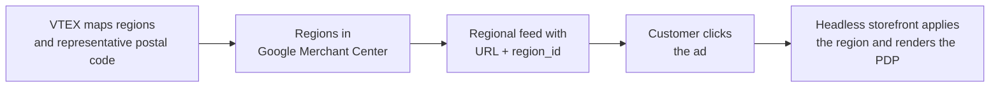
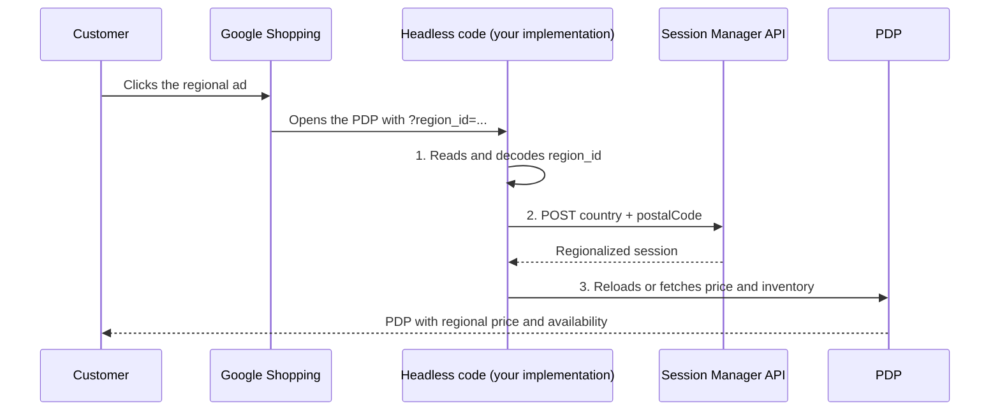

When a customer clicks a regional Google Shopping ad, Google expects the landing **product detail page (PDP)** to show the same regional price and availability that appeared in the ad without requiring the customer to enter a postal code first.

## Compatibility by storefront type

| Store type | Status regarding |
|---|---|
| Store Framework or FastStore | Native support. The `region_id` parameter and session regionalization are already handled by the platform; no storefront adaptation is required. |
| Headless | Adaptation required. The store's technical team must implement the flow in this guide. |
| CMS Portal (Legacy) | Adaptation is not possible. Portal accounts must [migrate to headless](https://developers.vtex.com/docs/guides/headless-commerce) or to Store Framework or FastStore to use regional price and availability in Google Shopping ads with consistency on the PDP. |

## How regionalization of Google ads works

VTEX maps groups of postal codes that we call delivery regions, registers these regions in Google Merchant Center, and sends, for each product and region, regional price and availability with a destination URL that includes the `region_id` parameter. When the customer clicks the ad, they land on that URL, and the headless storefront must apply the region so the PDP matches the ad.



Example destination URLs:

```text
https://www.{account}.com.br/{product-slug}/p?region_id=dnRleDpCUkE6MjAyNDEyMjA=
https://www.{account}.com.br/{product-slug}/p?region_id=dnRleDpVU0E6MTAwMDE=
```

### Understanding the `region_id` parameter

The `region_id` identifies the ad region in the destination URL. The VTEX integration includes it in the product link sent to Google so the storefront knows which country and postal code to use when loading the PDP.

In the URL, the value arrives encoded in `Base64`. After decoding, the content follows this pattern:

```text
vtex:{countryCode}:{postalCode}
```

| Part | Meaning | Example |
|---|---|---|
| `vtex` | Fixed format prefix | `vtex` |
| `countryCode` | Country code in the ISO 3166-1 alpha-3 standard | `BRA`, `USA`, `ARG` |
| `postalCode` | Postal code with digits only | `04561000`, `10001` |

Examples of the value in the URL and the content after decoding:

| `region_id` in the URL | Decoded value |
|---|---|
| `dnRleDpCUkE6MjAyNDEyMjA=` | `vtex:BRA:20241220` |
| `dnRleDpVU0E6MTAwMDE=` | `vtex:USA:10001` |
| `dnRleDpCUkE6MDQ1NjEwMDA=` | `vtex:BRA:04561000` |
| `dnRleDpBUkc6MTQyNQ==` | `vtex:ARG:1425` |

The example below shows how the storefront turns the `region_id` from the URL into a country and postal code that can be used in the session:

```javascript
// 1. Read the region_id parameter from the URL query string
const regionId = new URLSearchParams(window.location.search).get('region_id')
// e.g.: "dnRleDpCUkE6MDQ1NjEwMDA="

// 2. Decode the Base64
const decoded = atob(regionId)
// e.g.: "vtex:BRA:04561000"

// 3. Split the parts: ignore "vtex", keep country and postalCode
const [, country, postalCode] = decoded.split(':')
// country = "BRA" | postalCode = "04561000"
```

The full implementation of this step is in [Recognize the `region_id` from the URL and extract country and postal code](#1-recognize-the-region_id-from-the-url-and-extract-country-and-postal-code).

> ℹ️ If the customer already has `postalCode` and `country` set in the public session, those values take precedence over `region_id`. Use `region_id` to regionalize customers who do not yet have a locality in the session.

## Adapting a headless storefront

VTEX already sends the regional feed and builds the URL with `region_id`. The headless storefront must apply this parameter when the customer arrives by reading `region_id`, saving the country and postal code in the session, and showing on the PDP the price and availability for that region.

In addition to applying the region via `region_id`, the PDP must fulfill the promise of the regional ad. Google evaluates whether the landing page matches what was shown in Shopping. Inconsistency between the ad and the PDP is a common cause of regional offer disapproval.

### Where to implement

Choose where the regionalization logic will run in the headless architecture. This also defines how the PDP search and rendering will be executed:

| Pattern | When to use | How to execute |
|---|---|---|
| Middleware | Store with a server-side layer on the destination route | On the server, in this order: read `region_id` > save locality in the session > fetch price and inventory > serve the PDP code. The first response is already regionalized; the customer does not need a reload. |
| PDP frontend | Headless front without middleware on the destination route | On PDP load: read `region_id` > save the session on the client > fetch price and inventory again with the updated `vtex_session` > update the UI. If the page has already loaded national data, discard it and replace it with the regional result. Do not ask the customer for a postal code. |

Regardless of the pattern, the storefront flow is the same:



In practice, the store code must do three things in sequence:

### 1. Recognize the `region_id` from the URL and extract country and postal code

When the page or middleware loads, read the `region_id` query param, decode the Base64, and validate the `vtex:{countryCode}:{postalCode}` format.

```javascript
const regionId = new URLSearchParams(window.location.search).get('region_id')
if (!regionId) return // not from regional Google — nothing to do

const decoded = atob(regionId) // e.g.: "vtex:BRA:04561000"
const [, country, postalCode] = decoded.split(':')

if (!country || !postalCode) {
  // invalid region_id — ignore
  return
}
```

### 2. Save country and postal code in the store session

In this step, the merchant must call the [`POST` Create new session](https://developers.vtex.com/docs/api-reference/session-manager-api#post-/api/sessions) endpoint of the [Session Manager API](https://developers.vtex.com/docs/api-reference/session-manager-api), sending the `country` and `postalCode` extracted from `region_id`. This call saves the locality in the customer session and enables price and availability regionalization on VTEX.

If the customer already has the `vtex_session` cookie, use the [`PATCH` Edit session](https://developers.vtex.com/docs/api-reference/session-manager-api#patch-/api/sessions) endpoint with the same body; the effect on locality is the same. See an example below:

```json
{
  "public": {
    "country": {
      "value": "BRA"
    },
    "postalCode": {
      "value": "04561000"
    }
  }
}
```

#### Add a sales channel

If the store operates with more than one sales channel, include the `sc` parameter in the call URL. The value is the ID of the channel in which price and availability must be resolved:

```text
POST https://{accountName}.{environment}.com.br/api/sessions?sc={salesChannel}
```

Example: `?sc=1` for the main channel. If the store uses a single channel, this parameter can be omitted.

#### Validate the session update

After saving the country and postal code in the session, check whether the locality was saved in the session with the [`GET` Get session](https://developers.vtex.com/docs/api-reference/session-manager-api#get-/api/sessions) endpoint. Request only the `public.country` and `public.postalCode` fields, as in the example below:

```bash
curl --request GET \
  --url 'https://{accountName}.{environment}.com.br/api/sessions?items=public.country,public.postalCode' \
  --header 'Cookie: vtex_session={sessionToken}'
```

Example of the expected response:

```json
{
  "id": "{sessionToken}",
  "namespaces": {
    "public": {
      "country": {
        "value": "BRA"
      },
      "postalCode": {
        "value": "04561000"
      }
    }
  }
}
```

If the update worked, the response must return the same `country` and `postalCode` that you extracted from `region_id`. If these fields are empty or different, the PDP is not regionalized yet. Review the body of the call made in [Save country and postal code in the store session](#2-save-country-and-postal-code-in-the-store-session) and whether the `vtex_session` cookie is being sent in subsequent requests.

### 3. Display the price and availability of that session on the PDP

In this step, the merchant runs the product and shipping calls, if applicable, after [saving the locality in the session](#2-save-country-and-postal-code-in-the-store-session), always sending the `vtex_session` cookie returned in step 2. If the calls are made without that cookie or before step 2, the PDP still shows national price and inventory.

#### How to execute

1. **Store the session cookie**  
   After the `POST`/`PATCH` in step 2, persist `vtex_session` and send it in all subsequent PDP requests.

2. **Fetch the product with the regionalized session**  
   Use the endpoint the store already uses on the PDP; the recommended one is [`GET` Get product (v1)](https://developers.vtex.com/docs/api-reference/intelligent-search-api-v1#get-/products) from the [Intelligent Search API](https://developers.vtex.com/docs/api-reference/intelligent-search-api-v1):

   ```bash
   curl --request GET \
     --url 'https://{accountName}.{environment}.com.br/api/intelligent-search/v1/products?sc=1&field=slug&value={product-slug}' \
     --header 'Cookie: vtex_session={sessionToken}'
   ```

   Adjust `field` and `value` according to the available identifier (`slug`, `id`, `sku`). Learn more in [Headless catalog](https://developers.vtex.com/docs/guides/headless-catalog).

3. **Simulate shipping or the cart with the same session**  
   If the PDP shows delivery time or shipping price, use the [Checkout API](https://developers.vtex.com/docs/api-reference/checkout-api) with the same `vtex_session` cookie — for example, a cart simulation or a `shippingData` attachment with the region's postal code. See [Headless cart and checkout](https://developers.vtex.com/docs/guides/headless-cart-and-checkout).

4. **Render the PDP with that data**  
   Display in the interface the price and availability returned by that fetch. Do not ask for a postal code, state, or geolocation before showing the ad price.

Apply this sequence according to the pattern chosen in [Where to implement](#where-to-implement).
