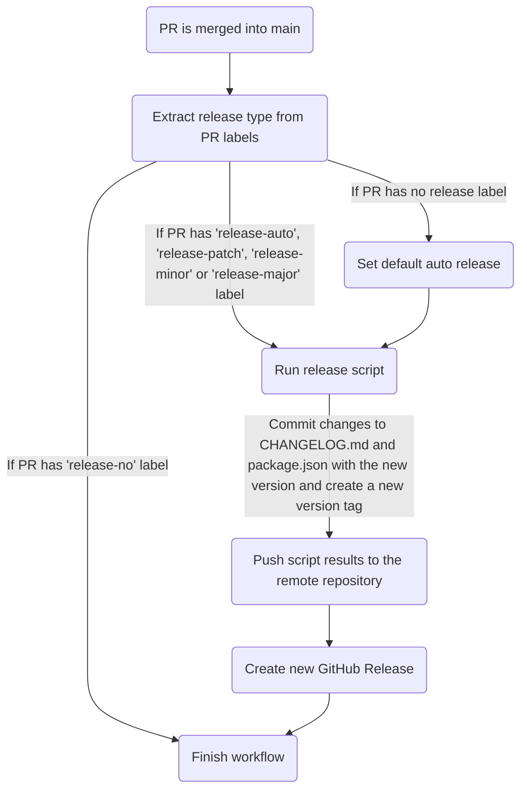

Categories organize your product assortment within your ecommerce. They work as hierarchical levels of product classification, making your client’s search for a product easier and keeping your store organized.

## Mermaidjs diagram



## Category tree

The category tree is the backbone of the Catalog, so it needs to be carefully planned and validated before importing to VTEX.

We strongly recommend starting to work on the category tree by creating a table similar to this one:


The idea behind this template is to allow easy visualization of how the tree is organized and how the specifications are being presented.

VTEX does not limit the number of categories that can be created. We strongly recommend having a maximum of three levels of categories.

## Limitations

- **Moving categories**: Although it is possible to move categories to different levels (higher/lower) and/or different departments, this is too risky because of the specifications attached to this category. This action can negatively affect product information, because products can inherit not only the previous specifications but also the new ones. To avoid issues, we recommend following the workaround described in [Deactivating and reorganizing categories](https://help.vtex.com/en/tutorial/deactivating-and-reorganizing-categories--tutorials_264#changing-the-category-tree).
- **Deleting categories**: You cannot delete a category unless you make a [full cleanup](https://help.vtex.com/en/tutorial/database-maintenance-full-cleanup--34P9LGs7BCIQK6acQom802) of the catalog. This means you cannot delete categories unless you clear the entire catalog.

## Category inheritance

All specifications registered in the upper levels of the hierarchy are inherited by the lower categories. In the example above, we have what we call the root category "level zero". This means that all specs registered at this level (Gender, Simple Color, and Country) will be inherited by level 1.

Note that the Shirt category (level 2) has the `Style` field as a specification. This means that the product contained in this category will have as attributes the `Style` field and all others defined in the upper level, in this case, the root level.

Products must be associated with the categories at the lowest level of the category tree. In this example, they must be associated with the category: `Jeans` with `Pants` or `Polo` with `Shirt`.

## Create a category

Creating a category is the most basic configuration you must do in Catalog. For a product to exist, it must have a category associated with it.

To create a category, one can use the [Create category](https://developers.vtex.com/vtex-rest-api/reference/catalog-api-post-category) endpoint. See the request body example below of the creation of a category called Clothing:

**Request body**

```json
{
    "Name": "Clothing",
    "FatherCategoryId": null,
    "Title": "Clothing",
    "Description": "Shop from brands like Patagonia, The North Face, Billabong, Columbia, and more to dress yourself for success.",
    "Keywords": "Clothing,apparel,clothes, clothing department",
    "IsActive": true,
    "ShowInStoreFront": true,
    "ShowBrandFilter": true,
    "ActiveStoreFrontLink": true,
    "GlobalCategoryId": 772,
    "StockKeepingUnitSelectionMode": "SPECIFICATION",
    "Score": null
}
```

**Response body**

```json
{
    "Id": 2000089,
    "Name": "Clothing",
    "FatherCategoryId": null,
    "Title": null,
    "Description": "Shop from brands like Patagonia, The North Face, Billabong, Columbia, and more to dress yourself for success.",
    "Keywords": "Clothing,apparel,clothes, clothing department",
    "IsActive": true,
    "ShowInStoreFront": true,
    "ShowBrandFilter": true,
    "ActiveStoreFrontLink": true,
    "GlobalCategoryId": 772,
    "StockKeepingUnitSelectionMode": "SPECIFICATION",
    "Score": null,
    "LinkId": null,
    "HasChildren": false
}
```

In this example, the created category is a parent category, which means that it is not inside another category. A *parent category* can have subcategories, or *children categories*, associated with it. To create a subcategory, you must insert the parent category ID on the `"FatherCategoryId"`.

>❗ Do not forget to activate the categories, otherwise the products will not be indexed and thereafter will not be displayed on the website.

## Edit a category

You can edit an existing category by using the [Update Category](https://developers.vtex.com/vtex-rest-api/reference/catalog-api-put-category) endpoint.

## Get category tree

You can get information of all the category tree or just some specific level by using the [Get Category Tree](https://developers.vtex.com/vtex-rest-api/reference/catalog-api-get-category-tree) endpoint.

## Get a category

You can get information about a specific category by using the [Get Category by ID](https://developers.vtex.com/vtex-rest-api/reference/catalog-api-get-category)
endpoint.

## FAQ

See below the answer to some frequently asked questions.

### When should I choose to import categories manually or by an integration via API?

It is not common for the customer to change the category tree once it is defined. Usually, specific changes may be required and can be made manually under VTEX Admin rather than having one more integration to take care of. Potentially we can find some cases where the category tree is built progressively according to the evolution of the store. But this typically happens during the validation of a new business. In that case, having category integration can be useful.

### What category fields are actually used by VTEX Intelligent Search?

- Title
- Description

### What are the best practices for Title and Meta Tag Description for SEO?

- The Title should be about 55 to 60 characters long.
- When writing the Meta Tag Description, aim for about 1-2 sentences (140-160 characters) long. Offer a compelling reason to visit the webpage. Add a clear call to action, address an emotional pain point, or offer a specific benefit to visitors.

>⚠️ Department, Category, and Subcategory titles can be customized using VTEX Intelligent Search. So on the search navigation bar, the store can present different titles for each category level.