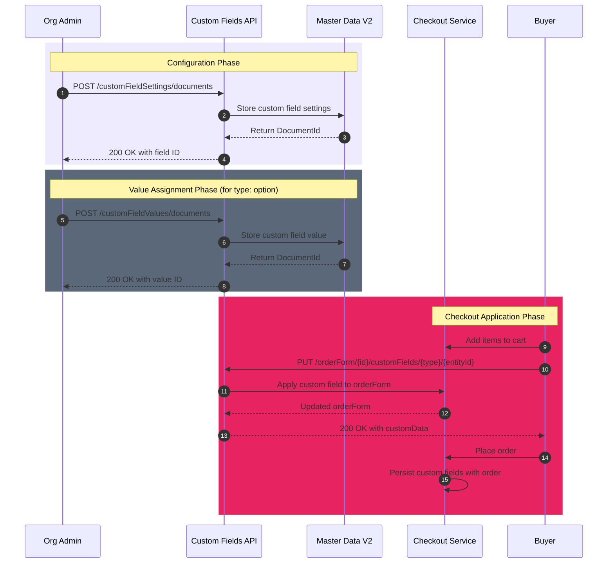
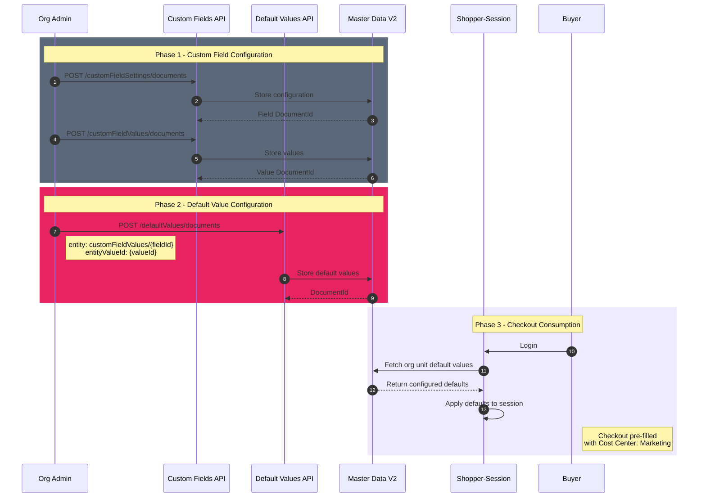

The Custom Fields integration enables B2B stores to capture additional business-specific information during checkout. This guide explains how to use the [Custom Fields API](https://developers.vtex.com/docs/api-reference/custom-fields-api) to define, manage, and apply custom fields such as Cost Center, PO Number, or Location to orders.

The integration supports three main operations:

* **[Custom field settings](#create-custom-field-settings):** Define the structure and behavior of custom fields for a contract.
* **[Custom field values](#create-custom-field-value):** Create predefined values for fields of type `option`.
* **[OrderForm application](#apply-custom-field-to-orderform):** Apply custom field values to shopping carts during checkout.

>⚠️ The Custom Fields API is only available for B2B Buyer Portal. Authorization from the Commerce Engineer of the account is required for use.

## How it works

The custom fields integration works in three phases: configuration, value assignment, and checkout application.

Example flow:

1. Create a custom field setting for a contract:

   ```txt
   POST /api/dataentities/customFieldSettings/documents?_schema=v2
   ```

2. Create values for the custom field (if type is `option`):

   ```txt
   POST /api/dataentities/customFieldValues/documents?_schema=v2
   ```

3. Apply the custom field to an orderForm during checkout:

   ```txt
   PUT /api/checkout/pub/orderForm/{orderFormId}/customFields/{entityType}/{entityId}
   ```

>ℹ️ Custom fields can be applied at three levels: `order` (entire order), `item` (individual cart items), or `address` (specific shipping addresses).



## Create custom field settings

This endpoint creates the configuration for a custom field associated with a specific contract. You define the field name, type, level, and whether it's required.

>ℹ️ Find more details about this endpoint in `POST` [Create custom field settings](https://developers.vtex.com/docs/api-reference/custom-fields-api#post-/api/dataentities/customFieldSettings/documents).

### Request example

```curl
curl -X POST "https://{{accountName}}.myvtex.com/api/dataentities/customFieldSettings/documents?_schema=v2" \
  -H "Content-Type: application/json" \
  -H "VtexIdclientAutCookie: {{userToken}}" \
  -d '{
    "contractId": "2da4e9ab-050b-11f0-b37f-f4b136dbcce1",
    "name": "Cost Center",
    "enabled": true,
    "required": true,
    "level": "item",
    "type": "option"
  }'
```

### Response body example

```json
{
  "Id": "customFieldSettings-89f1da93-6917-4cbf-894e-1f1399682826c",
  "Href": "https://accountName.myvtex.com.br/api/dataentities/customFieldSettings/documents/89f1da93-6917-4cbf-894e-1f1399682826c?_schema=v2",
  "DocumentId": "89f1da93-6917-4cbf-894e-1f1399682826c"
}
```

## Get custom field settings

This endpoint retrieves all custom field settings configured for a specific contract. Use the `_where` parameter to filter by `contractId`.

>ℹ️ Find more details about this endpoint in `GET` [Get custom field settings](https://developers.vtex.com/docs/api-reference/custom-fields-api#get-/api/dataentities/customFieldSettings/search).

### Request example

```curl
curl -X GET "https://{{accountName}}.myvtex.com/api/dataentities/customFieldSettings/search?_schema=v2&_fields=_all&_where=contractId={{contractId}}" \
  -H "VtexIdclientAutCookie: {{userToken}}"
```

### Response body example

```json
[
  {
    "id": "34575ee8-80c1-458d-b75a-7492b36513e3",
    "contractId": "2da4e9ab-050b-11f0-b37f-f4b136dbcce1",
    "name": "Cost Center",
    "enabled": true,
    "required": true,
    "level": "item",
    "type": "option",
    "createdIn": "2025-09-24T12:32:08.6879184Z"
  }
]
```

## Create custom field value

This endpoint creates a value for custom fields of type `option`. Each value is associated with a specific custom field and contract.

>ℹ️ Find more details about this endpoint in `POST` [Create custom field value](https://developers.vtex.com/docs/api-reference/custom-fields-api#post-/api/dataentities/customFieldValues/documents).

### Request example

```curl
curl -X POST "https://{{accountName}}.myvtex.com/api/dataentities/customFieldValues/documents?_schema=v2" \
  -H "Content-Type: application/json" \
  -H "VtexIdclientAutCookie: {{userToken}}" \
  -d '{
    "contractId": "2da4e9ab-050b-11f0-b37f-f4b136dbcce1",
    "customFieldId": "89f1da93-6917-4cbf-894e-1f1399682826c",
    "value": "CC1",
    "description": "Cost Center 1 - Marketing Department"
  }'
```

### Response body example

```json
{
  "Id": "customFieldValues-07d12677-08d8-11f0-b37f-e1ae31409099",
  "Href": "https://accountName.myvtex.com.br/api/dataentities/customFieldValues/documents/07d12677-08d8-11f0-b37f-e1ae31409099",
  "DocumentId": "07d12677-08d8-11f0-b37f-e1ae31409099"
}
```

## Search custom field values

This endpoint retrieves all values for a specific custom field. Use the `_where` parameter to filter by `contractId` and `customFieldId`.

>ℹ️ Find more details about this endpoint in `GET` [Search custom field values](https://developers.vtex.com/docs/api-reference/custom-fields-api#get-/api/dataentities/customFieldValues/search).

### Request example

```curl
curl -X GET "https://{{accountName}}.myvtex.com/api/dataentities/customFieldValues/search?_schema=v2&_fields=_all&_where=contractId={{contractId}} AND customFieldId=\"{{customFieldId}}\"&_sort=value ASC" \
  -H "VtexIdclientAutCookie: {{userToken}}"
```

### Response body example

```json
[
  {
    "id": "e5130781-32ed-11f0-b37f-942217c27f9b",
    "contractId": "1124b2d8-32eb-11f0-b37f-e2557e6b18d5",
    "customFieldId": "a7f2b3d4-5c6e-7f89-0123-456789abcdef",
    "value": "CC1",
    "description": "Cost Center 1"
  },
  {
    "id": "f6240892-43fe-22f1-c48a-053328d28f0c",
    "contractId": "1124b2d8-32eb-11f0-b37f-e2557e6b18d5",
    "customFieldId": "a7f2b3d4-5c6e-7f89-0123-456789abcdef",
    "value": "CC2",
    "description": "Cost Center 2"
  }
]
```

## Apply custom field to orderForm

This endpoint applies a custom field value to an orderForm during checkout. The `linkedEntity.type` determines the level (`order`, `item`, or `address`) and `linkedEntity.id` identifies the specific entity.

>ℹ️ Find more details about this endpoint in `PUT` [Create or update custom field in orderForm](https://developers.vtex.com/docs/api-reference/custom-fields-api#put-/api/checkout/pub/orderForm/-orderFormId-/customFields/-linkedEntityType-/-linkedEntityId-).

### Request example

```curl
curl -X PUT "https://{{accountName}}.myvtex.com/api/checkout/pub/orderForm/{{orderFormId}}/customFields/item/B2949D0A45244825B177D2F9F96DC711" \
  -H "Content-Type: application/json" \
  -H "VtexIdclientAutCookie: {{userToken}}" \
  -d '{
    "name": "Cost Center",
    "value": "CC3",
    "refId": "1dd9eeb8-23ed-42b3-8028-dc7745c01ada"
  }'
```

### Response body example

```json
{
  "customData": {
    "customFields": [
      {
        "linkedEntity": {
          "type": "item",
          "id": "B2949D0A45244825B177D2F9F96DC711"
        },
        "fields": [
          {
            "name": "Cost Center",
            "value": "CC3",
            "refId": "1dd9eeb8-23ed-42b3-8028-dc7745c01ada"
          }
        ]
      }
    ]
  }
}
```

## Apply custom fields in batch

This endpoint applies multiple custom fields to an orderForm in a single request. Use this when you need to set fields at different levels simultaneously.

>ℹ️ Find more details about this endpoint in `PUT` [Create or update custom fields in orderForm (batch)](https://developers.vtex.com/docs/api-reference/custom-fields-api#put-/api/checkout/pub/orderForm/-orderFormId-/customFields).

### Request example

```curl
curl -X PUT "https://{{accountName}}.myvtex.com/api/checkout/pub/orderForm/{{orderFormId}}/customFields" \
  -H "Content-Type: application/json" \
  -H "VtexIdclientAutCookie: {{userToken}}" \
  -d '[
    {
      "linkedEntity": { "type": "order" },
      "fields": [{ "name": "PO Number", "value": "PO-2025-001" }]
    },
    {
      "linkedEntity": { "type": "item", "id": "B2949D0A45244825B177D2F9F96DC711" },
      "fields": [{ "name": "Cost Center", "value": "CC3" }]
    }
  ]'
```

## Delete custom field from orderForm

This endpoint removes a specific custom field from an orderForm.

>ℹ️ Find more details about this endpoint in `DELETE` [Delete custom field from orderForm](https://developers.vtex.com/docs/api-reference/custom-fields-api#delete-/api/checkout/pub/orderForm/-orderFormId-/customFields/-linkedEntityType-/-linkedEntityId-/-fieldName-).

### Request example

```curl
curl -X DELETE "https://{{accountName}}.myvtex.com/api/checkout/pub/orderForm/{{orderFormId}}/customFields/item/B2949D0A45244825B177D2F9F96DC711/Cost Center" \
  -H "VtexIdclientAutCookie: {{userToken}}"
```

## Field levels and types

Custom fields support different levels and types to accommodate various business requirements:

| Level | Description | Example use cases |
| :--- | :--- | :--- |
| `order` | Applied to the entire order | PO Number, Project Code |
| `item` | Applied to individual cart items | Cost Center, Budget Code |
| `address` | Applied to specific shipping addresses | Delivery Instructions, Dock ID |

| Type | Description | Example use cases |
| :--- | :--- | :--- |
| `text` | Free-form text input | Notes, reference numbers |
| `number` | Numeric values only | Quantities, numeric codes |
| `option` | Predefined list of values | Cost centers, departments |

>⚠️ For **Budgets** integration, only custom fields of type `option` are supported. This allows using the value ID for matching, enabling value renaming without breaking budget configurations.

## Integration with other B2B features

### Budgets

When configuring budgets that use custom fields, use `entityType` as `CUSTOMFIELD` and the custom field value `id` (DocumentId) as the `entityId`.

### Buying Policies

When configuring buying policies, use the custom field value `id` in boolean expressions instead of the actual value. This allows renaming values without breaking existing policies.

### Default Values

The Default Values integration allows you to pre-configure which custom field value should be automatically selected at checkout for each organizational unit. When a buyer logs in, the system automatically loads the configured default values, eliminating the need for manual selection.

#### How it works

The integration works in two phases:

1. **Configuration phase:** The organization administrator defines which custom field values should be used as defaults for each organizational unit (org unit, contract, or user).

2. **Consumption phase:** At buyer login, the shopper-session app fetches the configured default values and automatically applies them to checkout.

#### Entity format

To configure a custom field as a default value, use the following format in the `defaultValues` array:

```json
{
  "entity": "customFieldValues/{{customFieldId}}",
  "entityValueId": "{{customFieldValueId}}"
}
```

| Field | Description |
| :--- | :--- |
| `entity` | Entity type identifier. For custom fields, use `customFieldValues/` followed by the custom field setting ID (obtained when creating the field configuration). |
| `entityValueId` | ID of the custom field value to be used as default (DocumentId returned when creating the value). |

#### Request example - Create default values with custom field

In this example, we configure the Cost Center "Marketing" as the default value for the organizational unit `orgUnit-456`:

```curl
curl -X POST "https://{{accountName}}.myvtex.com/api/dataentities/defaultValues/documents" \
  -H "Content-Type: application/json" \
  -H "Accept: application/json" \
  -H "X-VTEX-API-AppKey: {{appKey}}" \
  -H "X-VTEX-API-AppToken: {{appToken}}" \
  -d '{
    "id": "orgUnit-456",
    "defaultValues": [
      { 
        "entity": "address/shipping", 
        "entityValueId": "ed30b8d1-3128-4b0c-be56-f55b79592248" 
      },
      { 
        "entity": "customFieldValues/89f1da93-6917-4cbf-894e-1f1399682826c", 
        "entityValueId": "07d12677-08d8-11f0-b37f-e1ae31409099" 
      }
    ]
  }'
```

>ℹ️ In this example, `89f1da93-6917-4cbf-894e-1f1399682826c` is the ID of the "Cost Center" custom field setting and `07d12677-08d8-11f0-b37f-e1ae31409099` is the ID of the "Marketing" value.

#### Response example

```json
{
  "Id": "orgUnit-456",
  "Href": "https://accountName.myvtex.com/api/dataentities/defaultValues/documents/orgUnit-456",
  "DocumentId": "orgUnit-456"
}
```

#### Update default values

To update the default values of an existing organizational unit:

```curl
curl -X PATCH "https://{{accountName}}.myvtex.com/api/dataentities/defaultValues/documents/orgUnit-456" \
  -H "Content-Type: application/json" \
  -H "Accept: application/json" \
  -H "X-VTEX-API-AppKey: {{appKey}}" \
  -H "X-VTEX-API-AppToken: {{appToken}}" \
  -d '{
    "defaultValues": [
      { 
        "entity": "customFieldValues/89f1da93-6917-4cbf-894e-1f1399682826c", 
        "entityValueId": "f6240892-43fe-22f1-c48a-053328d28f0c" 
      }
    ]
  }'
```

#### Remove default values

To completely remove the default values of an organizational unit:

```curl
curl -X DELETE "https://{{accountName}}.myvtex.com/api/dataentities/defaultValues/documents/orgUnit-456" \
  -H "Accept: application/json" \
  -H "X-VTEX-API-AppKey: {{appKey}}" \
  -H "X-VTEX-API-AppToken: {{appToken}}"
```

#### Complete integration flow

The diagram below illustrates the complete flow from creating the custom field to applying the default value at checkout:



#### Default Values permissions

The following License Manager permissions are required for Default Values operations:

| Operation | Required resources |
| :--- | :--- |
| Create default values | Insert or update document (not remove), Full access to all documents, or Master Data administrator |
| Read default values | Read-only documents, Insert or update document (not remove), Full access to all documents, or Master Data administrator |
| Update default values | Insert or update document (not remove), Full access to all documents, or Master Data administrator |
| Delete default values | Full access to all documents or Master Data administrator |

>⚠️ Only custom fields of type `option` are supported for default value configuration. This ensures that the value ID is used for matching, allowing values to be renamed without breaking configurations.

>ℹ️ If a custom field's name or value is altered after an order has been placed, these changes will not be reflected in the existing order. The order retains the original values.

## Permissions

The following License Manager resources are required:

| Operation | Required resources |
| :--- | :--- |
| Create/Update settings or values | Insert or update document (not remove), Full access to all documents, or Master Data administrator |
| Read settings or values | Read-only documents, Insert or update document (not remove), Full access to all documents, or Master Data administrator |
| Delete settings or values | Full access to all documents or Master Data administrator |
| OrderForm operations | Read Shopping Cart |

All resources belong to the **Dynamic Storage** product, except OrderForm operations which belong to the **Checkout** product.
