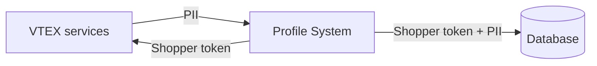

The VTEX data residency feature enables stores to select the specific geographic region where their shoppers' information is stored.

When your VTEX account is created under the PII data architecture, you may choose your residency location from two available options:
- **AWS us-east-1:** located in Virginia, USA.
- **AWS eu-west-1:** located in Ireland.

This feature applies to all data saved in the [Profile System](https://developers.vtex.com/docs/guides/profile-system), such as name, email, and shipping address, among others. 

There are two instances of the [Profile System](https://developers.vtex.com/docs/guides/profile-system) running in parallel, each based in different locations: US (Virginia) and EU (Ireland). These instances are identical in terms of their functioning. However, each instance stores and processes only data associated with stores that selected that location as their accounts' PII data residency.

Every time data is requested from the Profile System, the VTEX edge layer routes that request to the corresponding [Profile System](https://developers.vtex.com/docs/guides/profile-system) location, depending on the account's selected data residency location.

>ℹ️ The [Profile System](https://developers.vtex.com/docs/guides/profile-system) is the VTEX module responsible for keeping Shopper Profile PII at rest.
