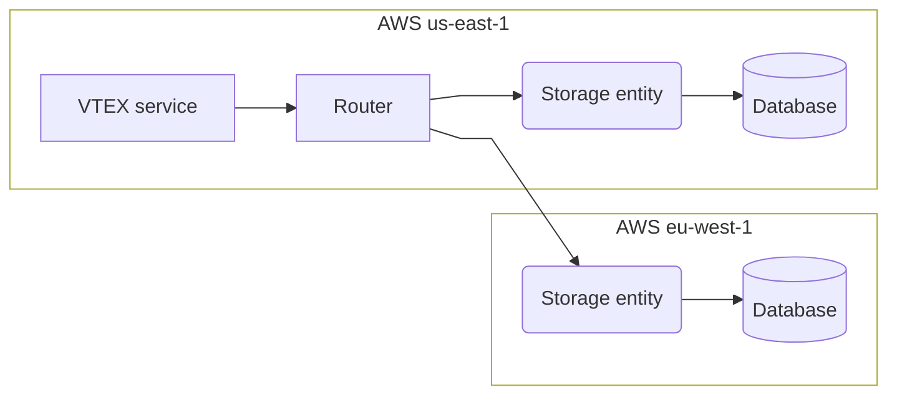

>⚠️ **Closed beta:** [Data Protection Plus](https://developers.vtex.com/docs/guides/data-protection-plus) is in closed beta and is only available in select regions.

>❗ This feature is part of [VTEX Shield](https://help.vtex.com/en/tutorial/vtex-shield--2CVk6H9eY2CBtHjtDI7BFh), meaning *additional fees may apply.* 
> 
> If you are already a VTEX customer and want to adopt VTEX Shield for your business, please contact [Commercial Support](https://help.vtex.com/en/tracks/support-at-vtex--4AXsGdGHqExp9ZkiNq9eMy/3KQWGgkPOwbFTPfBxL7YwZ).
>
> If you are not yet a customer but are interested in this solution, please complete our [contact form](https://vtex.com/us-en/contact/). 

The VTEX data residency feature enables stores implementing [Data Protection Plus](https://developers.vtex.com/docs/guides/data-protection-plus) to select the specific geographic region where all data saved in the [Profile System](https://developers.vtex.com/docs/guides/profile-system) is stored, such as name, email, and shipping address, among others.

It is possible to choose the data residency location from two available options:

- **AWS us-east-1:** located in Virginia, USA.
- **AWS eu-west-1:** located in Ireland.

There are two instances of the [Profile System](https://developers.vtex.com/docs/guides/profile-system) running in parallel, each based in different locations: US (Virginia) and EU (Ireland). These instances are identical in terms of their functioning. However, each instance only holds and processes data associated with stores that selected that location as their accounts' PII data residency. Profile System information is backed up in the same selected region, using [Amazon DynamoDB Point-in-time recovery (PITR)](https://aws.amazon.com/dynamodb/pitr).

In practice, when data is requested from the [Profile System](https://developers.vtex.com/docs/guides/profile-system), the VTEX edge layer directs the request to the appropriate Profile System location based on the data residency location selected by the account, as illustrated below.

>ℹ️ The [Profile System](https://developers.vtex.com/docs/guides/profile-system) is the VTEX module responsible for keeping Shopper Profile PII at rest.
