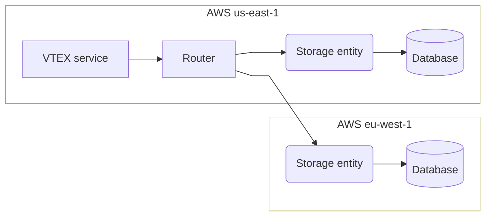

>❗ This feature is in closed beta phase, meaning we are evolving it to support all scenarios. Do not share this documentation with people outside of your company.

The VTEX data residency feature enables stores implementing the [PII data architecture](https://developers.vtex.com/docs/guides/pii-data-architecture) to select the specific geographic region where all data saved in the [Profile System](https://developers.vtex.com/docs/guides/profile-system) is stored, such as name, email, and shipping address, among others.

It is possible to choose the data residency location from two available options:

- **AWS us-east-1:** located in Virginia, USA.
- **AWS eu-west-1:** located in Ireland.

There are two instances of the [Profile System](https://developers.vtex.com/docs/guides/profile-system) running in parallel, each based in different locations: US (Virginia) and EU (Ireland). These instances are identical in terms of their functioning. However, each instance only holds and processes data associated with stores that selected that location as their accounts' PII data residency.

In practice, when data is requested from the [Profile System](https://developers.vtex.com/docs/guides/profile-system), the VTEX edge layer directs the request to the appropriate Profile System location based on the data residency location selected by the account, as illustrated below.

>ℹ️ The [Profile System](https://developers.vtex.com/docs/guides/profile-system) is the VTEX module responsible for keeping Shopper Profile PII at rest.
