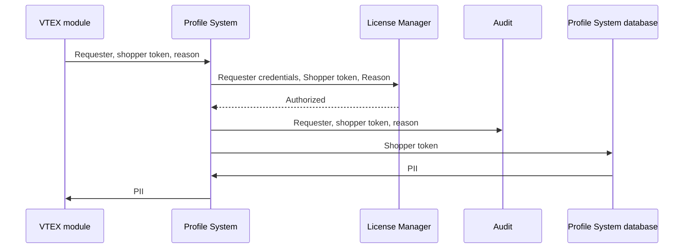
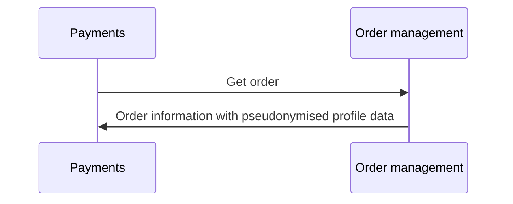

VTEX's comprehensive PII data architecture incorporates a range of solutions and processes for managing personally identifiable information (PII). Here you can find detailed information about how this architecture works to ensure the protection of shoppers' data privacy.

See the sections below to learn more about:

- [Profile System](#profile-system)
- [Encryption](#encryption)
- [Tokenization](#tokenization)
- [Masked data by default](#masked-data-by-default)
- [Auditability](#auditability)
- [Marketplaces](#marketplaces)
- [PII data architecture integration changes](#pii-data-architecture-integration-changes)

## Profile system

The [Profile System](https://developers.vtex.com/docs/guides/profile-system) is VTEX's single source of truth when it comes to shopper's profile data. Other modules, such as checkout and order management, can request data from the Profile System when necessary.

This means that Profile System information is subject to specific data guidelines and processes, appropriate to handling PII. These specifications also apply whenever other VTEX modules communicate with the Profile System. In the following sections you can learn more about these specifications.

>⚠️ The Profile System does not store credit card information. Instead, all credit card data, including billing addresses, is processed and stored in a [PCI compliant](https://help.vtex.com/tutorial/what-is-the-pci-ssc) manner for all VTEX stores, regardless of any differences in data architecture. This ensures that VTEX adheres to the best practices of data protection regulations when it comes to handling credit card-related PII. Learn more about [VTEX PCI certification](https://secure.vtex.com/?an=VTEX).

>ℹ️ You can integrate with the Profile System via its REST APIs, as described in the [Profile System integration guide](https://developers.vtex.com/docs/guides/profile-system).

### Data entities

The Profile System has three data entities:

- **Prospect:** information entered by shoppers during cart and checkout flow.
- **Profile:** prospect information can become a profile if the shopper creates a profile, which can happen via order placement, manual profile creation or [single sign on integrations](https://developers.vtex.com/docs/guides/authentication-overview#single-sign-on-integrations).
- **Address:** once a prospect or profile places an order, shipping address information is saved, associated with a given profile. One profile may be associated with multiple shipping addresses.

>⚠️ The **address** data entity only stores shipping addresses. All credit card related PII, including billing addresses, is stored and processed in a [PCI compliant](https://help.vtex.com/tutorial/what-is-the-pci-ssc) manner for all VTEX stores, regardless of any differences in data architecture.

### Communication with other VTEX modules

Some VTEX modules may need to access PII data from the Profile System: checkout, order management and transactional emails. Consider, for instance, a shopper that wishes to see their previous order history, including addresses and payment methods used at your store. In this case, the order management module must be able to display their own PII to them.

>ℹ️ Although shopper data flows from checkout to the Profile System, no data is stored by the checkout module. The same applies to order management and transactional emails, as these may access shopper data from the Profile System at times, but do not keep any of it.

The diagram below shows the information flow whenever another VTEX module requests unmasked PII from the Profile System.



When another VTEX module needs [unmasked](#masked-data-by-default) information from the Profile System it may request it, while informing:

- Shopper [token](#tokenization).
- Requester credentials.
- Reason for requesting data.

Then the Profile System proceeds with the following actions:

1. Check whether the requester can access that data. If they do, it proceeds to the next steps.
2. Log [audit](#auditability) event.
3. Retrieve [encryption key](#encryption) from the key management system.
4. Decrypt information.
5. Return information to the requester.

These steps ensure access control with specific authorization and auditability of each access.

>ℹ️ The key management system is a separated system and can only be accessed by the Profile System.

### Versioning

The Profile System works with versioning, meaning that each [token](#tokenization) may have multiple versions. Because of this, every change is safely stored and other modules' related information, such as order history is not compromised due to profile changes made by users.

## Encryption

All PII is encrypted with a unique key for each store. The [Profile System](#profile-system) uses AES GCM with an encryption key of 256 bits. VTEX does not share the encryption keys with any external entity, not even with the corresponding merchants.


## Tokenization

All PII is tokenized, meaning it is indexed under a token, which is a unique shopper ID internal to VTEX.

The diagram below exemplifies this communication in the case of a [Get order request](https://developers.vtex.com/docs/api-reference/orders-api#get-/api/oms/pvt/orders/-orderId-) from the payments module to order management.



Modules may need to index PII information for purposes such as search. In this case, the data is hashed, meaning it can not be reversed. This minimizes requests to the [Profile System](#profile-system) and overall latency of the shopping experience. 

See how the platform hashes this data in this case:

1. Concatenate information with an account specific salt.
2. Apply SHA256 to the resulting string.

This process is irreversible. So the information is safe even if the request indexer data becomes exposed.

## Masked data by default

PII is masked by default. This means that when you access a shopper's order history in VTEX Admin panel or when you request their profile information via API, for example, any PII information returned will be masked.

However, unmasked data can be requested by modules, integrations, and store operators with the appropriate [permissions](https://help.vtex.com/en/tutorial/roles--7HKK5Uau2H6wxE1rH5oRbc).

See examples, as returned by [Profile System APIs](https://developers.vtex.com/docs/guides/profile-system#masked-data).

Masked profile:
```
{
	"id": "70caf394-8534-447e-a0ca-1803c669c771",
	"meta": {
    	"version": "abc",
    	"author": "e40e0b6d-0605-4fa6-8176-1d69fbaf0818",
    	"creationDate": "13/12/2021T00:00:00Z",
    	"lastUpdate": "13/12/2021T00:00:00Z"
	},
	"document": {
    	"firstName": "J***",
    	"lastName": "D**",
    	"email": "j***.d**@e******.c**",
    	"birthDate": "1925-11-17",
    	"document": "1**********",
    	"documentType": "CPF"
	}
}
```

Unmasked profile:
```
{
	"id": "70caf394-8534-447e-a0ca-1803c669c771",
	"document": {
    	"firstName": "John",
    	"lastName": "Doe",
    	"email": "john.doe@example.com",
    	"birthDate": "1925-11-17",
    	"document": "12345678911",
    	"documentType": "CPF"
	},
	"meta": {
    	"version": "abc",
    	"author": "e40e0b6d-0605-4fa6-8176-1d69fbaf0818",
    	"creationDate": "13/12/2021T00:00:00Z",
    	"lastUpdate": "13/12/2021T00:00:00Z"
	}
}
```

>ℹ️ Learn more about retrieving unmasked data with the [Profile System integration guide](https://developers.vtex.com/docs/guides/profile-system#masked-data).

## Auditability

The VTEX platform enables stores to audit actions of store operators with the [Audit module](https://help.vtex.com/en/tutorial/searching-for-events-on-audit--5RXf9WJ5YLFBcS8q8KcxTA), including actions related to personal data and PII.

Every successful request to unmasked personal data and PII generates a log on [Audit](https://help.vtex.com/en/tutorial/searching-for-events-on-audit--5RXf9WJ5YLFBcS8q8KcxTA). This includes the Id of the store operator that requested this information.

You can see the [list of events available on Audit](https://help.vtex.com/en/tutorial/eventos-disponiveis-no-audit--6r1Mzcu5NmkmmDLJlz9CCZ), but stores using the PII data architecture also log Profile System events, which you can see in the [Profile System integration guide](https://developers.vtex.com/docs/guides/profile-system#auditability).

## Marketplaces

The VTEX platform enables your store to be a marketplace and a seller to other marketplaces at the same time. Data privacy processes may impact your store in different ways depending on the roles your operation assumes in this context.

### Your store is the marketplace

Shopper data belongs to the marketplace, so all specifications described above apply.

Fullfilment information is shared with the seller, so you must make sure that your associated sellers are also compliant with data privacy laws.

### Your store is the seller

The specifications described above apply to the fulfillment data received by your store from the marketplace.

The marketplace is your source of data, so you must guarantee that marketplaces associated with your store are also compliant with data privacy laws.

## PII data architecture integration changes

Due to the changes in data architecture made for the PII data architecture, it has some differences in implementation when compared to the previous version, such as API contracts and how information is displayed. See this article about [Changes and limitations of the PII data architecture](https://developers.vtex.com/docs/guides/changes-and-limitations-pii-data-architecture). This document is constantly updated to reflect the evolution of the PII data architecture.
