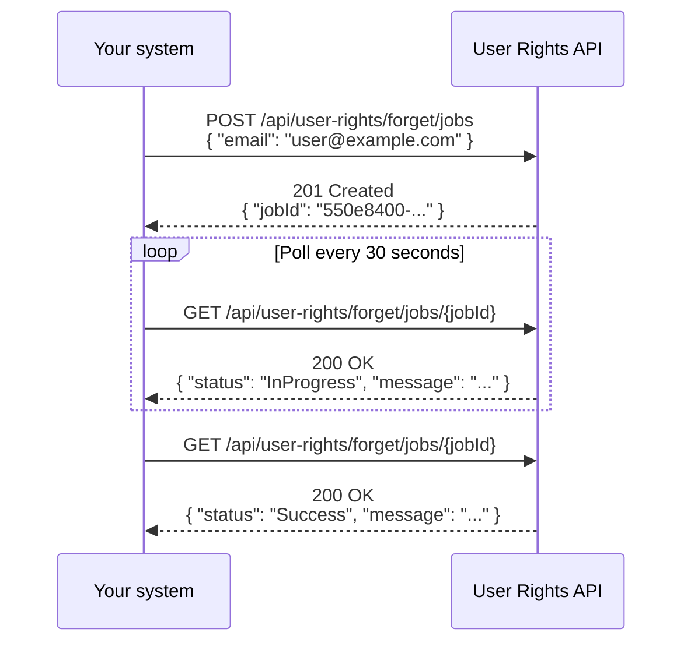

The [User Rights API](https://developers.vtex.com/docs/api-reference/user-rights-api) allows you to automate the deletion of a user's personal data stored across VTEX applications, in compliance with "Right to be Forgotten" regulations.

Instead of manually processing each erasure request, you submit the user's email, receive a job ID, and poll for status updates until the deletion is complete.

> ⚠️ This data erasure flow applies only to non-corporate shoppers. They don't apply to B2B buyers or Admin users.

> ℹ️ This API handles personal data that is standard to the VTEX platform. For custom data stored in [Master Data](https://help.vtex.com/en/tutorial/master-data--4otjBnR27u4WUIciQsmkAw) entities, follow the process described in [Erasing customer data](https://help.vtex.com/docs/tutorials/erasing-customer-data).

## Integration flow

The diagram below illustrates the complete integration flow:



## Step 1 - Create a data erasure job

Send a `POST` request to the [Create data erasure job](https://developers.vtex.com/docs/api-reference/user-rights-api#post-/api/user-rights/forget/jobs) endpoint with the user's email address:

```bash
curl -X POST "https://{accountName}.vtexcommercestable.com.br/api/user-rights/forget/jobs" \
  -H "Content-Type: application/json" \
  -H "Accept: application/json" \
  -H "X-VTEX-API-AppKey: {appKey}" \
  -H "X-VTEX-API-AppToken: {appToken}" \
  -d '{"email": "user@example.com"}'
```

The response returns a `jobId` that you will use to track the deletion progress:

```json
{
  "jobId": "550e8400-e29b-41d4-a716-446655440000"
}
```

## Step 2 - Poll the job status

>⚠️ Do not poll more frequently than once every 30 seconds. Requests that exceed this rate may be throttled.

Send periodic `GET` requests to the [Get data erasure job status](https://developers.vtex.com/docs/api-reference/user-rights-api#get-/api/user-rights/forget/jobs/-jobId-) endpoint using the `jobId` from the previous step:

```bash
curl "https://{accountName}.vtexcommercestable.com.br/api/user-rights/forget/jobs/{jobId}" \
  -H "Accept: application/json" \
  -H "X-VTEX-API-AppKey: {appKey}" \
  -H "X-VTEX-API-AppToken: {appToken}"
```

The response contains the current status of the job:

```json
{
  "status": "InProgress",
  "message": "Processing deletion request."
}
```

Continue polling until the `status` field returns either `Success` or `Failed`.

### Status values

| Status | Description | Action |
| --- | --- | --- |
| `InProgress` | The deletion is still being processed. | Continue polling. |
| `Success` | The user's data has been deleted. | Stop polling. The job is complete. |
| `Failed` | The deletion could not be completed after all retry attempts. | Stop polling. Check the `message` field for details. |

## Behavior details

Keep the following details in mind when integrating with this API:

- **Polling interval:** We recommend waiting at least 30 seconds between status checks to avoid unnecessary load.
- **Automatic retries:** The system retries failed internal operations up to 10 times before marking the job as `Failed`. You do not need to implement retry logic on your end.
- **Non-existent emails:** If no data is found for the given email, the job completes with `Success`. No error is returned.
- **Job not found:** If you query a `jobId` that does not exist, the API returns a `404 Not Found` response.
