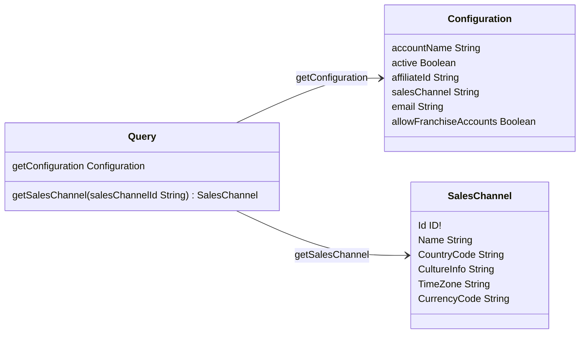
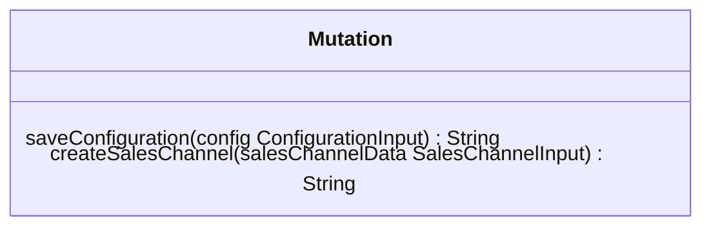

This document outlines the GraphQL API for managing external marketplace integrations within the VTEX ecosystem, provided via the [mkp-app-template](https://github.com/vtex/mkp-app-template) app template. The API enables querying and modifying integration settings, including sales channel configurations, affiliate mappings, and account details.

## Schema overview

### Query

<table>
  <thead>
    <tr>
      <th align="left">Field</th>
      <th align="right">Argument</th>
      <th align="left">Type</th>
      <th align="left">Description</th>
    </tr>
  </thead>
  <tbody>
    <tr>
      <td colspan="2" valign="top">
        <strong id="query.getconfiguration">getConfiguration</strong>
      </td>
      <td valign="top"><a href="#configuration">Configuration</a></td>
      <td>Retrieves the current marketplace integration configuration, including account settings, affiliate details, and sales channel information.</td>
    </tr>
    <tr>
      <td colspan="2" valign="top"><strong id="query.getsaleschannel">getSalesChannel</strong></td>
      <td valign="top"><a href="#saleschannel">SalesChannel</a></td>
      <td>Retrieves detailed properties of a specific sales channel using its unique ID.</td>
    </tr>
    <tr>
      <td colspan="2" align="right" valign="top">salesChannelId</td>
      <td valign="top">String</td>
      <td>Sales channel ID.</td>
    </tr>
  </tbody>
</table>

### Mutation

<table>
  <thead>
    <tr>
      <th align="left">Field</th>
      <th align="right">Argument</th>
      <th align="left">Type</th>
      <th align="left">Description</th>
    </tr>
  </thead>
  <tbody>
    <tr>
      <td colspan="2" valign="top"><strong id="mutation.saveconfiguration">saveConfiguration</strong></td>
      <td valign="top">String</td>
      <td>Updates the integration configuration with the provided settings. Returns a success message or error if the operation fails. </td>
    </tr>
    <tr>
      <td colspan="2" align="right" valign="top">config</td>
      <td valign="top"><a href="#configurationinput">ConfigurationInput</a></td>
      <td>Properties of the configuration to be saved.</td>
    </tr>
    <tr>
      <td colspan="2" valign="top"><strong id="mutation.createsaleschannel">createSalesChannel</strong></td>
      <td valign="top">String</td>
      <td>Creates or updates a sales channel with the provided information. Returns a success message or error if the operation fails.</td>
    </tr>
    <tr>
      <td colspan="2" align="right" valign="top">salesChannelData</td>
      <td valign="top"><a href="#saleschannelinput">SalesChannelInput</a></td>
      <td>Sales channel properties to be created or modified.</td>
    </tr>
  </tbody>
</table>

## Schema description

> ⚠️ Arguments must be provided by the user. Required fields are marked with an exclamation mark (`!`).

### Configuration

<table>
  <thead>
    <tr>
      <th align="left">Field</th>
      <th align="left">Type</th>
      <th align="left">Description</th>
    </tr>
  </thead>
  <tbody>
    <tr>
      <td valign="top">
        <strong id="configuration.accountname">accountName</strong>
      </td>
      <td valign="top">
        String
      </td>
      <td>Account name where the integration is installed.</td>
    </tr>
    <tr>
      <td valign="top">
        <strong id="configuration.active">active</strong>
      </td>
      <td valign="top">
        Boolean
      </td>
      <td>Indicates whether the integration is active. If <code>true</code>, the integration is active. If <code>false</code>, the integration is inactive.</td>
    </tr>
    <tr>
      <td valign="top">
        <strong id="configuration.affiliateid">affiliateId</strong>
      </td>
      <td valign="top">
        String
      </td>
      <td>ID (3 consonants) that represents the connection with the external marketplace. The ID needs to be unique in the VTEX seller account. Example: <code>LVL</code>.</td>
    </tr>
    <tr>
      <td valign="top">
        <strong id="configuration.saleschannel">salesChannel</strong>
      </td>
      <td valign="top">
        String
      </td>
      <td>Sales channel ID, which defines the catalog that will be sent to the marketplace. Example: <code>1</code>.</td>
    </tr>
    <tr>
      <td valign="top">
        <strong id="configuration.email">email</strong>
      </td>
      <td valign="top">
        String
      </td>
      <td>Email that will receive VTEX notifications related to the affiliate.</td>
    </tr>
    <tr>
      <td valign="top">
        <strong id="configuration.allowfranchiseaccounts">allowFranchiseAccounts</strong>
      </td>
      <td valign="top">
        Boolean
      </td>
      <td>Indicates whether the integration allows franchise accounts. If <code>true</code>, the integration allows them. If <code>false</code>, the integration doesn't allow them.</td>
    </tr>
  </tbody>
</table>

<a href="#query">Query</a> 🔼

### SalesChannel

<table>
  <thead>
    <tr>
      <th align="left">Field</th>
      <th align="left">Type</th>
      <th align="left">Description</th>
    </tr>
  </thead>
  <tbody>
    <tr>
      <td valign="top">
        <strong id="saleschannel.id">Id</strong>
      </td>
      <td valign="top">ID!</td>
      <td>Sales channel ID. Example: <code>1</code>.</td>
    </tr>
    <tr>
      <td valign="top">
        <strong id="saleschannel.name">Name</strong>
      </td>
      <td valign="top">
        String
      </td>
      <td>Sales channel name. Example: <code>"Marketplace channel"</code>.</td>
    </tr>
    <tr>
      <td valign="top">
        <strong id="saleschannel.countrycode">CountryCode</strong>
      </td>
      <td valign="top">
        String
      </td>
      <td>Sales channel country code in <a href="https://en.wikipedia.org/wiki/ISO_3166-1_alpha-2#Officially_assigned_code_elements" target="_blank">ISO 3166-1 alpha-2 format</a> for the external marketplace. Example: <code>"US"</code>.</td>
    </tr>
    <tr>
      <td valign="top">
        <strong id="saleschannel.cultureinfo">CultureInfo</strong>
      </td>
      <td valign="top">
        String
      </td>
      <td>Sales channel culture information for the external marketplace in <a href="https://www.rfc-editor.org/info/bcp47" target="_blank">IETF BCP 47 format</a> and combining a language code in <a href="https://en.wikipedia.org/wiki/List_of_ISO_639_language_codes" target="_blank">ISO-639 format</a> and a region code in <a href="https://en.wikipedia.org/wiki/ISO_3166-1_alpha-2#Officially_assigned_code_elements" target="_blank">ISO 3166-1 alpha-2 format</a>. Example: <code>"en-US"</code>.</td>
    </tr>
    <tr>
      <td valign="top">
        <strong id="saleschannel.timezone">TimeZone</strong>
      </td>
      <td valign="top">
        String
      </td>
      <td>Sales channel <a href="https://learn.microsoft.com/en-us/windows-hardware/manufacture/desktop/default-time-zones?view=windows-11" target="_blank">time zone name</a> for the external marketplace. Example: <code>"Pacific Standard Time"</code>.</td>
    </tr>
    <tr>
      <td valign="top">
        <strong id="saleschannel.currencycode">CurrencyCode</strong>
      </td>
      <td valign="top">
        String
      </td>
      <td>Sales channel currency code in <a href="https://en.wikipedia.org/wiki/ISO_4217#List_of_ISO_4217_currency_codes" target="_blank">ISO 4217 format</a> for the external marketplace. Example: <code>"USD"</code>.</td>
    </tr>
  </tbody>
</table>

<a href="#query">Query</a> 🔼

### ConfigurationInput

<table>
  <thead>
    <tr>
      <th align="left">Field</th>
      <th align="left">Type</th>
      <th align="left">Description</th>
    </tr>
  </thead>
  <tbody>
    <tr>
      <td valign="top">
        <strong id="configuration.accountname">accountName</strong>
      </td>
      <td valign="top">
        String
      </td>
      <td>Name of the account where the integration is installed.</td>
    </tr>
    <tr>
      <td valign="top">
        <strong id="configuration.active">active</strong>
      </td>
      <td valign="top">
        Boolean
      </td>
      <td>Property that defines if the integration is active. If <code>true</code>, the integration is active. If <code>false</code>, the integration is inactive.</td>
    </tr>
    <tr>
      <td valign="top">
        <strong id="configuration.affiliateid">affiliateId</strong>
      </td>
      <td valign="top">
        String
      </td>
      <td>ID (3 consonants) that represents the connection with the external marketplace. The ID needs to be unique in the VTEX seller account. Example: <code>LVL</code>.</td>
    </tr>
    <tr>
      <td valign="top">
        <strong id="configuration.saleschannel">salesChannel</strong>
      </td>
      <td valign="top">
        String
      </td>
      <td>Sales channel ID, which defines the catalog that will be sent to the marketplace. Example: <code>1</code>.</td>
    </tr>
    <tr>
      <td valign="top">
        <strong id="configuration.email">email</strong>
      </td>
      <td valign="top">
        String
      </td>
      <td>Email that will receive VTEX notifications related to the affiliate.</td>
    </tr>
    <tr>
      <td valign="top">
        <strong id="configuration.allowfranchiseaccounts">allowFranchiseAccounts</strong>
      </td>
      <td valign="top">
        Boolean
      </td>
      <td>Property that defines if the integration allows franchise accounts. If <code>true</code>, the integration allows them. If <code>false</code>, the integration doesn't allow them.</td>
    </tr>
  </tbody>
</table>

<a href="#mutation">Mutation</a> 🔼

### SalesChannelInput

<table>
  <thead>
    <tr>
      <th align="left">Field</th>
      <th align="left">Type</th>
      <th align="left">Description</th>
    </tr>
  </thead>
  <tbody>
    <tr>
      <td valign="top"><strong id="saleschannel.id">Id</strong></td>
      <td valign="top">ID!</td>
      <td>Sales channel ID. Example: <code>1</code>.</td>
    </tr>
    <tr>
      <td valign="top"><strong id="saleschannel.name">Name</strong></td>
      <td valign="top">String</td>
      <td>Sales channel name. Example: <code>"Marketplace channel"</code>.</td>
    </tr>
    <tr>
      <td valign="top"><strong id="saleschannel.countrycode">CountryCode</strong></td>
      <td valign="top">String</td>
      <td>Sales channel country code in <a href="https://en.wikipedia.org/wiki/ISO_3166-1_alpha-2#Officially_assigned_code_elements" target="_blank">ISO 3166-1 alpha-2 format</a> for the external marketplace. Example: <code>"US"</code>.</td>
    </tr>
    <tr>
      <td valign="top"><strong id="saleschannel.cultureinfo">CultureInfo</strong></td>
      <td valign="top">String</td>
      <td>Sales channel culture information for the external marketplace in <a href="https://www.rfc-editor.org/info/bcp47" target="_blank">IETF BCP 47 format</a> and combining a language code in <a href="https://en.wikipedia.org/wiki/List_of_ISO_639_language_codes" target="_blank">ISO-639 format</a> and a region code in <a href="https://en.wikipedia.org/wiki/ISO_3166-1_alpha-2#Officially_assigned_code_elements" target="_blank">ISO 3166-1 alpha-2 format</a>. Example: <code>"en-US"</code>.</td>
    </tr>
    <tr>
      <td valign="top"><strong id="saleschannel.timezone">TimeZone</strong></td>
      <td valign="top">String</td>
      <td>Sales channel <a href="https://learn.microsoft.com/en-us/windows-hardware/manufacture/desktop/default-time-zones?view=windows-11" target="_blank">time zone name</a> for the external marketplace. Example: <code>"Pacific Standard Time"</code>.</td>
    </tr>
    <tr>
      <td valign="top"><strong id="saleschannel.currencycode">CurrencyCode</strong></td>
      <td valign="top">String</td>
      <td>Sales channel currency code in <a href="https://en.wikipedia.org/wiki/ISO_4217#List_of_ISO_4217_currency_codes" target="_blank">ISO 4217 format</a> for the external marketplace. Example: <code>"USD"</code>.</td>
    </tr>
  </tbody>
</table>

<a href="#mutation">🔼 Mutation</a>

