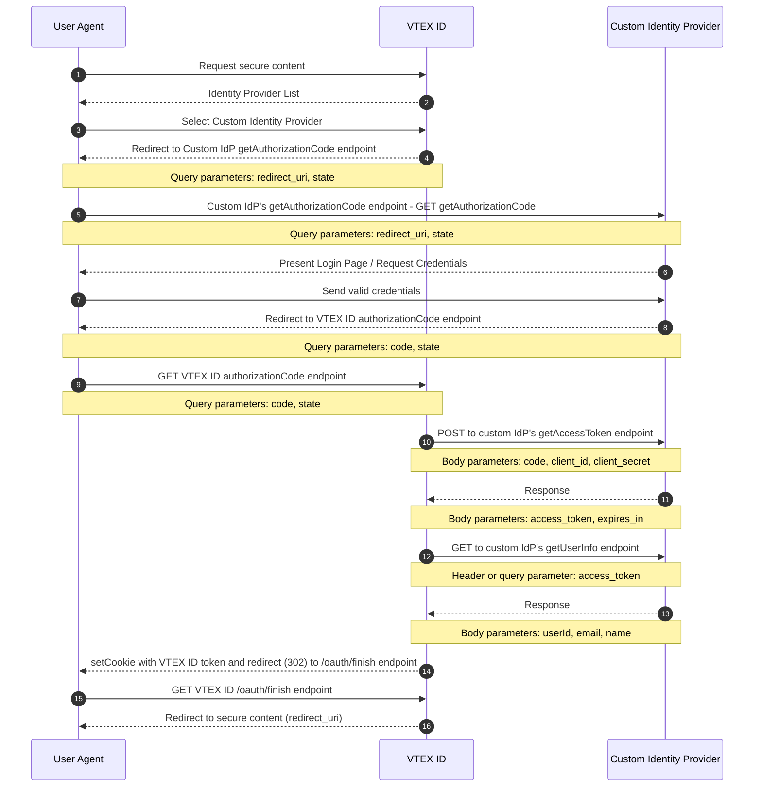

VTEX stores can identify returning customers by requesting that they provide login information. That way, logged-in customers can access their previous purchases, and the store can display customized content based on customer profile information.

By default, our platform stores user information in our secure servers, but sometimes it is helpful to integrate external identity providers with the authentication process. The framework described in this guide will allow the VTEX platform to connect pre-existing user bases in private servers. The same protocol enables clients to use their Google accounts to log in to a third-party application.

In this guide, you will learn about:

- [OAuth2 and VTEX](#oauth2)
- [How to set up or edit a custom OAuth user login option](#custom-oauth)

## OAuth2

The OAuth2 specification defines a framework that enables applications (__service providers__) to ask anyone requesting access to protected data for user authentication without having to interact with their private credentials. It achieves this by interacting with a trusted partner (__identity provider__) that handles user identification, validates their credentials, and returns to the application the information it needs to proceed safely. You can learn more about the __OAuth2 Authorization Framework__ by reading its [specification document](https://tools.ietf.org/html/rfc6749).

This is an example of VTEX's custom OAuth2 authentication flow:

### User agent

The user agent in this context is the user's browser. The user interacts with the browser manually, but it's the application that sends requests to servers, follows redirects and renders pages to the user.

### Redirects

All server communications in this guide happen via the HTTPS protocol. One feature of this protocol is responding to a request by redirecting the user agent to a different URI. When the browser receives a redirect response, it instantly proceeds to the specified URI. For example, when a user tries to access protected areas of a store, they can be redirected to a login page.

### VTEX ID

__VTEX ID__ is the service used to identify users on our platform. Applications usually talk to it to obtain the token required to access protected information.

### Relevant requests

Some steps of the OAuth2 authentication process are worth highlighting and describing in more detail.

> ℹ️ Note that some of the variable names in the requests mentioned below are customizable when you implement a custom OAuth option. You can adapt them to the specifications of your identity provider.

#### Authorization request

When an unauthenticated user requests access to protected resources in a store, VTEX ID will start the authentication process by generating a unique identifier for this authentication session, storing the URI of the requested resource for this session, and redirecting the __user agent__ to this endpoint with the following query variables:

- `Client ID`: Client identification.
- `state`: The state containing the unique identifier.
- `redirect_uri`: This will always be `https://vtexid.vtex.com.br/VtexIdAuthSiteKnockout/ReceiveAuthorizationCode.ashx`.

In this endpoint, the user is expected to be presented with a way to send their credentials or redirected to an endpoint that displays it. This is usually a form requesting a username and password. It is also common practice to check for cookies indicating the user is logged in.

Once the __identity provider__ has safely identified the user, it should generate an authorization code with more than 64 characters. Store it so you can use it later to identify this session, and redirect the __user agent__ to the `authorizationCode` endpoint with the code in a query variable named `code`. The `state` variable will also be forwarded as received. The __identity provider__ can also pass a query string parameter `error` to inform occasional errors on its side.

#### Authorization code callback request

The __user agent__ should be redirected to this endpoint after the __identity provider__ has successfully checked its user credentials. VTEX ID will retrieve two parameters from the query variables: `code` and `state`.

- `code`: Single-use code that should expire after a few minutes, as indicated by the [RFC specification](https://datatracker.ietf.org/doc/html/rfc6749#section-4.1.2). If there are multiple attempts to use this code, the credentials must be revoked.
- `state`: Used to identify the authentication session, which is important to detect [replay attacks](https://en.wikipedia.org/wiki/Replay_attack). In addition, the `code` variable will be used so VTEX ID can get the __access token__ by using the __Access Token Exchange__endpoint.

#### Access token exchange

This is a simple endpoint that expects a `POST` request with three parameters in the body:

- `client_id`
- `client_secret`
- `code`
- `redirect_uri` (`https://vtexid.vtex.com.br/VtexIdAuthSiteKnockout/ReceiveAuthorizationCode.ashx`)

The values of `client_id` and `client_secret` are stored in VTEX ID when the __identity provider__ is configured and should be used by this endpoint as credentials to guarantee that only VTEX ID and other well-known customers can have access. VTEX ID expects two parameters in the response body:

- `access_token`: The credential that VTEX ID needs to use in the [Get user information exchange](#get-user-information).
- `expires_in`: The time, in seconds, before the token expires.

#### Get user information

This endpoint should only allow requests with valid `access_token` credentials, which can be used to identify the user and return the following user information in the request body:

- `userId` (required)
- `email` (required)
- `name`

A user's `email` is the key to uniquely identifying each VTEX user. VTEX ID needs this information to finish the authentication process.

## Custom OAuth

In addition to the default options of using [Google and Facebook as identity providers](https://help.vtex.com/en/tutorial/configuring-login-with-facebook-and-google--tutorials_513#) for your store, VTEX allows you to implement a custom OAuth connection, in case you have another __identity provider__ that you want to enable for your customers.

You should understand all the expected behavior for the __identity provider__ endpoints. However, implementing the server from scratch is not necessarily a good idea. There are many certified OAuth2 libraries, and you should [take a look at them](https://oauth.net/code/) before writing your own code. Any lack of verification or mishandled steps can pose a severe security risk for your store and customers.

### Integration

You can implement a custom OAuth option by going to your Admin and providing information about the communication between VTEX and your __identity provider__ as shown in the relevant requests described above.

>⚠️ Each VTEX store may have up to one custom OAuth implementation, which will be active for all store names in that account.

The table below lists the information you need to configure for each request. After the table, you will find more details about each configuration step.

| __Request__                                                                 | __From__                     | __To__                       | __Fields requiring setup__                                                                                                                                                                                                                 |
| --------------------------------------------------------------------------- | ---------------------------- | ---------------------------- | ------------------------------------------------------------------------------------------------------------------------------------------------------------------------------------------------------------------------------------------ |
| [Authorization request](#4.-configure-authorization-code-requests)          | VTEX                         | Custom __identity provider__ | 
- __URL__

- Custom parameters (optional)
                                                                                                                                                                                         |
| [Authorization callback request](#4.-configure-authorization-code-requests) | Custom __identity provider__ | VTEX                         | - Authorization code key                                                                                                                                                                                                                   |
| [Access token exchange](#5.-configure-access-token-exchange)                | VTEX                         | Custom __identity provider__ | 
__Request:__

- __URL__

- Content-Type

- Authorization code key

- Custom parameters (optional)

__Response:__

- Access token key

- Token duration key
                                   |
| [User information exchange](#6.-configure-user-information-exchange)        | VTEX                         | Custom __identity provider__ | 
__Request:__

- __URL__

- Where to send the access token (bearer token or query string)

- Access token key (if sent in query string)

- Custom parameters (optional)
  
__Response:__

- User email key

- User ID key

- User name key
 |

> ⚠️ Note that many of the field values indicated in the table are dynamically generated or come from the __identity provider__. Because of this, you must define only the key under which this information will be sent to VTEX so the platform knows how to handle each piece of information properly. Examples include the _authorization code key_, _token duration key_, and _user email key_.

#### Configuration steps

To set up this process, follow the steps below:

1. Go to the __Admin__ > __Account Settings__ > __Authentication__.
2. In the __Webstore__ tab, click `SET UP` in the __My Custom OAuth__ section.

  

3. [Set the provider details.](#3.-setting-the-provider-details)
4. [Configure the authorization code requests.](#4.-configuring-the-authorization-code-requests)
5. [Configure the access token exchange request.](#5.-configuring-the-access-token-exchange)
6. [Configure the get user information request.](#6.-configuring-the-user-information-exchange)

> ℹ️ When configuring these steps, you will be able to preview the outcome in the respective __Request preview__ and __Expected response preview__ sections. We recommend checking them thoroughly when setting up the integration.

#### 3. Setting the provider details

When you start the custom OAuth setup, you must complete the following information:

- __Identity provider__ name
- __Client ID__ key (`client_id`)
- __Client ID__ value
- __Client secret__ key (`client_secret`)
- __Client secret__ value

> ❗ These keys are the names under which VTEX should send or expect to receive the information value when communicating with the identity provider. They must be `client_id` and `client_secret`, respectively.

 

Click `NEXT`.

#### 4. Configuring the authorization code requests

In this step, you must first provide the authorization request __URL__.

> ℹ️ If you want, you can also add [custom parameters](#custom-parameters) to this request. Then, scroll down to the __Callback Request Information__ section and enter the __Key__ under which the authorization code will be sent by the __identity provider__ to VTEX.
> 
> Click `NEXT`.

#### 5. Configuring the access token exchange

To configure the __access token__ exchange request, you need to provide:

- The request __URL__.
- The __authorization code key__ under which VTEX should send the authorization code to the identity provider. 

> ℹ️ If you want, you can also add [custom parameters](#custom-parameters) to this request.

Then, you may scroll down to the __Response Information__ section and enter the __Keys__ under which VTEX should expect to receive user information:

- __Access token key__
- __Token duration key__

 Click `NEXT`.

#### 6. Configuring the user information exchange

Now, you must provide the details about the user information exchange:

- Request __URL__.
- __Where to send the access token.__ It is sent as a bearer token by default. Use the toggle if you want to change it to __Send in query string__.

Check the __Request Preview__ section to make sure it matches the format expected by the __identity provider.__ Also, note that if you toggle __Send in query string,__ you can edit the access token key under which VTEX will send it to the __identity provider.__

> ℹ️ If you wish, you can also add [custom parameters](#custom-parameters) to this request.

Scroll down to the __Response Information__ section, and provide the __Keys__ under which VTEX should expect to receive user information:

- __User email key__
- __User ID key__
- __User name key__

 Click `FINISH` to complete your Custom OAuth configuration.

#### Custom parameters

You can configure custom parameters with static values for each of the [relevant requests](#relevant-requests) that VTEX sends to the __identity provider__. To do this, follow these steps:

1. Click `+ NEW PARAMETER`.
2. Enter the custom parameter __Key__.
3. Enter the custom parameter __Value__.

### Editing the custom OAuth

After you set up your custom OAuth option, you can edit it by following the same [implementation](#configuration-steps) steps described below.

> ❗ If your implementation was initially set up via [VTEX Support](https://help.vtex.com/en/support) instead of the process described above, you must be extra careful when editing it through the Admin. Incorrect values may cause your custom OAuth to stop working. We recommend you check the previews thoroughly and ensure they match what the __identity provider expects.__
