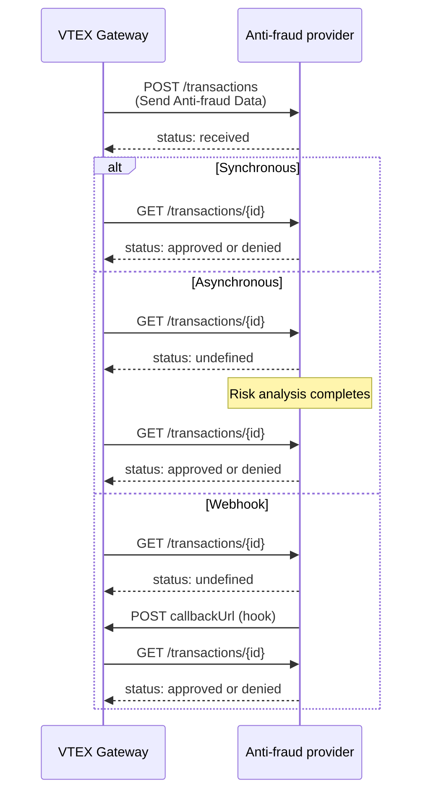

The Anti-fraud Provider Protocol is the integration standard between VTEX and companies that provide anti-fraud services. It's a public contract available to all providers that want to offer risk analysis on the VTEX platform.

The protocol supports:

- Synchronous and asynchronous risk analysis
- Webhook for status notification

> ⚠️ The Anti-fraud Provider Protocol only applies to payment transactions with credit, [debit](https://developers.vtex.com/docs/guides/implementing-a-pre-analysis-antifraud-flow-for-debit-card-transactions), and gift cards.

The following diagram shows how VTEX and the anti-fraud provider exchange data during a risk analysis:

## Key concepts

The following table defines the terms used in this guide:

| Term | Definition |
| --- | --- |
| **Provider** | The system or service that performs anti-fraud risk analysis. |
| **Anti-fraud Provider Protocol** | The integration protocol developed by VTEX for anti-fraud services. |
| **Connector** | The integration built by the provider that connects to the VTEX Gateway. |

## Before you begin

### 1. Partnership agreement

To make your anti-fraud service available on VTEX, you must sign a partnership agreement for financial services. If you don't have one yet, contact the VTEX team through the [Partner Program website](https://vtex.com/us-en/partner/).

### 2. Access to a VTEX environment

After signing the agreement, you receive access to a VTEX environment where you can publish, test, update, and get support for your connector.

> ℹ️ If you're a Service Implementer (SI) developing the integration for another provider, use the main provider's VTEX account — not the SI account.

## Integration steps

### 1. Implementing the protocol

Before configuring the VTEX environment, implement the backend service required to process anti-fraud requests. For the endpoint specifications, see the [Anti-fraud Provider Protocol API](https://developers.vtex.com/docs/api-reference/antifraud-provider-protocol).

> ℹ️ You can use the [anti-fraud provider template on GitHub](https://github.com/vtex-apps/antifraud-provider-example) to quickly develop your connector using the Anti-fraud Provider Protocol and VTEX IO.

### 2. Setting up the Anti-fraud Provider Tests

The Anti-fraud Provider Tester App is no longer available. To validate your integration, use the Postman collections in the [antifraud-provider-tests](https://github.com/vtex-apps/antifraud-provider-tests) repository. The suite covers the same test cases previously available in the app.

Download these files from the repository:

- [Anti-fraud Test Suite](https://github.com/vtex-apps/antifraud-provider-tests/blob/main/Anti-fraud%20Test%20Suite.postman_collection.json) (collection)
- [Anti-Fraud Test Suite](https://github.com/vtex-apps/antifraud-provider-tests/blob/main/Anti-Fraud%20Test%20Suite.postman_environment.json) (environment)
- [Anti-Fraud Webhook Mock](https://github.com/vtex-apps/antifraud-provider-tests/blob/main/Anti-Fraud%20Webhook%20Mock.postman_collection.json) (mock collection)

#### Configuring the webhook mock

The mock server is required for the webhook (`HookApproved` and `HookDenied`) test cases. To set it up, follow these instructions:

1. In Postman, [import](https://learning.postman.com/docs/getting-started/importing-and-exporting-data/#importing-postman-data) the **Anti-Fraud Webhook Mock** collection.
2. [Create a mock server](https://learning.postman.com/docs/designing-and-developing-your-api/mocking-data/setting-up-mock/#creating-a-mock-from-a-collection) from that collection.
3. Copy the mock server URL for use in `mockServerAddress`.

#### Configuring the environment

To configure the test environment, follow these instructions:

1. [Import](https://learning.postman.com/docs/getting-started/importing-and-exporting-data/#importing-postman-data) the **Anti-Fraud Test Suite** environment.
2. Set the following variables:

| Variable | Description |
| --- | --- |
| `serviceUrl` | Base URL of your provider service. For example, if the service URL is `https://antifraud.example.com`, the full URL for the transactions endpoint is `https://antifraud.example.com/transactions`. |
| `appKey` | Value of the `X-PROVIDER-API-AppKey` header used to authenticate with your provider. |
| `appToken` | Value of the `X-PROVIDER-API-AppToken` header used to authenticate with your provider. |
| `accountName` | VTEX account name that will process payments with this anti-fraud provider. |
| `mockServerAddress` | Mock server URL copied when you configured the webhook mock. |

> ⚠️ All communication must use HTTPS with TLS 1.2 exclusively. Your provider must accept two headers — **X-PROVIDER-API-AppKey** and **X-PROVIDER-API-AppToken** — which identify the merchant. All merchant-specific settings must persist on your side. VTEX only stores the AppKey/AppToken credential pair.

### 3. Running the tests

For your integration to be approved, **all tests must pass**. Your service must be accessible over HTTPS. To run the suite, follow these instructions:

1. Import the [Anti-fraud Test Suite](https://github.com/vtex-apps/antifraud-provider-tests/blob/main/Anti-fraud%20Test%20Suite.postman_collection.json) collection.
2. [Run the collection](https://learning.postman.com/docs/collections/running-collections/intro-to-collection-runs/) with a **2000 ms delay** between requests.

The tests validate the following scenarios:

| Test | Flow | Expected statuses |
| --- | --- | --- |
| **Authorize** | Synchronous approval | `received` → `approved` |
| **Denied** | Synchronous denial | `received` → `denied` |
| **AsyncApproved** | Asynchronous approval | `received` → `undefined` → (10 seconds) → `approved` |
| **AsyncDenied** | Asynchronous denial | `received` → `undefined` → (10 seconds) → `denied` |
| **HookApproved** | Webhook approval | `received` → `undefined` → (provider POSTs hook URL) → `approved` |
| **HookDenied** | Webhook denial | `received` → `undefined` → (provider POSTs hook URL) → `denied` |

All tests follow the same base pattern:

- VTEX sends a [Send Anti-fraud Data](https://developers.vtex.com/docs/api-reference/antifraud-provider-protocol#post-/transactions) request to `{{serviceUrl}}/transactions`. The expected initial status is `received`.
- VTEX sends a [Get Anti-fraud Status](https://developers.vtex.com/docs/api-reference/antifraud-provider-protocol#get-/transactions/-transactions.id-) request to `{{serviceUrl}}/transactions/{transactionId}` to check the status.
- For async and hook tests, the final status is checked after a 10-second wait, or after the provider posts to the hook URL.

To trigger the correct behavior for each test, the suite sends a transaction ID with a specific ending:

| Test | ID ending |
| --- | --- |
| Authorize | `1` |
| Denied | `2` |
| AsyncApproved | `3` |
| AsyncDenied | `4` |
| HookApproved | `5` |
| HookDenied | `6` |

### 4. Reviewing results and submitting for homologation

> ℹ️ Homologation is the VTEX certification process that validates an anti-fraud provider integration before stores can use it in production.

After the collection run finishes, review the pass/fail results in Postman. If a test fails, inspect the request and response payloads, fix your connector, and run the suite again.

When all tests pass, [open a ticket with VTEX Support](https://help.vtex.com/en/docs/tutorials/opening-tickets-to-vtex-support) with the following information:

- **Connector name**: The name of the provider. Use a maximum of 16 alphanumeric characters. This name can't be changed after publishing.
- **Partner contact**: Email address used for protocol updates and change notifications
- **Production service provider endpoint**: The base path used for API calls to the provider, for example `https://vtex.pagseguro.com`. It must respond to the `{{serviceUrl}}/manifest` route and be publicly available.
- **Sandbox service provider endpoint**: The base path used in test mode for API calls to the provider.
- **Owner account**: The VTEX account name used in callback requests. This account must be available at `{accountName}.myvtex.com`.
- **Allowed accounts**: Which VTEX accounts can use this provider, either all accounts or specific accounts.
- **New payment method**: Whether this connector supports a payment method that isn't yet available in the VTEX Admin.
- **New payment method purchase flow**: If the connector supports a new payment method, whether it uses Redirect or Payment App. For more information, see [Purchase Flows](https://developers.vtex.com/docs/guides/payments-integration-purchase-flows).

The VTEX payments team Service Level Agreement (SLA) for homologation is 30 days.

> ⚠️ The Anti-fraud Provider Protocol supports credit, debit, and gift card transactions. To enable gift card support, set `allowAntifraudOnGiftCard` to `true` in the [manifest](https://developers.vtex.com/docs/api-reference/antifraud-provider-protocol#get-/manifest).

## VTEX credentials

When calling the `callbackUrl`, include the **X-VTEX-API-AppKey** and **X-VTEX-API-AppToken** authentication headers. These credentials are available in VTEX License Manager and are used only by the anti-fraud provider.

Open License Manager at `https://{accountName}.myvtex.com/admin/license-manager/#/home`. Then follow [API authentication using API keys](https://developers.vtex.com/docs/guides/api-authentication-using-api-keys) to create the keys and tokens.

## Merchant configuration

After the integration is approved, a connector becomes available for VTEX merchants. To configure it, merchants need the contract with your company and two credentials: `X-PROVIDER-API-AppKey` and `X-PROVIDER-API-AppToken`.

You must provide these keys to merchants so they can identify the store using your anti-fraud service.

## Cardholder document configuration

Some anti-fraud providers may not use the cardholder's personal identification during analysis. In these cases, the merchant can choose whether to request this document from customers at checkout.

> ⚠️ The **Cardholder document field** option is only available if the anti-fraud provider declares `cardholderDocument` as `optional` in the [manifest](https://developers.vtex.com/docs/api-reference/antifraud-provider-protocol#get-/manifest). Learn more at [Cardholder document configuration](https://developers.vtex.com/docs/guides/cardholder-document-configuration).

To configure the cardholder document field, follow these instructions:

1. In the VTEX Admin, go to __Store Settings > Payment > Providers__, or type __Providers__ in the search bar at the top of the page.
2. On the providers screen, click the `New Provider` button.
3. Search for the anti-fraud provider name and select it.
4. Complete the required fields.
5. In **Cardholder document field**, select one of the following:
   - **Display as a required field**: The customer must provide cardholder information to complete the order.
   - **Display as an optional field**: The customer can choose whether to provide the information.
   - **Hide Field**: The field isn't displayed at checkout.
6. Click `Save`.

Changes may take up to 10 minutes to appear at the store's checkout.
