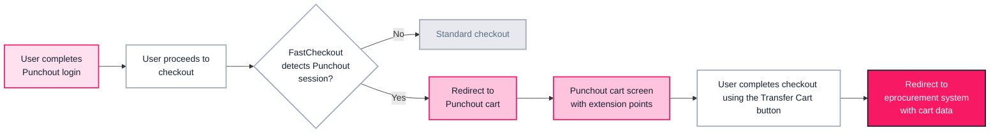

> ⚠️ This feature is only available for stores using B2B Buyer Portal, which is currently available to select accounts.

In a Punchout scenario, buyers must transfer their cart back to their organization’s eprocurement system for approval and compliance validation before completing the purchase.

This guide shows you how to customize the Punchout cart screen, where buyers transfer their cart to eprocurement systems.

> ℹ️ This integration applies only to stores using **FastCheckout**.

## How it works

The Punchout cart integration extends the [Punchout](https://developers.vtex.com/docs/guides/punchout) workflow after the [login](https://developers.vtex.com/docs/guides/punchout-login-integration) step. After the user logs in via Punchout and proceeds to checkout, FastCheckout detects the Punchout session, and the user is redirected to the dedicated Punchout cart screen.

On this screen, the user reviews the cart and clicks **Transfer cart**, which sends the cart data to the external eprocurement system and redirects the user back to it for approval.



## Setup

### Prerequisites

To implement the Punchout cart flow, you must enable Checkout extension points in FastCheckout. Contact our [Support team](https://supporticket.vtex.com/support) to request activation.

### Enable and implement extension points

After enabling the extension points, create a [storefront monorepo](https://beta.fast.store/reference/monorepo/) to customize it. Once you have set up your storefront monorepo, you’re ready to [set up Checkout extension points](https://beta.fast.store/checkout/setting-up).

To implement the Punchout cart flow, you must use the `punchout.order-summary.cta` extension point to send the cart data to the eprocurement system and redirect to its URL (e.g., via a “Transfer cart” or “Checkout” button).

The following extension point lets you implement this behavior:

| Use case      | Extension point              | Hooks         | Purpose                                                                   |
| ------------- | ---------------------------- | ------------- | ------------------------------------------------------------------------- |
| Transfer cart | `punchout.order-summary.cta` | `useRedirect` | Redirect the user to a URL (e.g., the eprocurement system) with the cart. |

### `punchout.order-summary.cta` extension point

The `punchout.order-summary.cta` extension point is rendered in the Punchout screen sidebar (order summary). Use it to add a primary action button that sends the user back to the eprocurement system with the cart.

The [`useRedirect` hook](https://beta.fast.store/checkout/reference/use-redirect) provides a **redirect** method that navigates the user to the eprocurement system using the target URL (e.g., the eprocurement system’s cart or checkout URL) during the “transfer cart” step.

#### Example: Transfer cart button

```tsx
// TransferCart.tsx
import { useState } from 'react';
import { useRedirect } from '@vtex/checkout';
import styles from './transfer-cart.module.css';

export const TransferCart = () => {
  const [isLoading, setIsLoading] = useState(false);
  const { redirect } = useRedirect();

  const handleSubmit = () => {
    setIsLoading(true);
    redirect('https://your-eprocurement-system.com/cart');
  };

  return (
    <button
      data-loading={isLoading}
      disabled={isLoading}
      className={styles.button}
      onClick={handleSubmit}
    >
      Transfer cart
      <span className={styles.spinner}></span>
    </button>
  );
};
```

```css
/* transfer-cart.module.css */
.button {
  background-color: var(--fc-colors-brand-primary);
  border-color: var(--fc-colors-brand-primary);
  color: #ffffff;
  display: inline-flex;
  justify-content: center;
  align-items: center;
  transition: background-color 100ms;
  padding: 16px 24px;
  border-radius: 999px;
  min-height: 5rem;
  font-family: var(--fc-fonts-sans);
  font-size: var(--fc-button-font-size);
  font-weight: var(--fc-button-font-weight);
  line-height: var(--fc-button-line-height);
  cursor: pointer;
  position: relative;
  border: 1px solid;
}

.button:disabled {
  cursor: default;
  background-color: var(--fc-colors-light-gray-300);
  color: #ffffff;
  border-color: var(--fc-colors-light-gray-300);
}

.button[data-loading='true'] {
  background-color: var(--fc-colors-light-gray-300);
  color: #ffffff;
  border-color: var(--fc-colors-light-gray-300);
}

.button:focus:not(:disabled):not([data-loading]) {
  outline: 1px solid var(--fc-colors-brand-primary-40);
  outline-offset: 4px;
}

.button:hover:not(:disabled):not([data-loading]) {
  background-color: var(--fc-colors-brand-primary-80);
}

.button:active:not(:disabled):not([data-loading]) {
  background-color: var(--fc-colors-brand-primary-darker);
}

@keyframes loading {
  to {
    transform: rotate(360deg);
  }
}

.spinner {
  user-select: none;
  border: 2px solid transparent;
  border-radius: 50%;
  width: 1.8rem;
  height: 1.8rem;
  animation: loading 1s linear infinite;
  display: none;
  position: absolute;
  right: 12px;
}

.button .spinner {
  border-left-color: #ffffff;
  border-bottom-color: #ffffff;
  border-top-color: #ffffff;
}

.button[data-loading='true'] .spinner {
  display: block;
  border-left-color: var(--fc-colors-brand-primary);
  border-bottom-color: var(--fc-colors-brand-primary);
  border-top-color: var(--fc-colors-brand-primary);
}
```

### Per-item extension points (optional)

The `punchout.cart-item.after` extension point is optional and renders below each item on the Punchout cart screen. Use it to add additional options or attachments to a line item (e.g., a protection plan or warranty).

The following hooks provide the necessary actions for the extension points:

* [`useCartPunchout` hook](https://beta.fast.store/checkout/reference/use-cart-punchout) – Access cart data and perform mutations that are reflected in other entities within the checkout data layer.
* [`useCartItem` hook](https://beta.fast.store/checkout/reference/use-cart-item) – Access detailed information about an individual cart item.

#### Example: Add protection plan (per-item checkbox)

```tsx
// AddProtectionPlan.tsx
import { useState } from 'react';
import styles from './add-protection-plan.module.css';
import { useCartPunchout } from '@vtex/checkout';

export const AddProtectionPlan = () => {
  const { sync } = useCartPunchout();
  const [isChecked, setIsChecked] = useState(false);
  const [focus, setFocus] = useState(false);
  const [disabled, setDisabled] = useState(false);

  const handleChange = async (event: React.ChangeEvent<HTMLInputElement>) => {
    setIsChecked(event.target.checked);
    setDisabled(true);

    // Call the Checkout API to add or remove an attachment for this item; on success, sync the cart
    // Example: update item with attachment (implementation depends on your API)
    try {
      // await yourCheckoutApiUpdateItem(...);
      await sync();
    } finally {
      setDisabled(false);
    }
  };

  return (
    <div className={styles.container}>
      <div>
        <label className={styles.label} data-disabled={disabled}>
          <input
            className={styles.hide}
            type="checkbox"
            checked={isChecked}
            onChange={handleChange}
            onFocus={() => setFocus(true)}
            onBlur={() => setFocus(false)}
            disabled={disabled}
          />
          <div
            className={styles.checkbox}
            data-checked={isChecked}
            data-focus-visible={focus}
            data-disabled={disabled}
          >
            <svg
              className={styles.icon}
              width="16"
              height="16"
              viewBox="0 0 24 24"
              fill="none"
              xmlns="http://www.w3.org/2000/svg"
            >
              <path
                d="M8.80001 15.9L4.60001 11.7L3.20001 13.1L8.80001 18.7L20.8 6.69999L19.4 5.29999L8.80001 15.9Z"
                fill="currentColor"
              />
            </svg>
          </div>
          Add Protection Plan
          <span className={styles.price}>($212.50)</span>
        </label>
      </div>
      <button
        type="button"
        className={styles.button}
        onClick={() => console.log('Info button clicked')}
      >
        Info
      </button>
    </div>
  );
};
```

If the Info button triggers asynchronous work (e.g., opening a modal or fetching details), you can add a loading state and a spinner using the same pattern as the Transfer cart example (e.g., `data-loading`, `.spinner` class, and matching CSS).

```css
/* add-protection-plan.module.css */
.container {
  display: flex;
  justify-content: space-between;
  align-items: center;
  width: 100%;
  background: var(--fc-colors-light-gray-100);
  padding: 12px;
  border-radius: 4px;
}

.button {
  background-color: transparent;
  border-color: transparent;
  color: var(--fc-colors-brand-primary);
  text-decoration: none;
  display: inline-flex;
  justify-content: center;
  align-items: center;
  transition: background-color 100ms;
  border-radius: 999px;
  font-family: var(--fc-fonts-sans);
  font-size: var(--fc-button-font-size);
  font-weight: 600;
  line-height: var(--fc-button-line-height);
  cursor: pointer;
  border: none;
  min-height: auto;
}

.button:disabled {
  cursor: default;
  color: var(--fc-colors-light-gray-300);
}

.label {
  font-family: var(--fc-fonts-sans);
  font-size: 1.4rem;
  font-weight: 400;
  line-height: 1.4rem;
  color: #000000;
  display: flex;
  align-items: center;
  gap: 4px;
  cursor: pointer;
}

.label[data-disabled='true'],
.label[data-disabled='true'] .price {
  color: var(--fc-colors-light-gray-400);
  cursor: progress;
}

.checkbox {
  flex-shrink: 0;
  width: 20px;
  height: 20px;
  border: 1px solid var(--fc-colors-light-gray-400);
  border-radius: 4px;
  padding: 2px;
  margin-right: 8px;
}

.checkbox[data-focus-visible='true'] {
  outline-offset: 4px;
  outline: 1px solid var(--fc-colors-brand-primary);
}

.checkbox[data-checked='true'] {
  background: var(--fc-colors-brand-primary);
  border: none;
}

.checkbox[data-disabled='true'] {
  background: var(--fc-colors-light-gray-300);
}

.checkbox[data-disabled='true'][data-checked='false'] {
  background: var(--fc-colors-light-gray-100);
  border: 1px solid var(--fc-colors-light-gray-400);
}

.checkbox[data-disabled='true'][data-checked='false'] .icon {
  display: none;
}

.icon {
  color: #ffffff;
}

.hide {
  display: none;
}
