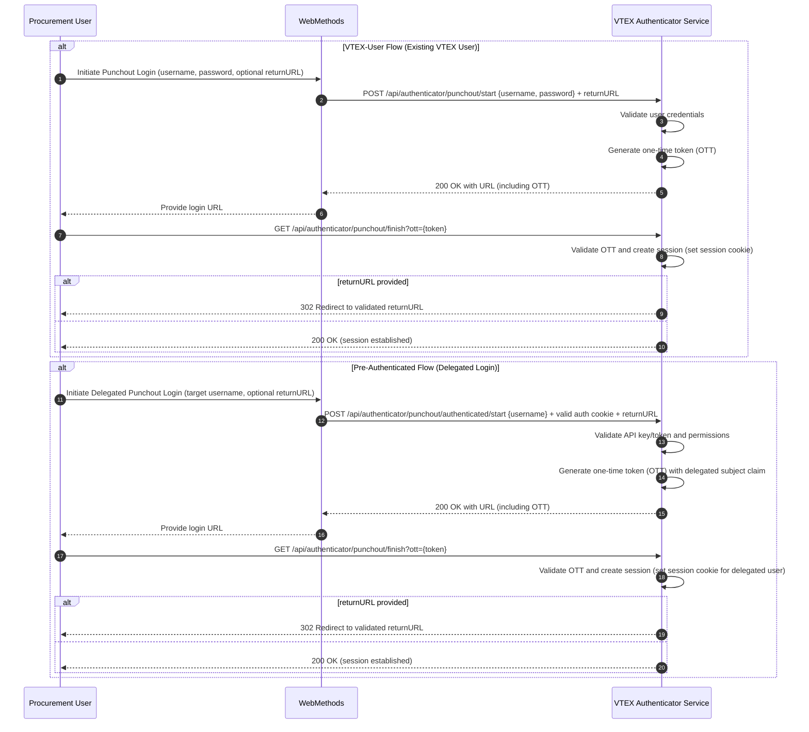

The Punchout login integration enables external procurement systems to authenticate users into a VTEX store without requiring manual credential input. This guide explains how to implement the [Punchout](https://developers.vtex.com/docs/guides/punchout) login flow using one-time tokens (OTT) for secure, session-based authentication.

The flow supports two integration types:

* **[VTEX user flow](#vtex-user-flow):** For procurement users who exist on the VTEX platform. In this flow, the username and password are sent as part of the request body, and VTEX authorizes them.

* **[Pre-authenticated user flow](#pre-authenticated-user-flow):** For procurement users who don't exist on VTEX. In these cases, VTEX trusts the integrator to authorize these users and receive their username for login.

## How it works

The authentication flow starts with a request to a Punchout endpoint and ends with the user's browser being redirected to a store page in a logged-in state.

The authentication process creates a one-time token (OTT) and returns a URL to be accessed by the procurement system. This URL starts a user session in the VTEX store.

Example flow:

1. Start request (VTEX user flow):

   ```txt
   https://host.com/api/authenticator/punchout/start?returnURL=/checkout
   ```

2. Finish redirect (with OTT):

   ```txt
   https://host.com/api/authenticator/punchout/finish?ott=TOKEN123
   ```

3. Final redirect (logged-in session):

   ```txt
   https://host.com/checkout
   ```

>ℹ️ The OTT is short-lived (expires in 5 minutes) and can only be used once.



## Start VTEX user flow

This flow validates the credentials of an existing VTEX user. It requires the user’s email and password. If the validation is positive, the response provides a URL that can be accessed directly via web browsers, initiating a session in the selected host.

>ℹ️ Find more details about this endpoint in `POST` [Start VTEX user punchout flow](https://developers.vtex.com/docs/api-reference/punchout-api#post-/api/authenticator/punchout/start).

### Request example

```json
curl -X POST "https://store.myvtex.com/api/authenticator/punchout/start?returnURL=/checkout" \
  -H "Content-Type: application/json" \
  -d '{
    "username": "user@example.com",
    "password": "vtex_user_password"
  }'
```

### Response body example

```json
{
  "url": "https://apiexamples.com/punchout/redirect/OTT123"
}
```

## Start pre-authenticated user flow

This flow is used when the procurement user doesn’t exist on VTEX. In this case, a password isn't required. An authenticated integration, using a valid API key/API token pair associated with a role that has the `CanPunchout` permission, generates an OTT on behalf of the user.  Other authentication methods (such as `VtexIdClientAutCookie`) don't work for this endpoint.

If the validation is positive, the response provides a URL that can be accessed directly via web browsers, initiating a session created with the username provided in the request body.

>ℹ️ Find more details about this endpoint in `POST` [Start pre-authenticated user punchout flow](https://developers.vtex.com/docs/api-reference/punchout-api#post-/api/authenticator/punchout/authenticated/start).

### Request example

```json
curl -X POST "https://store.myvtex.com/api/authenticator/punchout/authenticated/start?returnURL=/checkout" \
  -H "Content-Type: application/json" \
  -H "X-VTEX-API-AppKey: your-app-key" \
  -H "X-VTEX-API-AppToken: your-app-token" \
  -d '{
    "username": "buyer@company.com"
  }'
```

### Response body example

```json
{
  "url": "https://apiexamples.com/punchout/redirect/OTT123"
}
```

## Finish redirect

The finish endpoint exchanges the OTT for VTEX session cookies and completes the authentication process.

In browser-based integrations, the finish flow happens automatically when the user's browser accesses the URL returned by the start endpoint. This creates a seamless login experience.

For headless operations where no browser is involved, integrators must explicitly call the finish endpoint to obtain the necessary authentication cookies. This is useful for automated processes or server-side integrations.

The finish endpoint:

* **Validates the OTT**  
    
  * Checks if the token exists and hasn't expired.  
  * Ensures the token hasn't been used before.

* **Creates a VTEX session**  
    
  * For VTEX user flow: Creates session based on the validated VTEX user.  
  * For pre-authenticated flow: Creates session using the username from the token's sub claim.  
  * Adds `authMethod: "Punchout"` to the session token for tracking login source.

* **Sets authentication cookies**  
    
  * Returns VTEX session cookies in response headers.  
  * These cookies are required for subsequent authenticated requests.

>ℹ️ Find more details about this endpoint in `GET` [Finish punchout login flow](https://developers.vtex.com/docs/api-reference/punchout-api#get-/api/authenticator/punchout/finish).

### Request example

```curl
curl -X GET "https://store.myvtex.com/api/authenticator/punchout/finish?ott={one_time_token}" \
  -H "Content-Type: application/json" \
```

## Security mechanisms

Punchout login flows use the following security mechanisms to protect credentials and redirect behavior:

* **One-Time Tokens (OTT)**: Tokens expire after 5 minutes and can be used only once.

* **Secure credential handling**: Credentials are validated directly against the VTEX user database (VTEX user flow) or the request is made with secure API credentials (pre-authenticated flow).

* **Redirect protection**: The `returnURL` is validated against authorized hosts to avoid open redirects.
