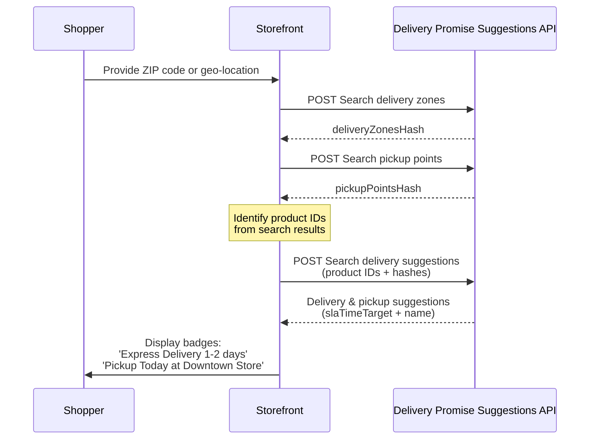

>ℹ️ This feature is in beta, and we are actively working to improve it. If you have any questions, please contact [our Support](https://help.vtex.com/en/support).

[**Delivery Promise**](https://developers.vtex.com/docs/guides/delivery-promise) is VTEX's new solution that allows customers to view only the products they can buy in their shopping experience, considering both the product availability and valid shipping methods for their delivery address. To further enhance this experience, the [Delivery Promise Suggestions API](https://developers.vtex.com/docs/api-reference/delivery-promise-suggestions-api) allows you to highlight the most relevant delivery options directly in the storefront.

In this guide, you will learn how to integrate the [Delivery Promise Suggestions API](https://developers.vtex.com/docs/api-reference/delivery-promise-suggestions-api) to display delivery promises and pickup options to shoppers in your [headless](https://developers.vtex.com/docs/guides/headless-commerce) storefront.


## Gathering delivery promise information

Before you implement the storefront components, gather the delivery information that will be available to the shopper. You must gather the delivery information that will be shown to the shopper by identifying the delivery zones and pickup points available for their location. This fulfillment context is then represented by two hashes (the delivery zones hash and the pickup points hash), which serve as a compact, precomputed snapshot of all relevant logistics configurations. Rather than recalculating these options on every request, these hashes make it possible to retrieve accurate suggestions more quickly, with lower latency and greater consistency across the shopping experience.

### Delivery zones

Use the [`POST` Search delivery zones](https://developers.vtex.com/docs/api-reference/delivery-promise-suggestions-api#post-/api/logistics-shipping/delivery-zones/_search/v2) endpoint to retrieve the following information:

- Delivery zone IDs
- Delivery zones hash
- Country code

Response example:

```json
{
   "deliveryZoneIds": [
         "BRA_COUNTRY",
         "BRA_REGION_NORDESTE",
         "BRA_SUBSTATE_PB_INTERIOR"
   ],
   "deliveryZonesHash": "c3e1a42f7b9d4e81aafe24ba6e7b120f",
   "countryCode": "BRA"
}
```

Use the `deliveryZonesHash` value when you search for delivery suggestions.

### Delivery pickup points

To retrieve the available pickup points for the shopper, use the [`POST` Search pickup points](https://developers.vtex.com/docs/api-reference/delivery-promise-suggestions-api#post-/api/logistics-shipping/pickuppoints/_search) endpoint.

Response example:

```json
{
   "pickupPointDistances": [
         {
            "pickupId": "fulfillmentqa_vtexsp",
            "distance": 4.990988731384277,
            "pickupName": "VTEX SP",
            "isActive": true,
            "address": {
               "city": "São Paulo",
               "neighborhood": "Itaim Bibi",
               "number": "4440",
               "postalCode": "04538-132",
               "street": "Avenida Brigadeiro Faria Lima",
               "state": "SP"
            },
            "businessHours": [
               {
                     "dayOfWeek": 0,
                     "openingTime": "00:00:00",
                     "closingTime": "23:59:00"
               },
               {
                     "dayOfWeek": 1,
                     "openingTime": "00:00:00",
                     "closingTime": "23:59:00"
               },
               {
                     "dayOfWeek": 2,
                     "openingTime": "00:00:00",
                     "closingTime": "23:59:00"
               },
               {
                     "dayOfWeek": 3,
                     "openingTime": "00:00:00",
                     "closingTime": "23:59:00"
               },
               {
                     "dayOfWeek": 4,
                     "openingTime": "00:00:00",
                     "closingTime": "23:59:00"
               },
               {
                     "dayOfWeek": 5,
                     "openingTime": "00:00:00",
                     "closingTime": "23:59:00"
               },
               {
                     "dayOfWeek": 6,
                     "openingTime": "00:00:00",
                     "closingTime": "23:59:00"
               }
            ]
         }
      ],
   "pickupPointsHash": "b92e64d0a08f4c6785e6d0319cbad19a"
}
```

Use the `pickupPointsHash` value when you search for delivery suggestions.

### Delivery suggestions

Use the [`POST` Search delivery suggestions](https://developers.vtex.com/docs/api-reference/delivery-promise-suggestions-api#post-/api/delivery-promise-suggestions/_search) endpoint with the `deliveryZonesHash` and `pickupPointsHash` values in the request body to gather the delivery promise suggestions that will be presented in your storefront. You can use this endpoint for batch processing and for scenarios that involve multiple products.

The following example response illustrates the data you can expect:

```json
{
      "suggestions": [
            {
                  "productId": "123",
                  "suggestions": {
                  "delivery": [
                        {
                              "id": "express-delivery",
                              "name": "Express Delivery",
                              "slaTimeTarget": {
                              "from": 0,
                              "to": 4,
                              "unit": "h"
                              },
                              "conditions": [
                              "fastest"
                              ]
                        },
                        {
                              "id": "standard-delivery",
                              "name": "Standard Delivery",
                              "slaTimeTarget": {
                              "from": 1,
                              "to": 3,
                              "unit": "d"
                              },
                              "conditions": []
                        }
                  ],
                  "pickup": [
                        {
                              "id": "store-downtown",
                              "name": "Downtown Store",
                              "slaTimeTarget": {
                              "from": 0,
                              "to": 2,
                              "unit": "h"
                              },
                              "conditions": [
                              "nearest"
                              ]
                        }
                  ]
                  }
            }
      ]
}
```

## Generating UI elements

Your storefront must translate the API response into user-facing visual indicators. This section explains how to map response fields into shopper-friendly messages.

### Mapping delivery tags

Use the following table to map delivery SLAs to suggested tags:

| Fulfillment condition | `slaTimeTarget` | Suggested badge |
|---|---|---|
| Same-day delivery | `{ "to": 0, "unit": "d" }` | "Receive Today" |
| Next-day delivery | `{ "to": 1, "unit": "d" }` | "Receive Tomorrow" |
| Standard delivery | `{ "to": X, "unit": "d" }` (X > 1) | "Receive in X days" |
| Express delivery | `{ "to": X, "unit": "h" }` | "Receive in X hours" |

### Mapping pickup tags

Use the following table to map pickup SLAs to suggested badges:

| Fulfillment condition | `slaTimeTarget` | Suggested badge |
|---|---|---|
| Same-day pickup | `{ "to": 0 }` | "Pickup Today" |
| Express pickup | `{ "unit": "h" }` | "Pickup in X hours" |
| Nearest location | Distance data must be available in the response | "Store at Y km from you" |
| Store name | Store name must be available in the response | "Pickup at Downtown Store" |

### Interpretation of `slaTimeTarget`

The `slaTimeTarget` defines a relative fulfillment window. Specifically, it indicates the latest calendar day (or hour) by which delivery or pickup must occur. The system already considers weekends, holidays, and logistics rules when calculating this deadline.

If you need to apply additional business rules outside the logistics configuration (for example, special events or campaign-specific promises), implement that logic in your storefront. Using the computed deadline, you can generate contextual messaging such as “Receive before Christmas” when applicable.

The target date is always calculated relative to when the API is called. For example, `{ "to": 2, "unit": "d" }` means fulfillment must occur within the next two calendar days.

### Display suggestions by context

Use different display strategies depending on where the shopper sees this information:

| Context | Display recommendation |
|---|---|
| PLP (Product Listing Page) | Show the top delivery and pickup suggestions for each product. Trigger display after Intelligent Search results have loaded. |
| PDP (Product Detail Page) | Show all available delivery and pickup options. Trigger display when the page loads or whenever the shopper’s location is updated. |

> ⚠️ If you do not refresh the fulfillment context when the shopper's location changes, the delivery and pickup suggestions may become outdated or inaccurate. To ensure recommendations are always correct, refresh the context on every location change, make a batch request for all visible product IDs, and request suggestions for the currently displayed product (including its variants, if relevant).


## End-to-end workflow example

This example illustrates the flow from shopper input to UI display:



1. **Input**: The shopper provides a ZIP code, or the storefront detects their location.
2. **Context update**: Create or refresh the fulfillment context whenever the location changes. Keep the context active by refreshing it before it becomes stale.
3. **Products fetch**: The storefront identifies the relevant product IDs (for example, from a search results page).
4. **API request**: Storefront calls [`POST` Search delivery suggestions](https://developers.vtex.com/docs/api-reference/delivery-promise-suggestions-api#post-/api/delivery-promise-suggestions/_search) with product IDs and the `deliveryZonesHash` and `pickupsHash`.
5. **API response**: The API returns recommendations, for example:
   - Delivery: `slaTimeTarget: {to: 2, unit: "d"}`, `name: "Express Delivery"`
   - Pickup: `slaTimeTarget: {to: 2, unit: "h"}`, `name: "Downtown Store"`
6. **Storefront render**: The storefront renders UI components, for example:
   - "Express Delivery (1–2 days)"
   - "Pickup Today at Downtown Store"
