This guide shows how to **create an external matcher** for the [Received SKUs](https://help.vtex.com/en/tutorial/manual-sku-cataloging--tutorials_396) module. An external matcher is a service that you develop and host. It receives notifications from the VTEX Suggestions API, applies your own matching rules, and returns the result to the marketplace.

Create an external matcher when the default [VTEX Matcher score](https://help.vtex.com/en/tutorial/understanding-vtex-matcher-scoring--tutorials_424) does not meet the marketplace catalog strategy. A common example is multicountry marketplaces, where the product name changes by translation even when the EAN and RefId are the same. In these cases, the default matcher may create duplicate products instead of matching existing items.

> ℹ️ You cannot customize the scoring rules of the default VTEX Matcher. The external matcher lets you define your own rules and runs in parallel with VTEX Matcher in the standard flow.

Creating the matcher happens in two stages:

1. **Matcher structure:** service, endpoints, authentication, technical stub flow, registration, and validation.
2. **Matching rules:** business logic, scores, `matchType`, and approval settings.

Before you create the matcher, confirm that the marketplace account already operates with `Received SKUs` and that you have an `appKey` and `appToken` with access to the **Suggestions** module and the approval settings. The matcher service must also be published over `HTTPS`, so that VTEX can notify your endpoints and the matcher can respond through the [Marketplace Suggestions API](https://developers.vtex.com/docs/api-reference/marketplace-apis-suggestions). Learn more in [Authentication](https://developers.vtex.com/docs/guides/authentication).

## Understanding the external matcher flow

When a seller sends a suggestion, VTEX stores the information and notifies all active matchers configured in the marketplace approval settings. To support this flow, an external matcher must:

1. Receive the notification.
2. Retrieve the suggestion from VTEX.
3. Calculate the match with the defined rules.
4. Send the result through the Match Received SKUs API.

See the complete flow below:

```mermaid
---
config:
  flowchart:
    useMaxWidth: true
    nodeSpacing: 28
    rankSpacing: 36
    padding: 8
  themeVariables:
    fontSize: 12px
---
flowchart LR
  A[Seller sends suggestion] --> B[API stores it]
  B --> C{Event}
  C -->|new| D[Notifies hook-base-address]
  C -->|update| E[Notifies UpdatesNotificationEndpoint]
  D --> F[Matcher receives it]
  E --> F
  F --> G[GET Suggestion by ID]
  G --> H[Calculates match and score]
  H --> I[Generates matchId and matcherId]
  I --> J[Match Received SKUs API]
  J --> K[Status updated]

  A -.->|without MatcherId / matchId| B
  I -.->|sends matchId and matcherId| J
```



| Event | Endpoint notified by VTEX | What the matcher must do |
|---|---|---|
| New suggestion | `hook-base-address` | Retrieve the suggestion, calculate the match, and return the result |
| Updated suggestion | `UpdatesNotificationEndpoint` | Retrieve the updated suggestion, recalculate the match, and return the result |

You can use the same URL in both fields or different URLs for creation and update events.

The external matcher and VTEX Matcher process the suggestion together, with or without autoApprove enabled. In the complementary flow, the suggestion only moves to the accepted state when both matchers return a score above the configured approval threshold.

To keep the standard Received SKUs processing and the display of suggestions in the VTEX Admin interface, VTEX Matcher must remain active (`IsActive: true`). If it is deactivated, the item no longer follows the standard flow and may not appear in the Received SKUs UI. In that scenario, the external matcher fully takes over retrieving and processing the suggestion.

## Creating the matcher structure

Before you define the matching rules, build a structure that receives the notification, retrieves the suggestion, and sends a stub result. For example, `matchType: pending`.

Recommended order:

`HTTPS` infrastructure → endpoints → VTEX `auth` → stub `GET + PUT pending` → registration in `/suggestions/configuration` → `new/update` test → match rules

### Host the HTTPS service

In this step, publish the matcher at a publicly accessible HTTPS URL. VTEX must be able to call your endpoints without network restrictions, such as a VPN.

1. Choose the infrastructure where the matcher will run, for example cloud, VTEX IO, a VM, or a container. The main criterion is that the service is available on the internet.
2. Deploy a minimal HTTP application with a health check, for example `GET /health`, responding `200 OK`. You can add the notification routes in the next step.
3. Configure a domain pointing to the service and enable a valid TLS certificate so that the final URL uses HTTPS.
4. Confirm public access with an external call, for example:
```
curl -i https://{your-domain}/health
```
The expected response is `200`. If the endpoint only responds on your local network, VTEX will not be able to notify the matcher.

5. Keep the final URLs that will be used in the VTEX configuration, for example:
- https://{your-domain}/suggestions/new → `hook-base-address`
- https://{your-domain}/suggestions/update → `UpdatesNotificationEndpoint`

> ℹ️ In this step, the goal is only to get the service online. Matching rules come after the technical flow is validated.

### Expose the notification endpoints

1. Create the **new suggestion** route, for example `POST /suggestions/new`. This URL will be the `hook-base-address`.
2. Create the **update** route, for example `POST /suggestions/update`. This URL will be the `UpdatesNotificationEndpoint`.
Alternatively, use a single route for both events and differentiate the handling in the handler.
3. Implement the endpoint to:
   - Accept the request sent by VTEX.
   - Validate authentication or headers, if your architecture requires it.
   - Extract the suggestion identifiers `sellerId`, `sellerSkuId`, and version, when available.
   - Acknowledge receipt of the notification with `200` or `202`.
4. Early in the implementation, log the raw notification payload. This helps you lock the real event contract before finalizing the parsing.

> ⚠️ Respond quickly to the notification. If retrieving the suggestion and matching are long-running operations, run them asynchronously, outside the webhook response time.

### Authenticate with VTEX APIs

In this step, configure the credentials the matcher will use to call the Marketplace Suggestions API. Without valid authentication, the service cannot retrieve suggestions or return the match result.

1. Generate an appKey and appToken pair in the marketplace account.
2. Confirm that the key has permission for Suggestions, Match Received SKUs, and Approval Settings.
3. Configure the credentials in the matcher as a secret, for example in environment variables. Do not hardcode this information in the code or in the repository.
4. In every call to VTEX, send the headers:

`X-VTEX-API-AppKey`
`X-VTEX-API-AppToken`

5. Test authentication with a simple call:

```
curl -i \
  -H "X-VTEX-API-AppKey: {appKey}" \
  -H "X-VTEX-API-AppToken: {appToken}" \
  "https://api.vtex.com/{{accountName}}/suggestions/configuration"
```

The expected response is `200`. Learn more in [Authentication](https://developers.vtex.com/docs/guides/getting-started-authentication).

### Implement the technical stub flow

In this step, the matcher does not yet apply business rules. Use the endpoint already exposed in the previous step to close the technical cycle of receiving the notification, retrieving the suggestion, and returning a stub result.

#### Retrieve the suggestion

1. With the `sellerId`, `sellerSkuId`, and `version` identifiers received in the notification, call [Get SKU Suggestion by ID](https://developers.vtex.com/docs/api-reference/marketplace-apis-suggestions#get-/suggestions/-sellerId-/-sellerSkuId-): `GET https://api.vtex.com/{{accountName}}/suggestions/{{sellerId}}/{{sellerSkuId}}`
2. Read the content object, with the data sent by the seller, and the version information required for Match Received SKUs.
3. Persist the minimum needed for auditing, such as IDs, version, and timestamp.

To reconcile or reprocess items, you can also list suggestions with [Get all SKU Suggestions](https://developers.vtex.com/docs/api-reference/marketplace-apis-suggestions#get-/suggestions).

#### Return a stub result

1. Generate a unique matchId for the execution. VTEX Matcher, for example, uses a date and time value.
2. Use the same MatcherId that you will register in the approval settings.
3. Call [Match Received SKUs individually](https://developers.vtex.com/docs/api-reference/marketplace-apis-suggestions#put-/suggestions/-sellerId-/-sellerskuid-/versions/-version-/matches/-matchid-) with a safe result for testing, for example `matchType: pending`.
4. Handle errors and retries if VTEX responds with a failure.

After you complete the steps above, the matcher already receives the notification, retrieves the suggestion, and returns a stub match.

### Register the matcher in the marketplace

With the service published and the stub flow working, register the matcher in the marketplace approval settings. Without this registration, VTEX does not notify your endpoints.

#### Get the current configuration

1. Call [Get Account's Approval Settings](https://developers.vtex.com/docs/api-reference/marketplace-apis-suggestions#get-/suggestions/configuration):

`GET https://api.vtex.com/{{accountName}}/suggestions/configuration`

2. Save the full JSON response before editing. The later PUT must resend the updated body, not only the new matcher.

#### Add the matcher to the `Matchers` array

1. Open the JSON obtained in the previous step.
2. Keep the VTEX Matcher object (`MatcherId: "vtex-matcher"`).
3. Include your external matcher in the `Matchers` array, with the URLs of the service you published.
4. Use in `MatcherId` the same value that the stub flow sends in Match Received SKUs.
5. Set `IsActive` to `true` to start receiving notifications.

Example:

```json
{
  "Matchers": [
    {
      "MatcherId": "vtex-matcher",
      "hook-base-address": "http://simple-suggestion-matcher.vtex.com.br",
      "IsActive": true,
      "UpdatesNotificationEndpoint": null,
      "Description": null
    },
    {
      "MatcherId": "external-matcher-v1",
      "hook-base-address": "https://{your-matcher-host}/suggestions/new",
      "IsActive": true,
      "UpdatesNotificationEndpoint": "https://{your-matcher-host}/suggestions/update",
      "Description": "External matcher with custom matching rules"
    }
  ]
}
```

| Field | Description |
|---|---|
| `MatcherId` | Unique identifier of the matcher. Use the same identity when returning match results. |
| `hook-base-address` | URL notified when a new suggestion arrives. |
| `UpdatesNotificationEndpoint` | URL notified when an existing suggestion is updated. |
| `IsActive` | Set to `true` to start receiving notifications. |
| `Description` | Optional description of the matcher. |

6. Call [Save Account's Approval Settings](https://developers.vtex.com/docs/api-reference/marketplace-apis-suggestions#put-/suggestions/configuration) with the full updated body.
7. Run another `GET` on `/suggestions/configuration` and confirm that the matcher appears as active in the response.

> ⚠️ Do not remove or deactivate VTEX Matcher unless the integration is prepared to take over all processing. External matchers complement the default matcher.

Before you define the matching rules, confirm that the structure works end to end by following the diagram below:

```mermaid
---
config:
  flowchart:
    useMaxWidth: true
    nodeSpacing: 28
    rankSpacing: 36
    padding: 8
  themeVariables:
    fontSize: 12px
---
flowchart LR
  A[1. Send SKU Suggestion]
  B[2. hook-base-address]
  C[3. Get Suggestion by ID]
  D[4. Match Received SKUs]
  E[5. Update suggestion]
  F[6. UpdatesNotificationEndpoint]
  G[7. Received SKUs]
  A --> B --> C --> D --> E --> F --> G
  click A "https://developers.vtex.com/docs/api-reference/marketplace-apis-suggestions#put-/suggestions/-sellerId-/-sellerSkuId-"
  click C "https://developers.vtex.com/docs/api-reference/marketplace-apis-suggestions#get-/suggestions/-sellerId-/-sellerSkuId-"
  click D "https://developers.vtex.com/docs/api-reference/marketplace-apis-suggestions#put-/suggestions/-sellerId-/-sellerskuid-/versions/-version-/matches/-matchid-"
  click G "https://help.vtex.com/en/tutorial/manual-sku-cataloging--tutorials_396"
```


If any step fails, fix the corresponding stage before moving on to rule configuration.

## Matching rules

With the structure validated, replace the stub result with the business logic that the new matcher must follow.

### Define the matching rules

Decide in the matcher code which attributes determine each result. For each scenario, define:

1. The entry condition, for example the same EAN, RefId, brand, and category as a marketplace item.
2. The output `matchType`, such as `itemMatch`, `productMatch`, `newproduct`, `pending`, or `deny`.
3. The score returned in that scenario.
4. Whether the same rule applies to both `new` and `update` events.

In the following example, each `return` represents a scenario: the entry condition is in the `if`, and the output is the `matchType` and the `score`. The same function can be reused for `new` and `update` events.

```javascript
function applyMatchingRules(suggestionContent, marketplaceSku) {
  if (!suggestionContent.ean) {
    if (!suggestionContent.refId) {
      return { matchType: "incomplete", score: 0 }
    }
  }

  if (!marketplaceSku) {
    return { matchType: "newproduct", score: 85 }
  }

  if (suggestionContent.ean !== marketplaceSku.ean) {
    return { matchType: "newproduct", score: 85 }
  }

  if (suggestionContent.refId !== marketplaceSku.refId) {
    return { matchType: "newproduct", score: 85 }
  }

  if (suggestionContent.brand !== marketplaceSku.brand) {
    return { matchType: "pending", score: 50 }
  }

  if (suggestionContent.category !== marketplaceSku.category) {
    return { matchType: "pending", score: 50 }
  }

  return {
    matchType: "itemMatch",
    score: 90,
    skuId: marketplaceSku.skuId,
    productId: marketplaceSku.productId,
  }
}
```

> ℹ️ Align the score thresholds with the marketplace approval settings. The default VTEX Matcher thresholds are: Approved ≥ 80, Pending 31 to 79, Denied 0 to 30. Learn more in [How VTEX Matcher scoring works](https://help.vtex.com/en/tutorial/understanding-vtex-matcher-scoring--tutorials_424).

### Calculate the match and return the real result

With the rules defined, replace the stub result with the decision returned by the code. Send the result with [Match Received SKUs individually](https://developers.vtex.com/docs/api-reference/marketplace-apis-suggestions#put-/suggestions/-sellerId-/-sellerskuid-/versions/-version-/matches/-matchid-).

In the request:

1. Use `sellerId`, `sellerSkuId`, and `version` obtained when retrieving the suggestion.
2. Generate a unique `matchId` for the execution and send that value in the URL.
3. Send the `matcherId` equal to the `MatcherId` registered in the approval settings.
4. Set the `matchType` and `score` returned by your rule. The supported `matchType` values are `newproduct`, `itemMatch`, `productMatch`, `deny`, `pending`, `incomplete`, and `insufficientScore`.
5. Include `skuRef` and `productRef` when the `matchType` is `itemMatch` or `productMatch`. Use the IDs from the marketplace catalog.

Example request for an `itemMatch`:

`PUT https://api.vtex.com/{{accountName}}/suggestions/{{sellerId}}/{{sellerSkuId}}/versions/{{version}}/matches/{{matchId}}`

```json
{
  "matcherId": "external-matcher-v1",
  "matchType": "itemMatch",
  "score": "90",
  "skuRef": "123456",
  "productRef": "7890"
}
```

Example of a pending result, when the rule does not yet associate the suggestion with an existing item:

```json
{
  "matcherId": "external-matcher-v1",
  "matchType": "pending",
  "score": "50"
}
```

### Configure the approval settings

With the matcher registered and returning a real score, adjust how the marketplace interprets these results. Use the same configuration endpoints from the registration step.

1. Get the current configuration with [Get Account's Approval Settings](https://developers.vtex.com/docs/api-reference/marketplace-apis-suggestions#get-/suggestions/configuration): `GET https://api.vtex.com/{{accountName}}/suggestions/configuration`

If the rule is per seller, use [Get Seller's Approval Settings](https://developers.vtex.com/docs/api-reference/marketplace-apis-suggestions#get-/suggestions/configuration/seller/-sellerId-).

2. In the returned JSON, locate and adjust:
   - The approval and rejection score thresholds, aligned with your matcher scores.

     Example: if the matcher returns `90` for `itemMatch` and `50` for `pending`, configure the account to treat `90` as approvable and `50` as pending.

   - The `MatchFlux`, with one of these values:

     - `default`: approval based on the matcher score.
     - `manual`: approval through the Received SKUs UI or the Match API.
     - `autoApprove`: automatic approval according to the configuration.

3. Save the configuration with [Save Account's Approval Settings](https://developers.vtex.com/docs/api-reference/marketplace-apis-suggestions#put-/suggestions/configuration) or [Save Seller's Approval Settings](https://developers.vtex.com/docs/api-reference/marketplace-apis-suggestions#put-/suggestions/configuration/seller/-sellerId-), resending the full updated body.

4. If the strategy includes automatic approval, enable autoApprove. At the account level, use the [Activate autoApprove in the Marketplace's Account](https://developers.vtex.com/docs/api-reference/marketplace-apis-suggestions#put-/suggestions/configuration/autoapproval/toggle) endpoint. At the seller level, use the [Activate autoApprove Setting for a Seller](https://developers.vtex.com/docs/api-reference/marketplace-apis-suggestions#put-/suggestions/configuration/autoapproval/toggle/seller/-sellerId-) endpoint.

5. Confirm with another `GET` that score, `MatchFlux`, and matchers are as expected.

>⚠️ With autoApprove enabled, SKUs may be approved regardless of the matcher score, according to the account or seller approval settings.

### Validate the matching rules

With the rules and approval settings configured, validate the business behavior. The goal is to confirm that each condition in the code produces the expected `matchType`, score, and status in [Received SKUs](https://help.vtex.com/en/tutorial/manual-sku-cataloging--tutorials_396).

1. Send the suggestion with [Send SKU Suggestion](https://developers.vtex.com/docs/api-reference/marketplace-apis-suggestions#put-/suggestions/-sellerId-/-sellerSkuId-).
2. In the matcher logs, confirm that `hook-base-address` received the notification and that the service called [Get SKU Suggestion by ID](https://developers.vtex.com/docs/api-reference/marketplace-apis-suggestions#get-/suggestions/-sellerId-/-sellerSkuId-).
3. Confirm that [Match Received SKUs individually](https://developers.vtex.com/docs/api-reference/marketplace-apis-suggestions#put-/suggestions/-sellerId-/-sellerskuid-/versions/-version-/matches/-matchid-) was called with the rule's `matchType` and `score`.
4. Check the suggestion status in Received SKUs or in the suggestion `GET`.
5. Update the same suggestion and confirm the flow on `UpdatesNotificationEndpoint`.

Example of the expected body:

```json
{
  "matcherId": "external-matcher-v1",
  "matchType": "itemMatch",
  "score": "90",
  "skuRef": "123456",
  "productRef": "7890"
}
```
