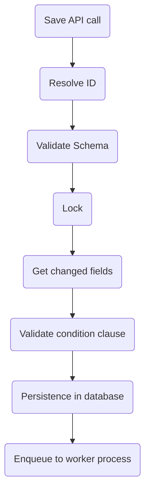

When you save a document in **Master Data v2**, the platform executes a series of orchestrated processes to ensure data integrity and consistency. The following diagram illustrates the key steps involved in this saving flow:

## Step 1 - Save API call

The flow begins with a `Save API` call, triggered by your request to save a document using one of the following HTTP methods: ([`POST`](https://developers.vtex.com/vtex-rest-api/reference/createnewdocument), [`PUT`](https://developers.vtex.com/vtex-rest-api/reference/updateentiredocument) or [`PATCH`](https://developers.vtex.com/vtex-rest-api/reference/updatepartialdocument)). This call triggers the entire sequence of processes.

## Step 2 - Resolve ID

In this step, an ID is added to the document. If the document lacks an ID, **Master Data** attempts to retrieve the document by index (alternate key). If the document by index does not exist, the platform creates a new ID for the document.

## Step 3 - Validate Schema

**Master Data** validates the document's content against the corresponding JSON schemas if the `_schema` parameter exists in the query. This ensures that the document adheres to the defined data structure.

## Step 4 - Lock

Following validation, a locking mechanism is applied. This ensures that only one operation can be executed using the document's ID or alternate key, preventing data conflicts.

## Step 5 - Get changed fields

In this step, the system retrieves the most recent version of the document from the database and compares it with the newly saved content. If any changes are detected, the process proceeds to the next step.

## Step 6- Validate condition clause

If you have included the `_where` parameter in your query, **Master Data** evaluates this condition at this point. This step allows you to specify additional criteria for document validation.

## Step 7 - Persistence in the database

With all validations completed, the document is ready for persistence in the database. It is securely stored, ensuring the durability and reliability of your data.

## Step 8 - Enqueue to the worker process

Finally, the operation is enqueued for processing by the _Background Worker_. This component handles background tasks, including further schema validation and indexing, to guarantee data consistency and performance.

