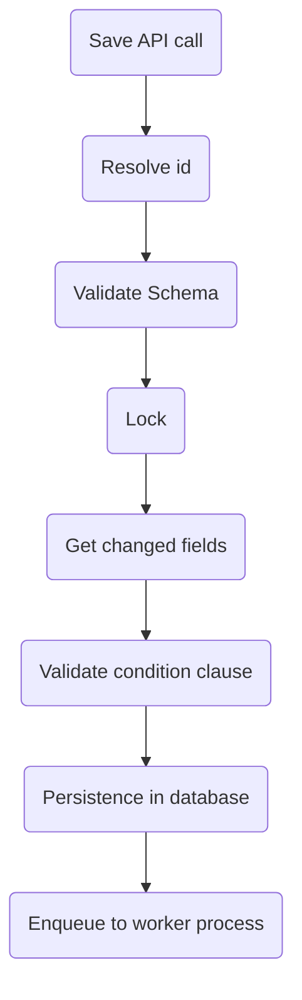

Whenever you save a document in Master Data v2, the platform performs a specific sequence of processes indicated in the diagram below. You can learn more about each step in this saving flow in this article.

## Save API call

It happens whenever you send a request to the saving documents APIs ([`POST`](https://developers.vtex.com/vtex-rest-api/reference/createnewdocument), [`PUT`](https://developers.vtex.com/vtex-rest-api/reference/updateentiredocument) or [`PATCH`](https://developers.vtex.com/vtex-rest-api/reference/updatepartialdocument)). This triggers the rest of the sequence of processes.

## Resolve ID

Add an ID to the document. If the ID doesn't exist in the content, **Master Data** tries to get the document by index (alternate key). If the document by index does not exist, the platform creates a new ID.

## Validate Schema

**Master Data** validates the content with the corresponding JSON schemas if the parameter `_schema` exists in the query.

## Lock

After this step, only one operation could be executed by ID or alternate key.

## Get changed fields

Get the last version of the document in the database and compare it with the saved content. If there is some change, it moves to the next step.

## Validate condition clause

If you pass the parameter `_where` in the query, **Master Data** will validate this condition at this moment.

## Persistence in the database

Save the document in the database.

## Enqueue to the worker process

Enqueue the operation. Some moments later, the *Background Worker* will start the background operations (validation with other schemas and indexing).
