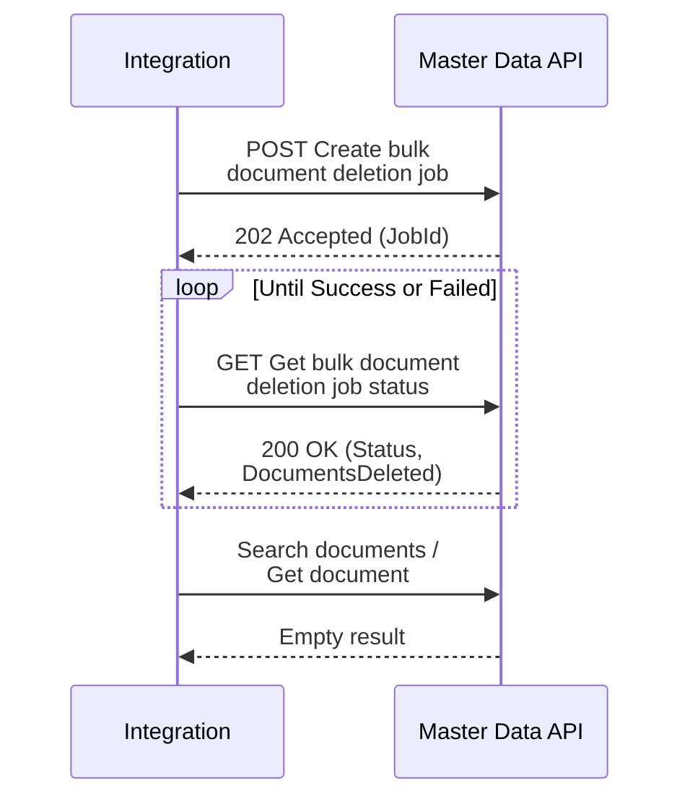

In this guide, you will learn how to delete every document that matches a filter in a [Master Data](https://developers.vtex.com/docs/guides/master-data-introduction) data entity, using a single asynchronous deletion job. The job is available for both Master Data v1 and Master Data v2 data entities. When you need to remove everything matching one filter, use this job instead of the scroll and per-document `DELETE` loop described in [Deleting documents in Master Data v1](https://developers.vtex.com/docs/guides/deleting-documents-in-master-data-v1).

> ⚠️ This feature is in closed beta, meaning only specific customers can access it now. If you want to implement it in the future, please contact [our Support](https://support.vtex.com/hc/en-us/).

This guide focuses on the create, poll, and confirm flow. For the full operation set, parameters, schemas, and errors, see the API reference in the following table:

| Operation | Master Data v1 | Master Data v2 |
| :---- | :---- | :---- |
| Create bulk document deletion job | [v1](https://developers.vtex.com/docs/api-reference/masterdata-api#post-/api/dataentities/-acronym-/delete) | [v2](https://developers.vtex.com/docs/api-reference/master-data-api-v2#post-/api/dataentities/-dataEntityName-/delete) |
| Get bulk document deletion job status | [v1](https://developers.vtex.com/docs/api-reference/masterdata-api#get-/api/dataentities/-acronym-/delete/jobs/-jobId-) | [v2](https://developers.vtex.com/docs/api-reference/master-data-api-v2#get-/api/dataentities/-dataEntityName-/delete/jobs/-jobId-) |

> ❗ This action cannot be undone. Deleted documents are permanently lost. Confirm how many documents your filter matches before you create the job, so you can compare that number with the `DocumentsDeleted` value at the end.

<!-- -->

> ℹ️ To erase data for one specific customer for privacy reasons, follow [Erasing customer data](https://help.vtex.com/en/docs/tutorials/erasing-customer-data), which uses search and per-document deletion. This guide does not replace that flow.

## Before you begin

- Both the create and status requests require a valid [user token](https://developers.vtex.com/docs/guides/api-authentication-using-user-tokens) in the `VtexIdclientAutCookie` header.
- The `filter` field is required and uses the same syntax as the data entity search filter. Wildcards aren't allowed.
- Every field in the filter must be indexed. Internal fields such as `createdIn` are already indexed. Custom fields follow a different rule in each Master Data version:
  - In Master Data v1, a custom field is indexed when it exists in the data entity and has `isSearchable` enabled. The API ignores the `schema` field, so you don't need to send it.
  - In Master Data v2, a custom field is indexed when it is listed in the `v-indexed` array of a [schema](https://developers.vtex.com/docs/guides/working-with-json-schemas-in-master-data-v2), and the request must declare that schema in the `schema` field.
- There is no limit to how many documents a single job can delete, but deleting hundreds of thousands of documents or more at once raises the chance of failure. Whenever possible, narrow the filter down to batches of a few tens of thousands of documents. For example, in a data entity with 10 million documents, run several jobs partitioned by a date field instead of a single filter that matches everything.
- Only one deletion job can be active per account and data entity at a time. While a job is `InProgress`, creating another job for the same data entity returns `409`. Follow the existing job as described in [step 2](#step-2---follow-the-job-status) and send the new request once that job reaches `Success` or `Failed`. If a job appears stuck, Master Data automatically allows a new job for that data entity after 12 hours.
- Before you create the job, search the data entity with the same filter criteria, and the same schema in the case of Master Data v2, record the number of matching documents as your baseline count, and save a few of the returned document IDs. You'll use these in [step 3](#step-3---confirm-the-deletion-result). To learn the query patterns and count how many documents a filter matches, see [Extracting data from Master Data with search and scroll](https://developers.vtex.com/docs/guides/extracting-data-from-master-data-with-search-and-scroll).

## How it works

Deletion is asynchronous and runs in three steps. The create request deletes nothing by itself. It only creates the job and returns a `JobId`.

1. Create the job with [Create bulk document deletion job](https://developers.vtex.com/docs/api-reference/master-data-api-v2#post-/api/dataentities/-dataEntityName-/delete).
2. Poll [Get bulk document deletion job status](https://developers.vtex.com/docs/api-reference/master-data-api-v2#get-/api/dataentities/-dataEntityName-/delete/jobs/-jobId-) until the job reaches `Success` or `Failed`.
3. Confirm the result against your baseline count and a follow-up search.



## Instructions

### Step 1 - Create the deletion job

Send a `POST` request to [Create bulk document deletion job](https://developers.vtex.com/docs/api-reference/master-data-api-v2#post-/api/dataentities/-dataEntityName-/delete), or to the [Master Data v1](https://developers.vtex.com/docs/api-reference/masterdata-api#post-/api/dataentities/-acronym-/delete) equivalent.

The following request body filters on an internal field:

```json
{
  "filter": "createdIn > 2026-08-16"
}
```

In Master Data v2, filtering on a custom indexed field also requires the `schema` that declares the field as indexed:

```json
{
  "filter": "number = 1337",
  "schema": "indexed-fields"
}
```

In Master Data v1, filtering on a custom field takes no `schema`. The field only needs `isSearchable` enabled:

```json
{
  "filter": "isActive = true"
}
```

A successful request returns HTTP status `202 Accepted`:

```json
{
  "JobId": "01M08C83Z5D91S3CA0A15SRNV8"
}
```

Save the `JobId`. It's the only way to track the operation.

### Step 2 - Follow the job status

Send a `GET` request to [Get bulk document deletion job status](https://developers.vtex.com/docs/api-reference/master-data-api-v2#get-/api/dataentities/-dataEntityName-/delete/jobs/-jobId-), or to the [Master Data v1](https://developers.vtex.com/docs/api-reference/masterdata-api#get-/api/dataentities/-acronym-/delete/jobs/-jobId-) equivalent, using the `JobId` from step 1.

Poll until `Status` is `Success` or `Failed`. Example response for a finished job:

```json
{
  "JobId": "01KZEEJ9ZRQ4XMMMBXNEX70EF4",
  "Entity": "bulk_delete_test",
  "Status": "Success",
  "Filter": "number < 100",
  "DocumentsDeleted": 19,
  "CreatedAt": "2026-08-07T15:48:15.4804028Z",
  "UpdatedAt": "2026-08-12T19:31:10.654298Z"
}
```

Each status requires a different action:

- `InProgress`: The job is running. Keep polling. Don't submit another job for this data entity.
- `Success`: The job deleted all matching documents. Compare `DocumentsDeleted` with your baseline count, as described in [step 3](#step-3---confirm-the-deletion-result).
- `Failed`: Processing stopped after the job exhausted its internal retries. Deletion is partial. Search the data entity with the same filter to see which documents remain, then create a new job with that filter to finish the deletion. For errors that reject a new job, see [Create bulk document deletion job](https://developers.vtex.com/docs/api-reference/master-data-api-v2#post-/api/dataentities/-dataEntityName-/delete) or the [Master Data v1](https://developers.vtex.com/docs/api-reference/masterdata-api#post-/api/dataentities/-acronym-/delete) equivalent.

> ⚠️ `Failed` doesn't mean that nothing was deleted. Documents from batches the job already completed are permanently gone.

### Step 3 - Confirm the deletion result

1. Read `DocumentsDeleted` from the job status response and compare it with the baseline count you recorded before creating the job.
2. Search the data entity again with the same filter criteria, and the same schema in the case of Master Data v2, using [Search documents](https://developers.vtex.com/docs/api-reference/master-data-api-v2#get-/api/dataentities/-dataEntityName-/search) or the [Master Data v1](https://developers.vtex.com/docs/api-reference/masterdata-api#get-/api/dataentities/-acronym-/search) equivalent. It should return no documents.
3. Send a `GET` request for one of the document IDs you saved, using [Get document](https://developers.vtex.com/docs/api-reference/master-data-api-v2#get-/api/dataentities/-dataEntityName-/documents/-id-) or the [Master Data v1](https://developers.vtex.com/docs/api-reference/masterdata-api#get-/api/dataentities/-acronym-/documents/-id-) equivalent. It should return an empty response.

After the documents are deleted, they are no longer counted in stored volume.

## Error reference

### `POST /api/dataentities/{name}/delete`

Master Data v1 and Master Data v2 validate the request on separate code paths, so some `400` errors are specific to one version, as indicated in the **Version** column.

| HTTP status | Version | Message or cause | Action |
| :---- | :---- | :---- | :---- |
| `400` | v1 and v2 | `The {filter} field is required.` | Send the `filter` field in the body. |
| `400` | v1 and v2 | `Wildcard filters are not allowed for bulk delete.` | Rewrite the filter using exact or range conditions over indexed fields. |
| `400` | v2 only | `The field {field} is not an internal indexed field, so the 'schema' that declares it as indexed must be provided.` | Add the `schema` that declares the field as indexed to the body, as shown in [step 1](#step-1---create-the-deletion-job). |
| `400` | v2 only | `The field '{field}' is not indexed in the schema '{schema}'...` | Mark the field as indexed in the schema and wait for reindexing, or filter on a field that is already indexed. |
| `400` | v1 only | `The field {field} does not exist for the data entity '{entity}'.` | Correct the field name in the filter. |
| `400` | v1 only | `The field {field} of the data entity {entity} is not indexed (isSearchable is not enabled)...` | Enable `isSearchable` on the field and wait for reindexing, or use another indexed field. |
| `400` | v1 and v2 | `Invalid data entity name.` | Correct the data entity name in the URL. Invalid characters are rejected. |
| `400` | v1 and v2 | The request body is empty or isn't valid JSON, and the `Content-Type` header is present. This response follows the standard validation format and has no `Message` field. | Send a valid JSON body containing the `filter` field. |
| `409` | v1 and v2 | `Bulk deletion job creation failed for entity {entity}`. A job is already `InProgress` for this account and data entity. | Follow the existing job as described in [step 2](#step-2---follow-the-job-status) and send the request again once it reaches a terminal state. If a job appears stuck, the lock is released automatically after 12 hours. |
| `415` | v1 and v2 | The `Content-Type` header is missing, or the media type isn't supported. | Send the request with the `Content-Type: application/json` header. |
| `5xx` | v1 and v2 | Transient infrastructure failure during job creation. | No residual state is left behind. Send the request again. |

### `GET /api/dataentities/{name}/delete/jobs/{jobId}`

| HTTP status | Cause | Action |
| :---- | :---- | :---- |
| `404` | The `jobId` does not exist for this account and data entity, or the job was created more than 60 days ago. Job records are kept for 60 days after creation. | Check the `jobId` and the data entity name in the URL, and make sure the `an` query parameter points to the correct account. |

## Next steps

- [Deleting documents in Master Data v1](https://developers.vtex.com/docs/guides/deleting-documents-in-master-data-v1): The difference between data entities and documents, per-document deletion for selective cleanups, and how to recover access to a data entity that was deleted from the Master Data v1 interface
- [Extracting data from Master Data with search and scroll](https://developers.vtex.com/docs/guides/extracting-data-from-master-data-with-search-and-scroll): How to query the documents a filter matches before deleting them
- [Master Data API v1 reference](https://developers.vtex.com/docs/api-reference/masterdata-api) and [Master Data API v2 reference](https://developers.vtex.com/docs/api-reference/master-data-api-v2): Parameters, schemas, and errors for both versions
