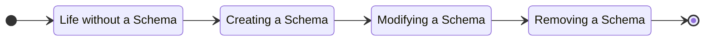

JSON Schema is a tool with rules to validate the structure of JSON data. More information about JSON Schema can be found in the book [Understanding JSON Schema](https://json-schema.org/understanding-json-schema). A Schema lets users configure the structure of a Data Entity.

> ⚠️ Schemas are supported only by Master Data V2.

This article explains how changes in a Schema affect the Data Entities, which actions are triggered in the background, and the amount of inconsistency time until all configurations are completed. So, consider the lifecycle of a Schema below:

Each phase of the lifecycle will be split into three areas: saving data, searching, and background process.

## Master Data without Schemas

Master Data can work without any Schema created before documents are stored, but there are limitations to saving and searching documents.

| Area | Description |
| - | - |
| Saving data | You can store data without a Schema, and the validation will affect only the `id` field. The `id` is validated in all requests with or without a Schema created. Since there is no Schema, there is no validation of any other field. |
| Searching | You can search and scan all the Documents you have stored, but there are limitations to filtering in the search. Since you don't have a Schema to configure which fields should be searchable, only internal fields are searchable (`id`, `createdIn` and `updatedIn`). For instance, you can use internal fields to retrieve only documents created in a specific month. |
| Background process | No Schema means no triggers or custom fields searchable. So, there is nothing being processed in the background. |

## Creating a Schema

You can create a Schema before or after sending documents to be persisted in Master Data. Schemas are created using the [Save schema by name](https://developers.vtex.com/docs/api-reference/master-data-api-v2#put-/api/dataentities/-dataEntityName-/schemas/-schemaName-) endpoint from [Master Data API - v2](https://developers.vtex.com/docs/api-reference/master-data-api-v2). In case we already have documents in the database, a process is triggered in the background.

| Area | Description |
| - | - |
| Background process | When there already are documents in the database, the process will revalidate all documents. If the document is valid, the internal field `schema` will receive the name of the Schema. The `schema` field is a list of Schema names which the document is compliant for. Documents that are not validated by the Schema keep existing in the database, but their `schema` field will not be updated.  The amount of time that it takes to revalidate all documents will depend on the number of documents and the number of parallel changes that are being processed at the moment. A Data Entity with 1 million documents usually takes one hour but it could be more. Also, currently, it is not possible to see the progress of the revalidation process. |
| Saving data | Nothing has changed yet because you are not sending the `_schema={{name}}` in the query string. The Master Data Worker will validate the document after the request, and it will follow the Background Process above to valid and invalid documents.  By using the Schema query string, you avoid creating invalid Documents. After this change, documents will be validated during the request and a bad request (HTTP status code 400) will be returned by the API to invalid documents.
| Searching | After the Background Process, you can use the [Search API](#search) using the custom fields as you want. You must also inform the `_schema={{name}}` in the query string. |

## Modifying a Schema

Modifications in a Schema allow you to add or change properties or enable more fields to be searchable.

| Area | Description |
| - | - |
| Background process | Modifying a schema works the same as in the [Schema creation](#creating-a-schema). |
| Saving data | After a schema is modified, the database behavior changes when saving documents. The validation of new properties will be applied, and documents could be rejected. Therefore, ensure you did the right configuration (you can roll back changes, if necessary). |
| Searching | While the Background Process is running, the Search becomes inconsistent until all documents in the Search Engine are updated. |

## Removing a Schema

If you want to remove the Schema for any reason, you must remove its usage.

| Area | Description |
| - | - |
| Background process | Nothing is processed in the background from removing a Schema. |
| Saving data | When saving data, ensure you are not using the removed Schema in the API, or you will receive a bad request. |
| Searching | Just like when saving data, make sure you are not making a search with the removed Schema to avoid a bad request. |
