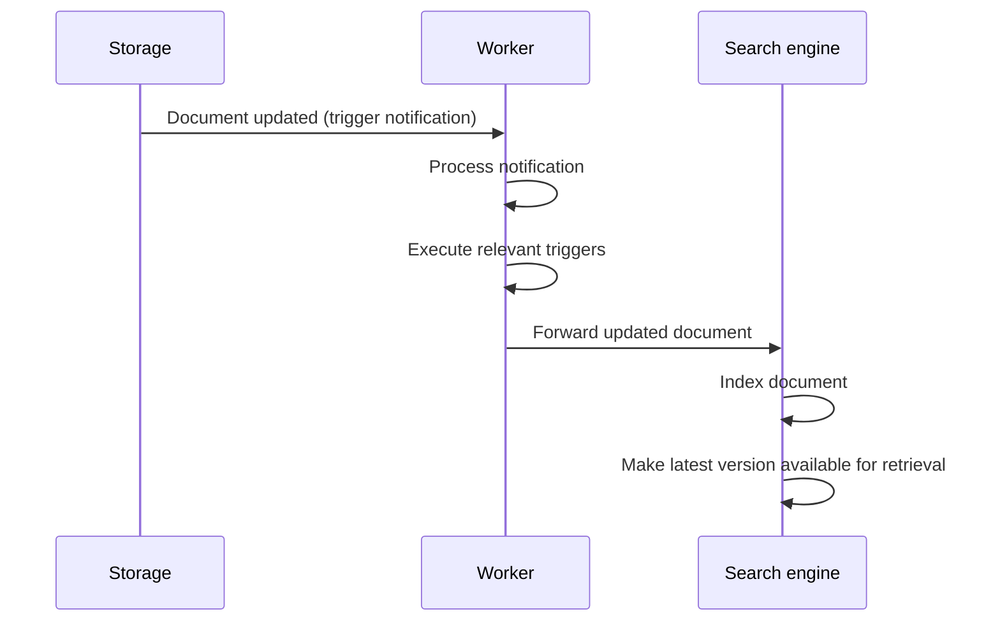

Master Data ensures businesses maintain consistent, reliable, and searchable information across their systems. This guide explains how its core services — API, Worker, Storage, and Search Engine — work together to manage large-scale data efficiently.

## Core services

A service is a program that performs automated tasks or responds to specific events, whether hardware-related or triggered by requests from other software. Master Data consists of four core services:

* **API:** Serves as the entry point for external systems to interact with Master Data.
* **Worker:** Manages backend processes, ensuring data consistency and enabling advanced operations.
* **Storage:** Serves as a central repository for storing documents securely.
* **Search engine:** Provides advanced search and aggregation capabilities.

### API

The API service acts as the main gateway for accessing and manipulating data in Master Data. It processes HTTP requests and routes them to the appropriate internal services. Its key features include:

* Endpoints for reading, writing, searching, and managing documents.
* Routing requests to internal services like [Storage](#storage) and [Search Engine](#search-engine).
* Ensuring secure communication between client applications and Master Data.

For detailed API endpoints, refer to:

* [Master Data V1](https://developers.vtex.com/docs/api-reference/masterdata-api)
* [Master Data V2](https://developers.vtex.com/docs/api-reference/master-data-api-v2)

>ℹ️ The API service does not process or store data directly. Instead, it routes requests to the appropriate services for execution.

### Worker

The Worker service automates backend processes to maintain data consistency and streamline operations. Its key features are:

* **Document indexing:** Sends documents to the [Search Engine](#search-engine) to keep search results up-to-date.
* **Trigger execution:** Automates tasks based on specific events, such as updating fields, notifying external systems, or sending customer emails.
* **Bulk data operations:** Supports large-scale data imports and exports in CSV format.

For example, when a customer updates their email address, the Worker service can automatically synchronize this change across multiple records and notify other systems.

### Storage

The Storage service functions as the central repository for Master Data, designed to store billions of documents securely and in a scalable way. Its key features are:

* **Document storage:** Securely stores documents, which can be retrieved via the Master Data API.
* **Account-specific access:** Ensures strict data isolation between different VTEX accounts.

### Search engine

The Search engine service enables efficient retrieval of documents through filtering, sorting, and aggregation. It indexes data from the Storage service, allowing users to perform advanced queries. Check out its key features:

* **Full-text search and filtering:** Retrieve relevant documents quickly using structured queries.
* **Pagination and scrolling:** Handle large data sets efficiently.

>ℹ️ Use the Search and Scroll APIs to retrieve large sets of indexed data from the Search Engine with advanced filtering and pagination capabilities. Learn more at [Extracting data from Master Data with search and scroll](https://developers.vtex.com/docs/guides/extracting-data-from-master-data-with-search-and-scroll) and [Pagination in the Master Data API](https://developers.vtex.com/docs/guides/pagination-in-the-master-data-api).

## Data consistency workflow

Master Data employs a synchronized workflow to ensure data consistency across all services:

1. **Storage update:** When a document is updated in Storage, a notification is triggered.
2. **Worker execution:** The Worker processes the notification, executes associated triggers, and forwards the updated document to the Search engine.
3. **Search engine update:** The Search engine indexes the document, making the latest version available for retrieval.

For more details, see [Data consistency and synchronization in Master Data](https://developers.vtex.com/docs/guides/data-consistency-and-synchronization-in-master-data).
