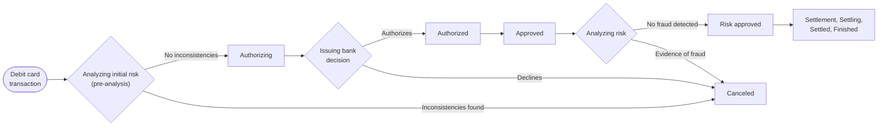

To provide more protection to debit card transactions, you can add an initial pre-analysis anti-fraud step to the standard payment transaction flow.

In the standard flow, the anti-fraud analysis runs only after the issuing bank authorizes the transaction. With pre-analysis enabled, the anti-fraud provider is also called before authorization, stopping transactions with initial inconsistencies before reaching the acquirer.

The following diagram shows a debit card transaction using the pre-analysis anti-fraud flow:

## Transaction flow

The pre-analysis flow adds one step (step 1) and reuses the standard anti-fraud analysis (step 5). Steps 7 to 10 follow the settlement sequence, which is identical for all payment flows:

1. **Analyzing initial risk (pre-analysis):** The flow starts with a pre-analysis by the anti-fraud system using the data sent by the payment gateway. Only the pre-analysis flow uses this step.
2. **Authorizing:** If the pre-analysis finds no inconsistencies, the transaction information is sent to the acquirer or another gateway, when applicable.
3. **Authorized:** The acquirer or gateway sends the transaction information to the issuing bank, which responds whether it authorizes the transaction. If the bank declines it, the payment is **canceled**. If the bank authorizes it, the status changes to **Authorized**.
4. **Approved:** This status indicates that the issuing bank authorized the transaction.
5. **Analyzing risk:** After the issuing bank approves the transaction, the anti-fraud system analyzes the risk of the operation.
6. **Risk approved:** If the anti-fraud provider approves the transaction, the status changes to **Risk approved**. If it identifies evidence of fraud, the transaction is **canceled**.
7. **Settlement of [amount]:** Indicates that the settlement for a given amount is about to start. The amount hasn't been settled yet at this stage. The status name includes the amount because a transaction can be settled in full or in part, generating one settlement status per amount.
8. **Settling:** The settlement attempt starts, and the systems begin transferring the transaction amount.
9. **Settled:** The amount was successfully settled and sent to the store's account.
10. **Finished:** The invoice with the payment amount was issued and linked to the order in the Order Management System (OMS). This is the final status of a successful transaction.

> ℹ️ Transaction statuses use the term **settlement**, while connector and VTEX Admin settings use **capture**. Both refer to the same operation.

When settlement starts depends on the capture behavior configured for the connector. By default, capture follows the schedule recommended by the acquirer, but it can also run immediately after authorization, immediately after the anti-fraud analysis, only when the order is invoiced, or on a fixed schedule. For more details, see [Custom Auto Capture Feature](https://developers.vtex.com/docs/guides/custom-auto-capture-feature).

> ⚠️ A successful settlement doesn't complete the transaction on its own. You must [include the invoice in the order](https://help.vtex.com/en/faq/why-has-a-transaction-been-successfully-settled-but-not-finalized-in-the-pci-gateway) for it to reach the **Finished** status.

## Cancellation scenarios

In the pre-analysis flow, a transaction can be canceled at three points:

| Stage                                     | Trigger                                                                                   | Result                                                                                                                   |
| ----------------------------------------- | ----------------------------------------------------------------------------------------- | ------------------------------------------------------------------------------------------------------------------------ |
| Pre-analysis (step 1)  | The anti-fraud provider finds initial inconsistencies.                    | The transaction is canceled before reaching the acquirer. No authorization is attempted. |
| Authorization (step 3) | The issuing bank declines the transaction.                                | The payment is canceled.                                                                                 |
| Risk analysis (step 5) | The anti-fraud provider identifies evidence of fraud after authorization. | The transaction is canceled and the authorized amount is reversed.                                       |

Because the pre-analysis step blocks suspicious transactions before authorization, it reduces the number of transactions that are authorized and later reversed at step 5.

## Activating the anti-fraud flow for debit card transactions

The `shouldUseAntifraudOnDebit` parameter controls this flow. This is a boolean field with the default value `false`.

> ⚠️ There is no self-service endpoint or Admin setting to enable this flow. Adding the parameter to your provider settings requires a request to VTEX Support. Plan this as a prerequisite step in your homologation schedule.

To activate the flow:

1. During the [homologation process](https://developers.vtex.com/docs/guides/payments-integration-payment-provider-homologation), [open a ticket with VTEX Support](https://help.vtex.com/en/tutorial/opening-tickets-to-vtex-support--16yOEqpO32UQYygSmMSSAM) requesting activation of the pre-analysis anti-fraud flow for debit cards. Include your provider name and the corresponding accounts.
2. The VTEX team adds the `shouldUseAntifraudOnDebit` parameter to your provider settings.
3. Set the parameter to `true`.

Once the parameter is `true`, any debit card transaction using a payment rule that includes an anti-fraud provider triggers the pre-analysis flow described in this article.

## Testing the flow

After activation, validate the integration in a test account before going live:

1. Configure a payment condition for debit cards associated with your anti-fraud provider. For details, see [Configuring payment conditions](https://help.vtex.com/en/tutorial/how-to-configure-payment-conditions--tutorials_455).
2. Place a test order with a debit card and confirm that the transaction reaches the **Analyzing initial risk** status before **Authorizing**.
3. Verify each cancellation scenario in the [Cancellation scenarios](#cancellation-scenarios) table, confirming that the transaction stops at the expected stage.
4. Check the transaction timeline in the VTEX Admin, under **Orders > Transactions**, to confirm that the status sequence matches the flow above.

> ℹ️ If the transaction skips the pre-analysis step and goes directly to **Authorizing**, confirm that `shouldUseAntifraudOnDebit` is set to `true` and that the payment rule includes an anti-fraud provider.
